# 架构总览图（四层架构 · 图说）

> 版本：Report v3（新增 §5「端到端完整过程（九步）」：HTTP 入口 → 路由 → 并发检查 → 排队 → 投递 → 返回）
> 日期：2026-09-16
> 状态：报告（**只做可视化与索引**，不定义任何机制、数值、枚举或矩阵）
> 位置：本文已从 `spec/design-concepts/总览/` 移入 `doc/report/`：图说不再承担规范效力，口径一律以 spec 下的 Normative 文档为准。
> 规则：所有图都是**示意图**；机制的唯一 owner 见 §1，任何冲突以 owner 为准，本文不产生第二套口径。

## 1. 索引：图的来源与唯一 owner

| 本文的图 | 主题 | 唯一 owner（spec 内） |
|---|---|---|
| §2 四层总览 | 分层、职责边界、两条冻结的跨层接口 | [四层整体架构与接口](../../spec/design-concepts/总览/1-四层整体架构与接口.md) §1–§3 |
| §3 接口 → role 路由 | 五个接口与五个 role 的对应 | [路由设计](../../spec/design-concepts/中层/3-路由设计.md) §3 |
| §4 两步路由 | token 寻址、三道检查、排队 / 直接开通道 | [路由设计](../../spec/design-concepts/中层/3-路由设计.md) §0、[并发设计](../../spec/design-concepts/中层/2-并发设计.md) §1 |
| §5 端到端完整过程（九步） | 从 HTTP 请求到结果返回的完整路径（含 ⑥–⑨ 检查 / 拒绝 / 排队 / 投递） | [四层整体架构与接口](../../spec/design-concepts/总览/1-四层整体架构与接口.md) §3、[路由设计](../../spec/design-concepts/中层/3-路由设计.md) §0、[并发设计](../../spec/design-concepts/中层/2-并发设计.md) §1–§3 |
| §6 一次 Skill 调用的时序 | 投递闸门、token 校验、两帧回包 | [四层整体架构与接口](../../spec/design-concepts/总览/1-四层整体架构与接口.md) §4.2 / §4.3 / §5.8 |
| §7 计数：三预算与通道记账 | 执行形态、三预算、拒绝文本 | [并发设计](../../spec/design-concepts/中层/2-并发设计.md) §1–§3 |
| §8 连接账本与 endpoint 复用 | 连接数量、复用矩阵、canonical key | [路由设计](../../spec/design-concepts/中层/3-路由设计.md) §4、[中层配置文档](../../spec/design-concepts/中层/add-中层配置文档.md) §6.5 |
| §9 CDS.log 的 offset 计数 | 日志增量、分级、限长 | [日志返回设计标准](../../spec/design-concepts/底层/6-日志返回设计标准.md) |
| §10 六步注册与授权 | 注册流程、reservation、目视确认 | [多用户与注册](../../spec/design-concepts/中层/1-多用户与注册.md) §3 |
| §11 代码落点 | 四层 ↔ 源码模块的对应 | —（本文自述） |

字段名与默认值读[中层配置文档](../../spec/design-concepts/中层/add-中层配置文档.md)；错误 `kind` 与保留码读[四层整体架构与接口 §4.4](../../spec/design-concepts/总览/1-四层整体架构与接口.md)；本版不做什么读[本版范围与明确不支持](../../spec/design-concepts/总览/add-本版范围与明确不支持.md)；总索引见 [spec/README.md](../../spec/README.md)。

---

## 2. 四层总览

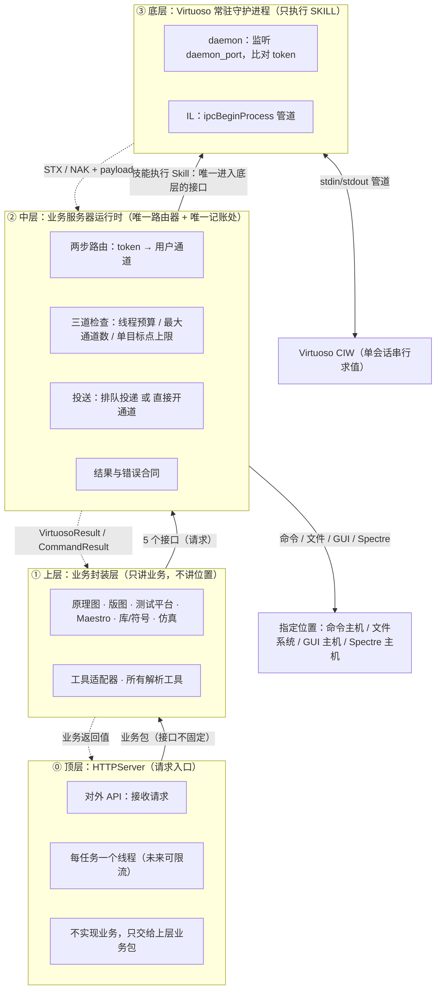

要点：

- 顶层只做入口：接收请求、为每个任务开一个线程（未来可能限流）；**不实现业务**，也**不直接访问中层/底层**（经上层调用）。
- 顶层 ↔ 上层**不设定死接口**（业务包直调）；真正冻结的跨层接口只有两条：上层↔中层（五个接口）与中层↔底层（Skill 投送）。
- 上层不接触 host、端口、SSH、隧道、socket、subprocess；它只看到**一个逻辑业务服务器**。
- 底层**只执行 SKILL**；命令、文件、GUI、Spectre 四条在中层完成，底层不参与。
- 依赖方向单向：顶层 → 上层 → 中层 → 底层 → Virtuoso；返回沿原路反向。

---

## 3. 五接口 → 五 role 路由图

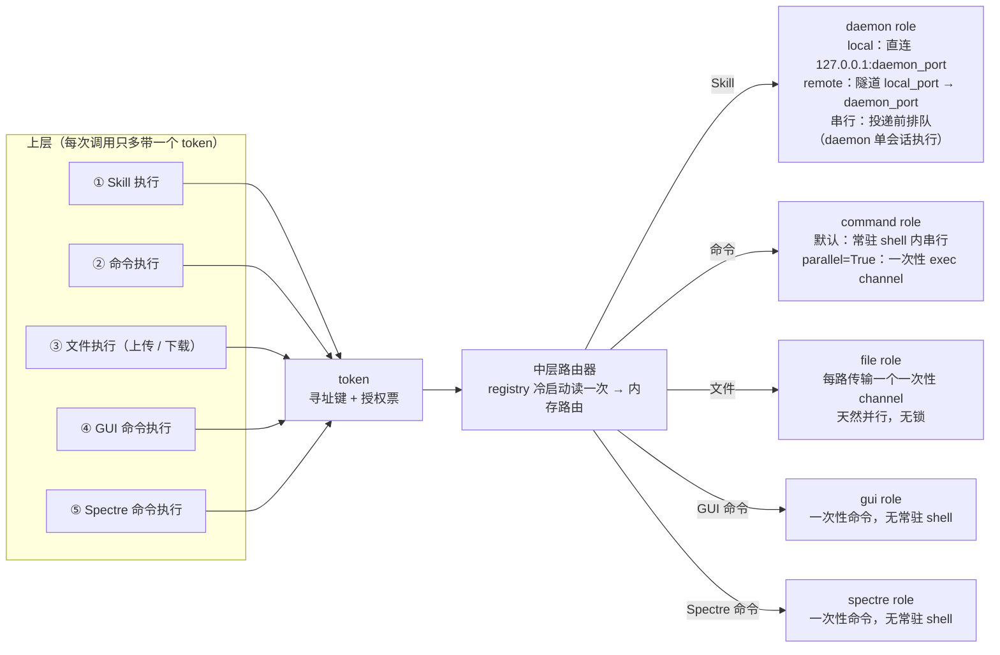

要点：

- **一个接口只投送一个 role**，不存在隐式退化，也不存在第六个接口；GUI / Spectre 命令与 `parallel=True` 命令属同一族（一次性通道）。
- **token 只由 daemon 比对**（Skill 通道）；命令 / 文件 / GUI / Spectre 只做寻址，安全边界是 SSH host key + 目标账号权限。
- 每个接口在真正投送之前都要先过**三道检查**（线程预算 → 最大通道数 → 单目标点上限），见 §4。
- role 之间**互相独立**：可跨主机、可混合 local/remote，bridge 不判断、不校验它们的拓扑一致性（忠实投送）。

---

## 4. 两步路由：从 token 到投递

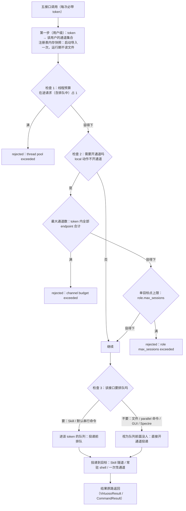

要点：

- 路由**只消费内存快照**：不探测、不写注册表、不读文件；文件、命令、Skill 各取自己 role 的根（注册时已写回绝对路径）。
- 三道检查**容得下才继续动作**：任何一道满都**不排队等待**，直接返回 `kind=rejected`（可重试），并指明是哪个参数容不下。
- 排队与直接投递只差“是否要排队”：Skill 与默认命令按 token 排队；并行类接口永远视为“队列前面没人”。
- 排队消耗同一条端到端 deadline：**排队中超时 = 未投递**（确定未执行，可安全重试）；**投递之后超时 = 结果未知**（不重发、不盲目重试）。

---

## 5. 端到端完整过程（九步）

> 这一节把一次调用从 HTTP 入口走到结果返回的全程串成一条链（不只 Skill，五个接口都走这条路）；
> ⑥–⑨ 的并发检查与排队语义是重点，更细的 Skill 通道交互见 §6。

### 5.1 全景时序（①–⑨）

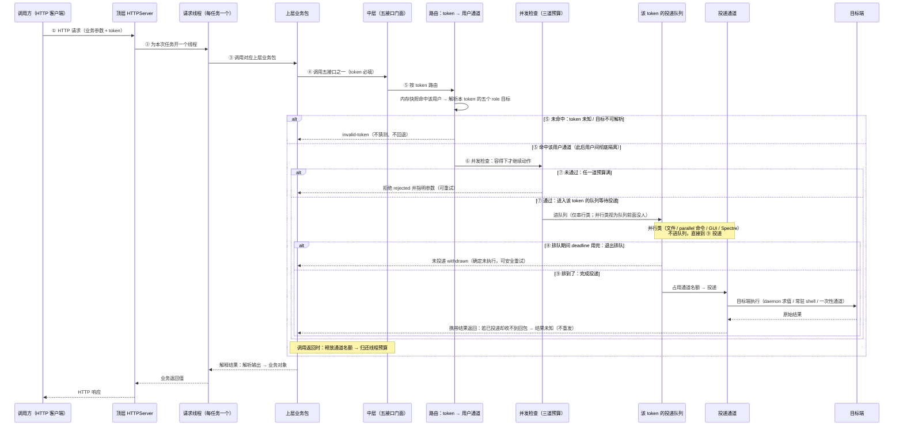

### 5.2 ⑥–⑨ 的判定细节（检查 → 拒绝 / 排队 → 投递）

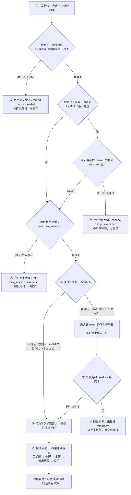

### 5.3 九步速查表

| 步 | 谁在做 | 做什么 | 失败 / 分支结局 |
|---|---|---|---|
| ① HTTP 请求 | 顶层 | 接收请求（业务参数 + token）；不实现业务 | 入口层错误由顶层直接返回 |
| ② 开线程 | 顶层 | 为本次任务开一个线程；该线程从头等到结果返回 | 未来可在此处限流 |
| ③ 业务包 | 上层 | 选对应业务包，做参数校验与领域逻辑 | 参数错误在业务层返回 |
| ④ 调五接口 | 上层 | 调 Skill / 命令 / 文件 / GUI / Spectre 之一；`token` 必填 | token 缺失 = 调用方错误（允许直接抛出） |
| ⑤ 按 token 路由 | 中层 | 内存快照查 token → 该用户通道集合；解析五个 role 目标 | 未命中 → `invalid-token`（不猜测、不回退） |
| ⑥ 并发检查 | 中层 | 容得下才继续动作：线程预算 → 最大通道数 → 单目标点上限 | —（详见 §5.2） |
| ⑦ 拒绝 / 进队 | 中层 | 任一道满 → 拒绝并指明参数；全部容得下 → 进该 token 队列等待投递 | 拒绝 = `kind=rejected`（不排队等待，可重试） |
| ⑧ 排队中超时 | 中层 | 排队与执行共享同一条 deadline；超时即退出，请求尚未出网 | 未投递：`delivery=withdrawn`，确定未执行、可安全重试 |
| ⑨ 排到 → 投递 → 返回 | 中层 + 目标端 | 占通道名额 → 投递 → 目标端执行 → 结果原路返回顶层 | 已投递却收不到回包 → 结果未知（不重发） |

返回链与结果形态：

- 结果形态：Skill → `VirtuosoResult`（携 `log` / `warnings`）；命令 / 文件 / GUI / Spectre → `CommandResult`（`kind` 区分失败类别与保留码）；
- 返回链：目标端 → 中层 → 上层（解释为业务对象）→ 请求线程 → 顶层 HTTP 响应；
- 收尾：调用返回时**先释放通道名额、再归还线程预算**；一次性 exec / 传输通道由远端自动关闭，常驻资源（Skill 隧道、常驻 shell）继续留用。

---

## 6. 一次 Skill 调用的时序（投递闸门）

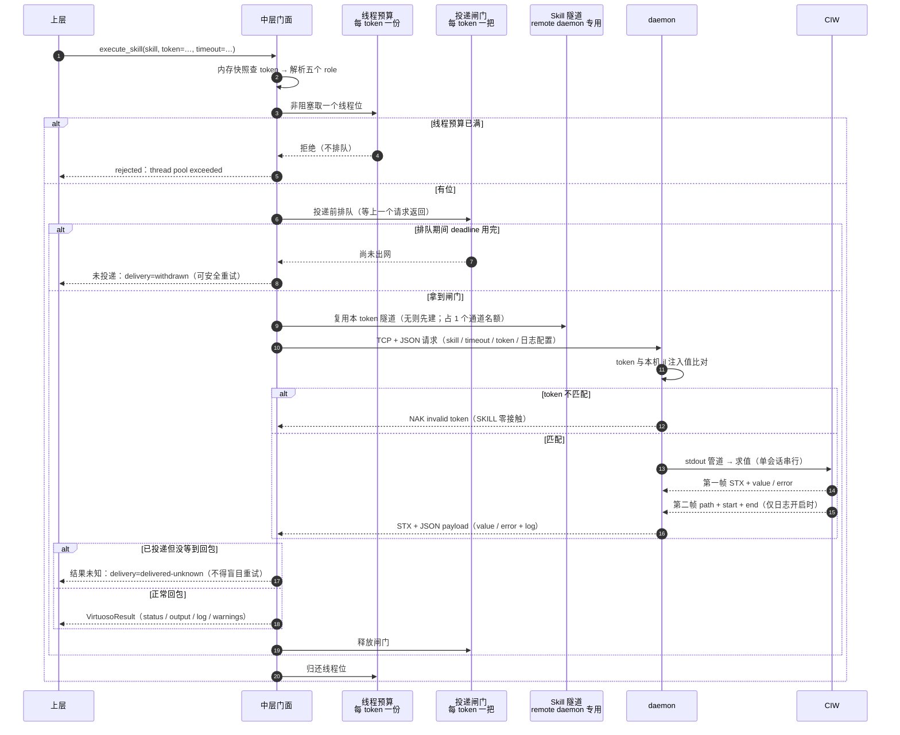

要点：

- 闸门在**请求出网之前**获取：这是“排队中超时=未投递、投递后超时=结果未知”两条语义的实现点。
- daemon 同一时刻只**执行**一个 SKILL；已投递、待执行的请求留在 daemon 队列里，客户端超时不取消它。
- **Skill 也占通道**：专用隧道的 forwarding 每 daemon endpoint 占 1（连接建立时占、连接关闭时释放）；记账口径见 §7。
- 日志第二帧超时不影响第一帧：结果照常返回，`log=""` 并附固定 warning。

---

## 7. 计数：三预算与通道记账

### 7.1 三种执行形态

| 形态 | 接口 | 投递方式 | SSH 资源 |
|---|---|---|---|
| 串行 · Skill | Skill 执行 | 排队投递（上一请求返回后才投递下一个） | daemon role 的专用隧道连接 |
| 串行 · 命令 | 命令执行（`parallel=False`） | 排队投递（常驻 shell 空闲才写入下一条） | 常驻 shell 会话 |
| 并行 | 文件执行 / `parallel=True` 命令 / GUI 命令 / Spectre 命令 | 直接开通道，无逻辑排队 | 一次性通道，用完关闭 |

- 串行两类的排队都发生在中层**投递前**，按 token 隔离；
- `mode=local` 的 role 没有 SSH：不占通道类预算，但**照常占线程预算**。

### 7.2 三道预算（每 token 一份）

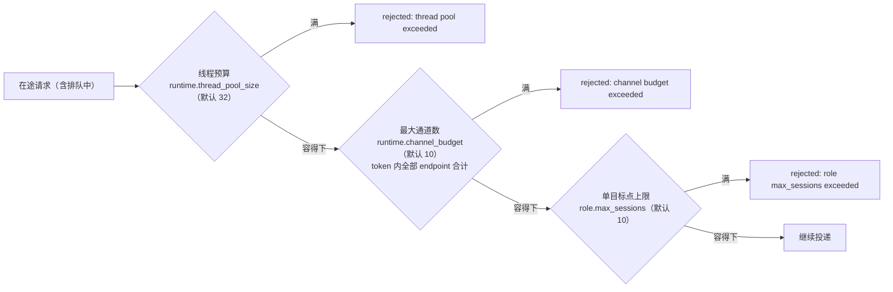

- 三份预算**互相独立**，任一超限都是 `kind=rejected`（可重试），**不排队等待**；
- 线程预算与最大通道数**每 token 一份**，token 内所有 role / endpoint 共用；单目标点上限**按 role**（一个 role 最多一个远端 endpoint）；
- **常驻资源照样记账**：Skill 隧道 forwarding 与常驻命令 shell 各在其 endpoint 上占 1，直到连接关闭。

### 7.3 通道记账示意表

> 只是图说；**矩阵唯一口径见[并发设计 §3](../../spec/design-concepts/中层/2-并发设计.md)**，数值见[中层配置文档 §2.2](../../spec/design-concepts/中层/add-中层配置文档.md)。

| 动作 | 线程预算 | 最大通道数（token 合计） | 单目标点上限 |
|---|---|---|---|
| 任意接口的在途调用（含排队中） | 占 1，完成释放 | 见对应行 | — |
| Skill 执行 | 占 1 | 隧道 forwarding 占 1（每 daemon endpoint 一条） | 占该 daemon endpoint 1 |
| 命令执行（默认串行） | 占 1 | 常驻 shell 占 1（每 command endpoint 一条） | 占该 command endpoint 1 |
| 并行命令 / 文件 / GUI / Spectre | 占 1 | 占 1（通道关闭即释放） | 占该 role 的 endpoint 1 |
| `mode=local` 的同类动作 | 占 1 | 不占 | 不占 |

- 文件传输结束后的**校验子命令在同一通道名额内**完成，不另占；
- 通道类预算是“SSH 开了多少通道”的计数，与客户端线程/进程无关。

---

## 8. 连接账本与 endpoint 复用

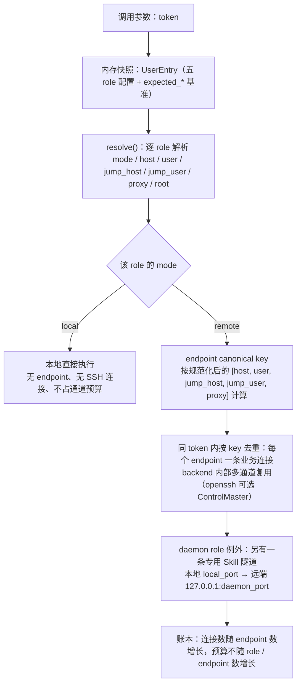

**复用矩阵**

| 关系 | 是否复用 |
|---|---|
| 不同 token（即使 endpoint 相同） | 严格隔离、永不复用：连接、隧道、常驻 shell、预算都按 token 分开 |
| 同 token 内不同 endpoint | 无法复用，各自独立建连 |
| 同 token 内同一 endpoint | 尽量复用：一条业务连接 + remote daemon 的一条专用 Skill 隧道 |

**endpoint key 要点**（唯一 owner：[中层配置文档 §6.5](../../spec/design-concepts/中层/add-中层配置文档.md)）

- 形状：`v1:` + SHA-256(规范化 JSON 数组)；`host / jump_host` 去空白 → 小写 → 去尾点，`user / jump_user / proxy` 只去空白；
- 两条独立规则：规范化决定“是否同一 endpoint”；**不做名称解析**（不查 DNS、不合并 alias）；
- 约束：SSH 端口固定 22，proxy 固定 `socks5://host:port`。

**计数量化示例**（示意，用于读账）

```text
每 token 计：
  业务连接        = 去重后的 endpoint 个数（共享 endpoint 的多个 role 只算一条）
  Skill 隧道      = 1（daemon role 为 remote）；daemon 为 local 时为 0
  线程预算        = 1 份（默认 32）
  最大通道数预算  = 1 份（默认 10），token 内全部 endpoint 共用
  单目标点上限    = 每个 role 一份（默认 10）

远端按连接计：
  sshd 子进程   = 每 SSH 连接 1 个（按连接数 fork，不按通道数）
  通道           = sshd 子进程内部的逻辑状态机，不是进程
  daemon 进程    = 每 token 1 个（CIW 的 ipcBeginProcess 子进程）
  一次性 shell   = 每次并行命令 / GUI / Spectre 一个，跑完即退
```

常驻与一次性的生命周期：

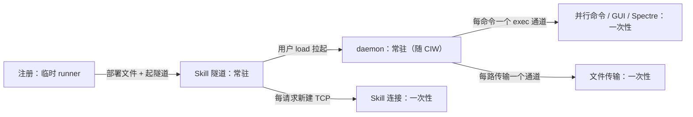

- 路径解析只有一套：绝对路径与 `~` 原样，相对路径按**目标 role 的根**拼接（根在注册探测后写回绝对路径）。
- **跨 token 永不共用连接**：即使两个 token 解析出同一个 endpoint，也是两条 SSH。

---

## 9. CDS.log 的 offset 计数（每次只取增量）

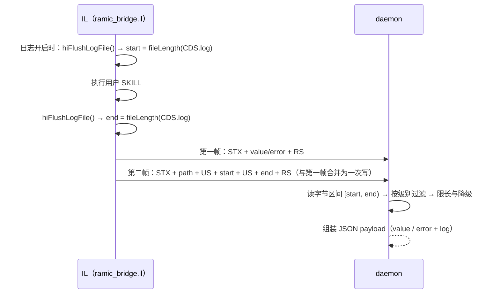

要点：

- 增量靠**两个字节偏移**定界，不需要 request_id，也不需要 daemon 常驻 cursor；不向 CDS.log 注入任何 marker。
- 请求**不携带 `log_level` 时按 `off` 处理**（不产生第二帧、`log=""`）；`off` 是**从源头掐断**：IL 不 flush、不取长度、不回第二帧，daemon 不读文件。
- 文件轮转或清空导致 `size < start` 或 `end < start` → `start` 归零，本次读 `[0, end)`，不报错。
- 超长先降级为只回 error，再按字节截断靠前部分；截断不会留下半个 UTF-8 字符。

---

## 10. 六步注册与授权

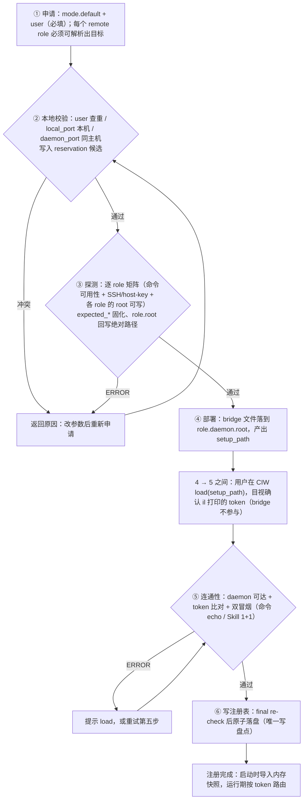

要点：

- **前五步任何失败 registry 零写入**，第六步是唯一写盘点，不存在“半成品 user”；
- 第四步部署是**覆盖式**的（重投 `ramic/`、`setup/`、`status/`）；用户在 CIW `load` 的等待**不计时**；
- 授权靠**目视确认**：token 部署时写进 il，`load` 时打印，用户比对一致即授权；daemon 逐请求比对，不匹配直接 NAK 且 **SKILL 零接触**；
- 注册结束只允许残留 registry 与远端部署文件：不留隧道、不留 SSH 进程、不留控制 socket；失败/取消释放 reservation。

---

## 11. 代码落点（四层 ↔ 源码）

| 层 / 关注点 | 源码位置 | 说明 |
|---|---|---|
| 顶层（HTTPServer） | `src/server/registration_server.py`（`ThreadingHTTPServer`）、`src/server/stress_server.py` | 注册引导服务与压测服务；业务 API 顶层按四层架构将落在 `src/server/` |
| 上层 | `src_bak/virtuoso_bridge/`（cli、wrappers、virtuoso 各领域包） | 业务封装、命令装配与所有解析工具 |
| 中层门面 | `src/transport/middle.py`（`BusinessServer`） | 五接口入口、token 路由、线程预算、**投递闸门**、错误映射 |
| 中层 · 每 token 远端状态 | `src/transport/tunnel.py`（`RemoteClient`） | endpoint 去重、通道预算、Skill 隧道、命令串行位 |
| 中层 · 连接与后端 | `src/transport/ssh.py`、`src/transport/paramiko_backend.py` | SSH 连接、ControlMaster、单连接通道门（`max_sessions`） |
| 中层 · 注册与解析 | `src/transport/register/`、`registry.py`、`remote_roles.py` | 六步注册、reservation、注册表、role 解析与 endpoint key |
| 中层 · 协议与文件 | `src/transport/skill_client.py`、`transfer.py`、`deploy.py` | 帧协议与日志挂载、上传下载与校验、部署 |
| 底层 | `src/bridge/resources/ramic_bridge_daemon_3.py`、`ramic_bridge_daemon_27.py`、`ramic_bridge.il` | daemon 与 IL（部署产物） |
| 接口模型 | `src/pyapi/models.py` | `VirtuosoResult`（含 `log` / `warnings` / `metadata`）、`CommandResult`、`Middle` 协议 |

> 本表只标位置，不承诺实现进度：四层重构正在收口，例如 `role max_sessions exceeded` 这一拒绝文本与部分预算口径仍以实现为准。

---

## 12. 图的读法小结

| 问题 | 看哪张图 |
|---|---|
| 谁在哪一层、谁能调谁 | §2 |
| 某个接口最后落在哪台机器、哪种执行形态 | §3 |
| **一个请求从 HTTP 入口到结果返回，一共几步** | **§5.1、§5.3** |
| **为什么被拒绝、拒绝文本是什么、能不能重试** | **§5.2、§7.2** |
| **排队超时和投递后超时有什么区别** | **§5.2、§5.3、§6** |
| 为什么 Skill 会排队、命令可以并行、文件从不排队 | §7.1 |
| 两个用户为什么不互相干扰 | §8 |
| 日志的“增量”是怎么数出来的 | §9 |
| 注册期间到底发生了什么 | §10 |
| 某段机制在代码里的位置 | §11 |
