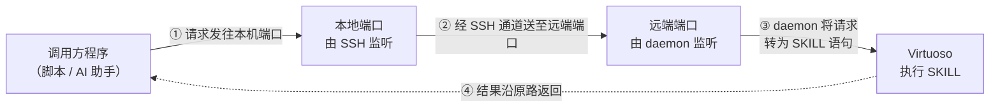

# virtuoso-bridge 基本原理

> 概要：Cadence Virtuoso 只接受 SKILL 语言输入。virtuoso-bridge 不修改 Virtuoso 本身，而是利用其官方提供的脚本加载机制与 SKILL IPC 机制，在 Virtuoso 进程内启动一个作为子进程的 Python daemon；该 daemon 对外接收请求并将其转换为 SKILL 语句交由 Virtuoso 执行，再将结果返回给调用方。

---

## 1. 问题背景

Virtuoso 的常规使用方式是通过图形界面手工操作。当需要由脚本或 AI 助手驱动它完成建器件、连线、配置仿真、运行仿真等工作时，会遇到两个限制：

- Virtuoso 是桌面程序，不提供对外的网络接口，无法直接远程调用；
- 设计数据的修改必须由 Virtuoso 自身完成，绕过进程直接修改磁盘文件不可行。

bridge 的解决思路是不改动 Virtuoso，而是利用它已有的两项能力：

1. 用户可在其命令行窗口（CIW）中加载自定义 SKILL 脚本；
2. 它可将一个外部程序作为**子进程**启动，父子进程之间通过标准输入输出通信。

由此，bridge 在 CIW 中加载一段 SKILL 脚本，由该脚本启动一个 Python **daemon**（即上述子进程）。daemon 监听网络端口，收到请求后转交 Virtuoso 执行，并将执行结果返回。

---

## 2. 链路总览

---

## 3. 三段路径

### 3.1 调用方 → 本地端口

调用方无需知道 Virtuoso 所在的机器，只需向**本机的一个固定端口**发送请求。

监听该端口的是 SSH 客户端进程，而非 Virtuoso。这一段不涉及远端，是纯本机连接。

### 3.2 本地端口 → 远端端口

SSH 在连接远端服务器时，可将**本机端口**与**远端端口**建立映射。

映射建立后，从本机端口进入的数据会被原样转发到远端对应端口，返回数据同理。由此带来两个结果：远端无需额外对外开放任何端口，全部流量都复用已建立的 SSH 通道；中间即使存在跳板机，对调用方也是透明的。

### 3.3 远端端口 → Virtuoso

这一段是该机制的核心。

远端端口由 daemon 监听，而 daemon 并非独立服务，它是 **Virtuoso 自己启动的子进程**。因此 daemon 与 Virtuoso 之间不存在网络连接，使用的是操作系统提供的父子进程通信方式：子进程写入标准输出，父进程即可读取；父进程写入子进程的标准输入，子进程即可读取。

完整流程如下：

daemon 收到网络请求 → 写入自身标准输出 → Virtuoso 读取该数据并作为一条 SKILL 语句执行 → 执行结果写回 daemon 的标准输入 → daemon 通过网络将结果返回调用方。

也就是说，Virtuoso 在该过程中只做两件事：读子进程的标准输出，向子进程的标准输入写入数据。**bridge 没有绕过 Virtuoso 执行任何设计操作，所有设计数据的修改均由 Virtuoso 通过官方 SKILL 接口完成。**

---

## 4. 设计约束

- **daemon 是 Virtuoso 的子进程。** Virtuoso 退出后 daemon 一并结束，此时本地端口将无法建立连接。因此连通性排查应先确认 Virtuoso 进程是否存在，再确认 SSH 隧道是否正常。
- **设计数据的修改始终由 Virtuoso 完成。** bridge 只传递 SKILL 语句与执行结果。建器件、连线、运行仿真均由 Virtuoso 通过官方接口完成，因此文件锁、权限、工艺库绑定、连接关系等机制均照常生效。
- **请求只能串行执行。** 一个 Virtuoso 只有一个 CIW，同一时刻只能执行一段 SKILL，因此不适用于多人并发修改同一份设计。
- **Spectre 仿真不经过本链路。** Spectre 可直接由命令行调用，无需 Virtuoso 参与，与 SKILL 通道相互独立。

---

## 5. 小结

Virtuoso 在 CIW 中加载 SKILL 脚本，经官方 IPC 机制启动 Python daemon 作为子进程；调用方将请求发往本机端口，经 SSH 转发至远端端口；daemon 从网络收到请求后写入自身标准输出，Virtuoso 读取后作为 SKILL 语句执行，再将结果写回 daemon 的标准输入，沿原路返回调用方。
