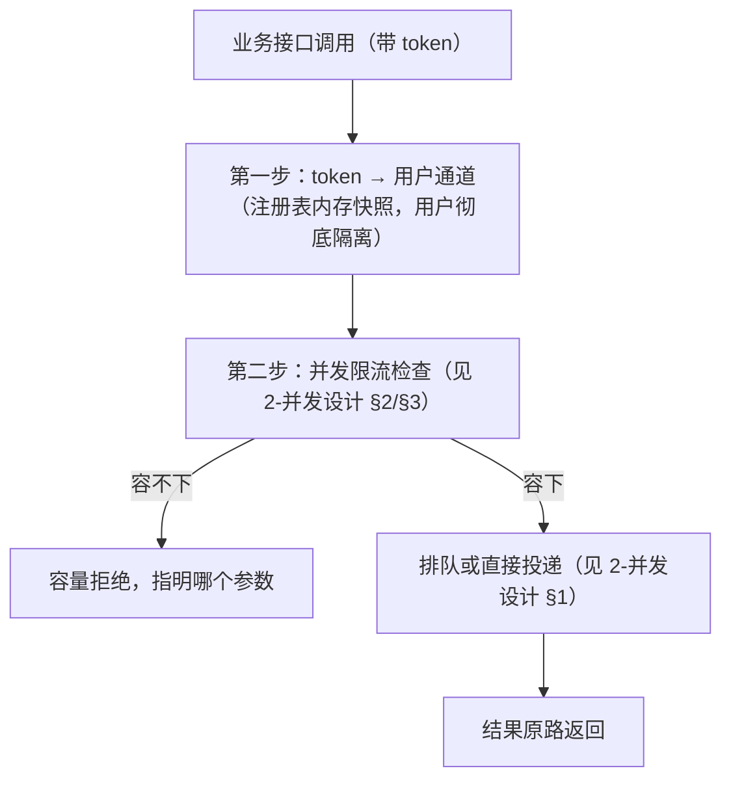

# 路由设计（5 role）

> 版本：v19
> 日期：2026-09-22
> 状态：Normative（5 role 拓扑与职责、token↔主机边界、连接复用原则的唯一口径）
> Supersedes：v18（GUI 命令支持显式 `display` 覆盖）
> 关联：字段定义见[中层配置文档 §2](../中层/add-中层配置文档.md)；接口基线见[四层整体架构与接口 §4](../总览/1-四层整体架构与接口.md)；并发与预算见[并发设计](2-并发设计.md)

## 0. 两步路由总览（路由是纯消费注册表的行为）

路由阶段只做一件事：**消费启动时已导入的注册表内存快照**。路由**不探测、不写注册表、不读文件**（注册表导入一次，此后全走内存）；文件、命令、Skill 各自去取**其对应 role 的根**——`role.<name>.root` 在注册时已写回注册表。

1. **第一步（用户级）**：按调用携带的 `token` 查内存快照 → 路由到该用户的通道集合；从此用户之间彻底隔离（预算、连接、队列都按 token 分开）。
2. **第二步（用户内检查与投递）**：在用户内按 role 解析目标后，执行并发 owner 的限流检查（线程预算、最大通道数、单目标点上限，见[并发设计 §2/§3](2-并发设计.md)），**容得下才继续投递**；需要排队的进对应队列，不需要排队的直接投递（形态见[并发设计 §1](2-并发设计.md)）。投递目标：串行命令 → command role 常驻 shell，Skill → daemon role 隧道/端口，并行类 → 对应 role 一次性通道。
3. 任一限流参数容不下 → 返回容量拒绝并**指明是哪个参数**（结果字段见[四层整体架构与接口 §4.5](../总览/1-四层整体架构与接口.md)）；拒绝文本与记账见[并发设计 §2/§3](2-并发设计.md)。

- 排队/投递超时语义、预算与记账见[并发设计 §1–§3](2-并发设计.md)；注册表导入与 token 生命周期见[多用户与注册](../其他/1-多用户与注册.md)。

## 1. 定位与边界

本版保留 **5 个 role**：`gui`、`daemon`、`command`、`file`、`spectre`。一个注册账号（token）最多可以连向五个不同目标。

**忠实投送原则（本设计的最高准则）**：bridge 只负责把指令或文件**正确投送到用户指定的目标位置**，并如实返回结果。

- bridge **不判断、不校验、不假设** role 之间是否在同一台主机、是否同账号、是否共享文件系统；
- 主机相同与否不是 bridge 要考虑的问题；用户给出什么目标，就忠实投送到什么目标；
- 由此产生的拓扑合理性（例如 CIW 与 daemon 是否同机、部署路径是否对 GUI 可见）属于**用户的拓扑责任**，bridge 只通过注册探测把"目标是否可用"如实报告给用户。

这条准则同时是评审 P0-01 的关闭口径：规范不再承诺"gui 与 daemon 必须同机"，也不再假设；bridge 按配置投送。

## 2. 五个 role 的职责

| role | 职责 | 被哪个接口消费 | 额外字段 |
|---|---|---|---|
| `gui` | Virtuoso CIW / X11 所在主机；执行 GUI 侧一次性命令（窗口枚举、dismiss、bootstrap 等） | **GUI 命令执行**（一次性） | `display`（X server） |
| `daemon` | SKILL daemon 监听主机；bridge 文件的部署目标 | **Skill 执行**（隧道到 daemon） | `daemon_port`、`local_port` |
| `command` | 通用命令执行主机（默认常驻 shell；`parallel=True` 走一次性 exec） | **命令执行** | — |
| `file` | 文件传输目标主机（上传/下载） | **文件执行** | — |
| `spectre` | Spectre 执行主机；上层经 **Spectre 命令执行** 调用 spectre（本版第 5 接口；仿真流程编排留待后续） | **Spectre 命令执行**（一次性） | `bin`（可选记录） |

### 2.1 token 与主机边界（唯一口径）

- 一个 token 拥有**五个 role**，这些 role **可以分布在多个主机**（含混合 local/remote）；bridge 不因为 role 跨主机而拒绝注册或拒绝投送；
- 一个 token **只允许一个 daemon role、一个活动 daemon、一个 CIW**：daemon 是本版唯一“单实例”资源，第二处 `load` 同一 token 属于配置错误；需要第二个 CIW 时注册第二个 user/token；
- 一个 token 只对应一个 X server（`role.gui.display` 单值）；多个 Virtuoso 在不同 X server 时分别注册多个 user/token；
- 除 daemon 之外，command / file / gui / spectre 各自可以是不同主机、不同账号、不同跳板，彼此不需要同机、同账号或共享文件系统；
- 该边界是本文的唯一口径；其它文档不得再出现“一个 token 多主机：不支持”这类无限定的表述。

`role.<name>.mode=local` 表示中层就在该 role 的目标主机上、直接本地执行、不经 SSH；`mode=remote` 表示经 SSH 投送到该 role 的 host/user；**不同 role 可以混合 mode**（例如客户端就在 daemon 主机上 → daemon=local、command/file=remote）。字段清单与默认值、逐字段回退规则见[中层配置文档 §2.3/§2.5](../中层/add-中层配置文档.md)，本文不重复。

## 3. 五个业务接口与 role 的对应关系

上层可用的业务接口共 **5 个**（详见[四层整体架构与接口 §4.1](../总览/1-四层整体架构与接口.md)）；只读查询 `query` 不计入（见[四层整体架构与接口 §4.2](../总览/1-四层整体架构与接口.md)）：

| # | 接口 | 目标 role | 执行形态 |
|---|---|---|---|
| 1 | Skill 执行 | `daemon` | 隧道 → daemon → Virtuoso（串行语义） |
| 2 | 命令执行 | `command` | 默认常驻 shell；`parallel=True` 一次性 exec |
| 3 | 文件执行（上传/下载） | `file` | 每次传输一个一次性通道 |
| 4 | GUI 命令执行 | `gui` | **一次性命令**（不建常驻 shell） |
| 5 | Spectre 命令执行 | `spectre` | **一次性命令**（不建常驻 shell） |

**GUI / Spectre 命令的本质**：它们是"用并行模式执行命令"——每次调用在对应 role 上执行一条一次性（one-shot）命令，不建立常驻会话、不保留 cwd/env，等价于 `parallel=True` 的命令语义。两者同样占用该 token 的 channel 预算（见[中层配置文档 §2.2](../中层/add-中层配置文档.md)与[并发设计](2-并发设计.md)）。

- GUI 命令用于 X11/窗口/CIW 相关的一次性操作；中层执行时以接口显式 `display` 优先，缺省取该 token 的 `role.gui.display` 设置 `DISPLAY`；两者皆无 → 执行失败并在错误中指明 GUI display 未配置；
- Spectre 命令用于 `spectre` 可执行文件的调用；`bin` 字段在注册期记录，供上层拼命令时使用；
- 两条通道都不经过 daemon，也不经过 Virtuoso 求值。

## 4. endpoint 与连接复用

- endpoint = 一个 **`mode=remote`** 的 role 解析后的 `(host, user, jump_host, jump_user, proxy)`；`mode=local` 的 role 没有 endpoint、不建 SSH 连接；
- **endpoint canonical key 的唯一 owner 是[中层配置文档 §6.5](../中层/add-中层配置文档.md)**（含规范化规则与测试向量），本文不复制算法。

**复用原则（唯一口径）**：

| 关系 | 是否复用 |
|---|---|
| 不同 token（即使 endpoint 相同） | **严格隔离，永不复用**——连接、隧道、常驻 shell、预算都按 token 分开 |
| 同 token 内不同 endpoint | **无法复用**——各自独立建连 |
| 同 token 内同一 endpoint | **尽量复用**——一条业务连接（backend 内多 channel 复用；`backend=openssh` 时可启用 ControlMaster，`backend=paramiko` 时为其 transport）；remote daemon role 另持有一条专用 Skill tunnel（外部 `ssh -N -L`，不经过业务连接） |

- 连接生命周期（建连/重试/关闭）见[并发设计 §4](2-并发设计.md)；
- 预算：线程预算与最大通道数**每 token 一份**（token 内所有 endpoint 共享），单目标点上限按 endpoint（字段配置在 role、共享 endpoint 取最小值）；记账矩阵见[并发设计 §2/§3](2-并发设计.md)，预算不因 role 数量而增加。

## 5. 本设计明确不做的事

1. **不做 role 间 mode 一致性约束**：允许 daemon=local 而 command=remote 这类混合拓扑，bridge 按每个 role 自己的 mode 忠实投送；
2. **不实现跨机启动 daemon 的协议（本版不做；未来版本 daemon 可能支持在其他节点启动）**：mpsserver / 远程 launcher 等均不在本版范围内。**当前版本 daemon 是 CIW 的本地 `ipcBeginProcess` 子进程**；启动方式与运行账号由站点拓扑决定，bridge 只忠实投送与连接、不参与也不校验：注册第四步结束后由用户自己 `load` 并拉起 daemon，bridge **不判断用户是否拉得起来**，只要求在第五步能**观察到**它（详见[多用户与注册 §3.2](../其他/1-多用户与注册.md)）。未来若支持其他节点启动，属于 daemon 侧能力扩展，不改变 5 role 与忠实投送原则；
3. **不校验 role 之间的主机/账号/路径一致性**：相同或不同都不影响 bridge 行为；
4. **不保证跨主机的文件可见性**：可见性由用户在注册探测中看到结果并自行负责；
5. **不提供 GUI/Spectre 的常驻会话**：两者只有一次性命令形态；
6. **业务接口总数固定为 5**：GUI 命令与 Spectre 命令是第 4、第 5 个业务接口；`query` 是只读伴随查询，不计入业务接口、不承担投送语义。

## 6. 与其它文档的关系

- 字段与默认值：[中层配置文档](../中层/add-中层配置文档.md)；
- 接口签名与错误模型：[四层整体架构与接口](../总览/1-四层整体架构与接口.md) §4；
- 六步注册流程与探测时机：[多用户与注册](../其他/1-多用户与注册.md) §3.1/§4.1；
- 并发、预算与连接复用：[并发设计](2-并发设计.md)；
- 本版不做什么：[本版范围与明确不支持](../总览/add-本版范围与明确不支持.md)。
