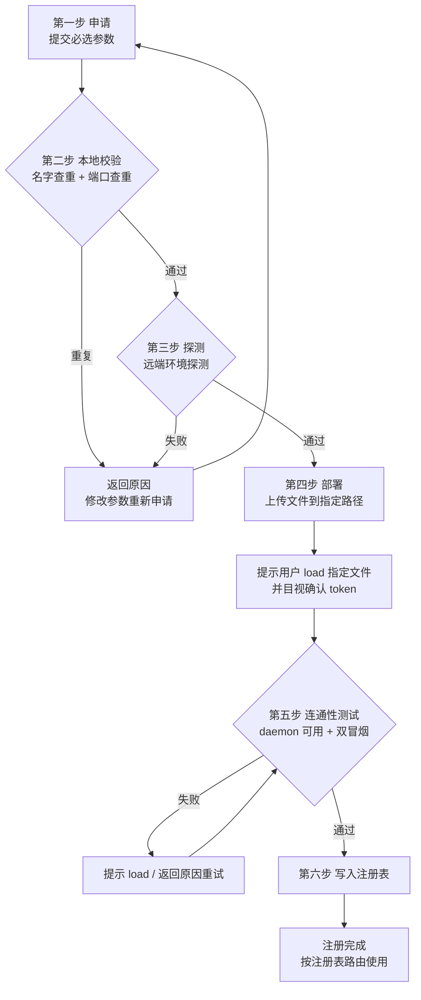
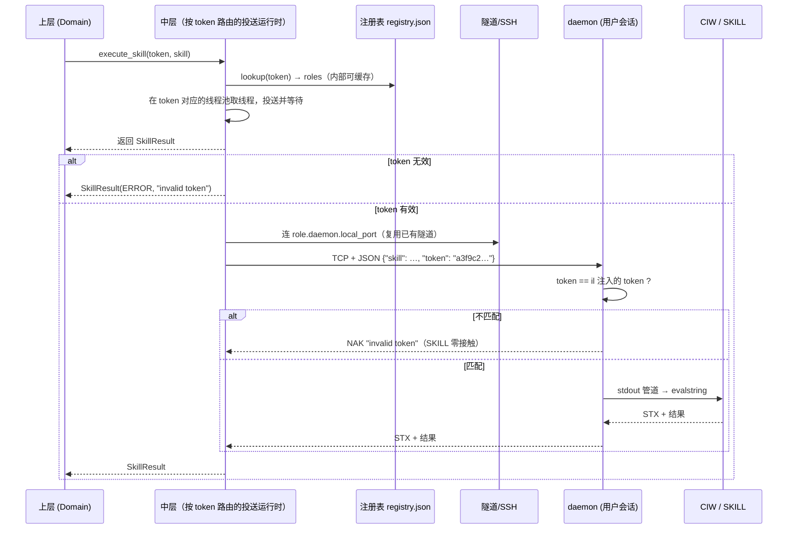

# 多用户设计（Token 寻址、目视确认授权与路由）

> 版本：Draft v14  
> 日期：2026-09-14  
> 状态：Normative（六步注册、token 寻址与生命周期唯一口径）  
> Supersedes：Draft v13（第一步必填引用、重试措辞、update 的 root 语义）  
> 关联：[四层整体架构与接口](../总览/1-四层整体架构与接口.md)、[多节点设计](多节点设计.md)、[Spec 索引](../../README.md)

## 1. 目标

把一个**单连接点对点桥接**演进为**多用户接入架构**：

- 每个用户拥有独立的 resident daemon、独立监听端口；连接复用与预算的唯一口径见[多节点设计 §6](多节点设计.md)与[并发设计](2-并发设计.md)；
- 所有会话共存于同一套 bridge 部署与同一网络连接设施之上；
- 上层每次调用向中层传入 **token 参数**，中层根据 token **自动路由**到对应用户的执行端点；token 是普通参数，不存在 `bind()` 绑定，也不要求上层维护 session 对象；
- **上层完全无感**：上层代码不接触 host、端口、profile、SSH、tunnel，只看得到"一个业务服务器"。

**量化验收标准**：

> **N 个用户 = N 个隔离域**。例如 6 个用户，上层看到的是 6 个业务服务器；每个隔离域包含五个 role、一个活动 daemon（= 一个 CIW）和一份 per-token 线程/channel 预算，中层按 token 参数路由到对应隔离域。跨用户并行互不阻塞；同账号场景下是桥层通道隔离（命令流不串、返回不混、文件落在各自 role 的根下）；**token 是核心区分**，OS 级权限分离由 IT 提供 Unix 账号保证，不在桥的职责内。接口清单与 role 映射见[四层整体架构与接口 §4.1](../总览/1-四层整体架构与接口.md)与[多节点设计 §3](多节点设计.md)，本文不重复。

核心原则一句话：

> token 是寻址键与授权票；中层是路由器；**授权由用户 load 时目视确认**（SSH 侧按标准公钥注册）；上层只知道"我要执行操作"，不知道"操作发生在哪里、经哪条通道"。

---

## 2. 现状与问题

| 现状机制 | 承担的角色 | 多用户下的缺口 |
|---|---|---|
| `profile`（`VB_*_<profile>` 后缀） | 按名字区分多套连接配置 | 配置写在 `.env`，路由靠**环境变量全局状态**；上层若按 profile 分支即违反分层 |
| `client_id` | 隔离"同一远端用户从多台本地机器连" | 遗留机制：改造后**删除**，远端目录按**用户名**子目录区分（`~/.virtuoso-bridge/<user>`），不再做客户端分段 |
| `state.json`（每 profile 一份） | 记录端口/隧道/setup 路径 | 已是事实上的注册表雏形，但没有 token 键，也没有统一查询入口 |
| `daemon_guard` | 事后校验"连没连错" | 每次新建客户端都要发一条 SKILL 查证；拦截点太晚（已接触错误会话） |
| 端口分配（用户名哈希） | 远端 daemon 端口去冲突 | 哈希碰撞靠人工改 `VB_REMOTE_PORT`；多用户规模化后不可持续 |

本设计把上述机制**统一收拢**为六步注册流程（详见 3.2）：**①申请 → ②本地校验 → ③探测 → ④部署 → ⑤连通性测试 → ⑥写入注册表**。注册完成后按注册表路由；SSH 连接在 token 内按 endpoint 去重复用（唯一口径见[多节点设计 §6](多节点设计.md)与[并发设计](2-并发设计.md)）。

---

## 3. 核心概念

### 3.1 Token

- 形式：`uuid4().hex`（32 字符），或用户手动注册时提供的字符串（如 `alice-prod`）。
- 语义：**寻址键与授权票**，对应三元组「daemon 主机 + daemon 端口 + CIW 会话」；它是每次调用的参数，不是绑定会话对象。
- 生命周期：
  - 本地生成（自动或手动指定）——**生成 ≠ 授权**，只是拿到一张票；
  - **一次生成终生有效，不轮换、不过期**——像账号密码一样，`restart`/重新部署/重建隧道均保留原 token；
  - 仅当**删除用户并重新注册**时才更换 token（相当于注销旧账号、新建账号）。
- **生成与授权分离（目视确认）**：
  - token 由**客户端本地生成**，保存在内存候选对象（客户端侧索引，无副作用），**第六步才随条目一起写入注册表**；
  - **授权是用户目视确认动作**：token 在投送（部署）时自动写入生成的 il 文件；用户在 CIW 里 `load` 时，il 打印 token，**用户目视确认与客户端持有的 token 一致**——确认即授权（见 3.5）。
- **token 使用范围（已明确）**：token 只用于**路由与校验**（注册表路由、daemon 比对、Skill 请求）；**用户可读路径一律用唯一用户名**（如 `~/.virtuoso-bridge/<user>/`），token 太长太散，不再作为路径段。
- 存放位置（闭环）：
  1. **生成的 il 文件** —— 投送时自动把 token 写成 il 常量（或 daemon 启动参数），CIW load 时打印供目视确认，daemon 直接持有，不经 Virtuoso 进程环境；
  2. daemon 进程 —— 持有 token，比对来访请求；
  3. **注册表** —— 客户端本地持久化，记录 token→路由的期望与 token 明文。

### 3.2 用户注册（六步注册流程）

**非必须**：已有账号则直接复用，无需重复注册。

注册是一条**先验证、后落盘**的流水线：前五步任何一步失败，注册表都不产生条目；第六步是唯一写入点。参数细节见 [配置一览 §4](../总览/配置一览.md)，此处聚焦流程本身。



**每步的预测目标与失败合同（唯一口径）**：

| 步 | 预测目标（可观察） | 不达成时 | 重试 |
|---|---|---|---|
| 1 申请 | 必填参数齐全（必填项以[配置一览 §4](../总览/配置一览.md)为准：至少 `mode.default`、`user`；每个 remote role 必须可解析出目标） | 参数错误，无副作用 | 修改后重新申请 |
| 2 本地校验 | registry 内无同名 user；`local_port` 在本机未被占用；`daemon_port` 若已提供，在**同一 daemon 目标主机**上查重（缺省端口待第三步分配） | 返回冲突原因 | 改参数后重试 |
| 3 探测 | 逐 role 探测矩阵唯一 owner：[多节点设计 §4](多节点设计.md)；`expected_*` 固化、`role.*.root` 回写（spectre 失败时相关字段为 null） | ERROR（spectre role 整体仅 WARNING） | 修复环境后重试 |
| 4 部署 | bridge 文件落到 `role.daemon.root`；产出 `setup_path` = **daemon 侧绝对路径**，纯粹给用户复制到 CIW 用 | ERROR | 覆盖式重试 |
| 4→5 之间（用户动作） | 用户在自己选定的 CIW 中 `load(setup_path)` 并拉起 daemon。**bridge 不参与、不判断用户是否拉得起来** | 不属于 bridge 的一步 | 用户自行重试 load |
| 5 连通性测试 | 能**观察到** daemon 可用（端口可达）+ token 比对通过 + 双冒烟通过 | ERROR（提示 load / 拉起） | 可重试第五步 |
| 6 写注册表 | 条目原子落盘 | ERROR | 前五步可重跑 |

**每步 deadline**：第二、三、五步的每个网络相位共享该步 30s 预算，`runtime.connect_timeout`（默认 15s）是其中的子预算、不额外加总；第四步之后**用户 load 的等待不计时**——第五步从用户确认、daemon 可观察时才开始计时。本表是注册侧 deadline 的唯一 owner；接口侧 deadline 见[四层整体架构与接口 §5.8](../总览/1-四层整体架构与接口.md)。

**第五步失败语义（唯一合同）**：

| 现象 | 级别 | 处置 |
|---|---|---|
| daemon 端口不可达 | **ERROR** | 提示在 CIW 中 `load(setup_path)`；不得进入第六步 |
| token NAK / 不匹配 | **ERROR** | SKILL 零接触；提示确认 load 的是本 user 的 setup |
| host-key 指纹不匹配 | **ERROR** | 期望类唯一阻断项；提示带外确认后 update |
| banner hostname / daemon user 与 `expected_*` 不一致 | WARNING | 记入 report.warnings，不阻断 |
| 命令冒烟失败 | **ERROR** | 命令通道不可用 |
| Skill 冒烟 `1+1` 非 `2` | **ERROR** | Skill 链未真正打通 |
| 以上全部通过 | — | 才允许进入第六步（`committed`） |

**重试与清理**：第四步部署是**覆盖式**的——重试重新投送同一 role 根下的 `ramic/`、`setup/`、`status/`，不做增量合并；第五步失败重试期间 registry 中仍不存在该条目（唯一写盘点是第六步）。

#### 第一步：申请

用户发起注册请求，提交**必选参数**（以[配置一览 §4](../总览/配置一览.md)为准；至少 `mode.default`、`user`，每个 remote role 必须可解析目标）；`mode.default ∈ {local,remote}` 是强制字段，不自动推断；`role.*.mode` 可逐 role 覆盖。本步只是"提出申请"，不产生任何副作用。token 在此时生成（自动或手动指定），随申请在流程内部传递，第六步才落盘。

> **参数清单**：完整参数表见 [配置一览 §4](../总览/配置一览.md)——本文件只关注流程，参数细节不在此展开。

#### 第二步：注册表本地校验

**纯本地、无网络**。对申请做两项查重：

| 校验项 | 检查内容 | 失败处置 |
|---|---|---|
| 用户名查重 | `registry.json` 里是否已有同名 user | **回退第一步**，返回"user 已存在" |
| 端口查重 | `daemon_port`：只与**同一 daemon 目标主机**上的已注册条目查重（不同主机可同端口号）；`local_port`：与本机已有条目查重 | **回退第一步**，返回"端口已被占用" |

本步只挡**注册表内**的冲突；远端环境是否真的可用，由第三步探测。

#### 第三步：探测（远端环境探测）

**核心时序**：此时 daemon 尚未启动，但 SSH 已可达——本步只探测“不依赖 daemon 即可验证”的项目，并把结果**记录到对应 role 的 `expected_*` 字段**供后续比对。对用户未填写的参数，以探测结果为准；对用户**显式填写**的参数，做**可用性校验**，不可用必须报告“该参数有问题”（而不是静默替换）。

**按 role 的 mode 验证环境**：`mode=local` 的 role 在客户端本机执行等价检查，`mode=remote` 的 role 通过 SSH 执行。探测清单：

| # | 探测项 | 在哪个 role 上验 |
|---|---|---|
| 1 | host-key | `mode=remote` 的 role 各自 SSH 握手取指纹，记录到 `role.<name>.expected_fingerprint`（gui/daemon/command/file 必检；spectre 失败仅 WARNING、不写） |
| 2 | **命令可用性** | **五个 role 全部探测**：各自执行一条一次性命令（如 `echo vb-ok`）并核对输出 |
| 3 | daemon 主机名 | daemon role `hostname -f` → `role.daemon.expected_hostname` |
| 4 | daemon 账号 | daemon role `whoami` → `role.daemon.expected_user` |
| 5 | daemon 端口 | 在 **daemon 目标主机**上检查该端口是否空闲（同一主机上不得重复分配；不同主机可同号）；是否真有 daemon 监听留到第五步 |
| 6 | python | daemon role 探测，决定 daemon 文件选型（_3 / _27） |
| 7 | 部署根 | daemon role `mkdir -p` + `test -w` |
| 8 | 各 role 文件根 | 五个 role 各自的 `role.<name>.root`（缺省 `root.default/<role>`；`root.default` 默认 `~/.virtuoso-bridge/<userid>`）可写/可见性检查 |
| 9 | spectre bin | spectre role：bin 显式校验/自动探测，失败仅 WARNING |

任一**必检**项失败 → **回退第一步**，返回结构化原因（如 `ssh handshake failed`、`daemon port 65081 already in use`、`role.daemon.root not writable`）。spectre role 的探测失败只产生 WARNING，不阻断注册。逐 role 的职责、探测矩阵与文件根唯一 owner：[多节点设计](多节点设计.md)。

**资源回收**：注册各步使用的 SSH runner/tunnel 在步骤结束（成功或失败）都必须 `close()`，拆除 ControlMaster 与隧道；注册完成后只允许残留文件系统变更（`registry.json` 与远端部署文件），不得残留隧道、master 进程或控制 socket。

#### 第四步：部署

探测通过 → 上传必要文件到指定路径：

```text
daemon 脚本（按探测到的 python 版本选 _3/_27）
ramic_bridge.il
生成的 virtuoso_setup.il（含 token 注入）
```

**完成后必须提示用户**：在 CIW 中 `load` 指定文件并启动 daemon。**当前版本 daemon 是 CIW 的本地 `ipcBeginProcess` 子进程**；未来版本可能支持在其他节点启动，启动方式与运行账号由站点拓扑决定，**bridge 不参与、不校验**（只负责把文件投送到 daemon role 的根；CIW 打印 token 供目视确认，见 3.5）。**部署结束 ≠ 注册完成**——daemon 起没起来、通道通不通，由第五步验收。

#### 第五步：连通性测试

**核心时序**：此时 daemon 已可用，把第三步“daemon 不可用期间无法完成”的校验全部补齐，完成全部探测/校准/确认后才允许进入第六步。

用户 load 之后，逐项验收：

| 校验项 | 方式 | 不匹配处置 |
|---|---|---|
| daemon 是否可用 | 连注册的 daemon 端口（本地直连 / 远程经隧道） | 无响应 → **ERROR**（提示 CIW 里 load setup） |
| token 比对 | daemon 校验 il 注入的 token | NAK → **ERROR**（未授权，SKILL 零接触） |
| banner 主机名 | daemon banner `host=` vs 注册的 `role.daemon.expected_hostname` | **WARNING**（期望类漂移，不阻断） |
| daemon user | 实际 daemon 用户 vs `role.daemon.expected_user` | **WARNING**（期望类漂移，不阻断） |
| **host key 指纹** | 当前 host key 与第三步记录的 `role.<name>.expected_fingerprint` 比对 | 不匹配 → **ERROR**（安全身份校验，是期望类唯一阻断项） |
| **命令冒烟** | SSH 跑 `echo vb-ok` 并校验返回 | ERROR（命令通道不可用） |
| **Skill 冒烟** | `execute_skill("1+1")` 必须 SUCCESS 且值为 `2` | ERROR（Skill 链未真正打通） |

失败 → 返回原因，**重试第五步**（提示 load / 重新部署）；通过 → 进入第六步。

**第五步的路由载体**：此时 registry 尚无条目；本步使用**内存中的候选对象**（`RegistrationState` / `ProbeResult`，含 token、各 role 配置、各 role `expected_*`、setup 路径）作为临时路由，**不查询、不写入 registry**。第六步是唯一写盘点。

**注册独立性（已定）**：注册模块（`transport/register`）不依赖**运行时状态**——不依赖 `BusinessServer`/`RemoteClient` 的连接缓存、线程池、channel 预算或隧道对象；允许依赖工具型组件（SSH 后端、Skill 协议客户端、路径生成器）与 registry 存储。

**resolver 复用（已定）**：第三步探测、第四步部署、第五步连通性测试**必须复用同一个无副作用的 canonical resolver**（per-role mode / 字段回退 / root / endpoint key 的唯一实现，归入配置与多节点共享基础组件），不得复制一套 fallback/endpoint/root 解析逻辑——"同一机制只保留一处"。注册与运行期的差别仅在于：注册使用**候选条目**（内存对象，不写 registry），运行期使用**已提交条目**。

#### 第六步：写入注册表

**前五步全部成功才落盘。** 写入完整注册条目（token、`mode.default`/`role.*.mode`、各 role 配置、各 role `expected_*` 探测值，见 3.4）。从此该 user 进入"已注册"状态，使用中按注册表路由（见 3.3）。

> **不落盘原则**：第二~五步任何失败，注册表不产生任何条目——不会留下"半成品 user"污染后续注册与路由。

### 3.3 使用中的路由与并发（同一 token 内按 endpoint 复用 SSH）

**注册完成后，使用期的核心约定：同一 token 内按解析后的 endpoint 去重复用 SSH 连接，按注册表路由。** 并发细节见 [并发设计](2-并发设计.md)，此处只列与路由相关的决策点。

```text
user ──(冷启动)──► registry lookup ──► roles 条目 + token（载入连接对象内存）
                                           ├─ Skill            → daemon endpoint（本地 TCP 或隧道端口）
                                           ├─ RunCommand       → command endpoint（常驻 shell / 显式并行）
                                           ├─ File             → file endpoint（上传/下载）
                                           ├─ GUI command      → gui endpoint（一次性命令）
                                           └─ Spectre command  → spectre endpoint（一次性命令）

连接建立后：内存映射 user→token→端口/SSH，不再查注册表
```

- **同一 token 内按 endpoint 去重复用 SSH 连接**；线程池与 channel 预算**每 token 一份**、token 内独立管理，与 endpoint 无关——严禁跨 user 复用；两个 user 连同一台机器也是两条 SSH（详见[并发设计 §4](2-并发设计.md)）；
- 路由表**只在中层内部可见**，上层拿不到；找不到 user、目标不可达 → 结构化错误返回，不猜测、不回退。

**连通性测试只有三个时机，业务调用本身零测试**。唯一检查矩阵：

| 阶段 | 检查项 | 失败级别 | deadline/重试 |
|---|---|---|---|
| 注册第五步 | daemon 可达、token 比对、命令冒烟（command role）、Skill 冒烟（daemon role）、**五个 role 的 host-key** | daemon/token/冒烟/gui+daemon+command+file 指纹 → ERROR；banner、daemon_user 漂移、spectre 指纹 → WARNING | 端到端 30s；建连最多 3 次总尝试 |
| runtime 冷启动 | 建连接、隧道就绪、首次 Skill 冒烟 | 建连失败 ERROR（最多 3 次总尝试，含初次）；冒烟失败 ERROR | 端到端 30s；建连 15s |
| 断线重连 | 同冷启动 + banner 主机名比对 | 同冷启动；banner 漂移 WARNING | 同冷启动 |
| 业务调用 | 仅 daemon 比对 token；命令/文件不再探测 | token 不匹配 NAK；命令/文件走已建 endpoint | 单次 30s |

**同 endpoint 可能被多个 `mode=remote` 的 role 共享**：每个 role 各自持有 `role.<name>.expected_fingerprint`，**同 endpoint 的多份值必须一致**（注册时校验；key 算法见[配置一览 §6.5](../总览/配置一览.md)）。gui/daemon/command/file 的指纹不匹配 → ERROR；spectre 走 Spectre 命令执行接口（上层预留），其指纹缺失/不匹配只 WARNING。

**通道保活**：

| 通道 | 保活需求 | 策略 |
|---|---|---|
| Skill 通道（daemon） | **当前版本 daemon 是 CIW 的本地 `ipcBeginProcess` 子进程**（生命周期随 CIW）；未来可能在其他节点启动。启动方式与账号由站点拓扑决定，**bridge 不参与、不校验** | 不保活；每请求新建 TCP 连接，连接失败时业务接口报错，由上层决定重连 |
| Skill 通道（SSH 隧道） | `ssh -N` 空闲会被网络设备/服务器掐断 | 隧道进程保活（`ServerAliveInterval`/paramiko keepalive）；隧道断 → 中层自动重建（现状已有端口自动重试机制） |
| 命令通道（persistent shell） | 空闲 shell 会被 sshd 超时断开 | 保活心跳 + **失效重连**：**仅在确认命令未投递时**透明重建；已投递的命令**不重发**、返回 `kind=unknown-effect`（唯一口径见[四层整体架构与接口 §5.8](../总览/1-四层整体架构与接口.md)） |

> **设计原则**：保活是**通道层的技术手段**，业务层无感。业务调用永远只看到"成功/失败"；通道死亡由中层自愈（重建隧道、重建 shell），但**已投递的命令一律不重发**，自愈不了时以结构化错误返回。

### 3.4 注册表（Registry，冷启动）

- **查询键**：**user**（`alice`）——中层的用户便利入口可按 user 查找 token 与路由；canonical 上层入口仍是每次调用携带 token 参数；
- **字段组成**：token、`mode.default`/`role.*.mode`、五个 role（gui/daemon/command/file/spectre，连接字段缺省回退全局 `ssh.default.*`，各 role 自带 `expected_*` 探测基准）——**字段与示例见 [配置一览 §2](../总览/配置一览.md)**，此处不重复；
- **冷启动**：注册表只在**连接建立时**读一次（解析 roles 与各 role `expected_*` → 载入连接对象内存），之后中层**不频繁查注册表**；探测完成后，中层关注的只有"哪个 token 发到哪个端口、哪个 SSH"——即**内存中的 token→端口/SSH 映射**，注册表仅是这份映射的冷启动源；
- **注册时机**：六步流程**第六步**（前五步全部成功才落盘，见 3.2）；
- **不维护运行态字段**：注册表**没有** `status`/`authorized` 字段；连接状态只存在于连接时（三时机见 §3.3），落盘快照只会过时误导；
- **注销时机**：仅在 `user remove` 删除用户时移除条目；`stop` 不改变注册表（条目与 token 永久保留）；
- 位置在**本地**（每台调用机一份）。

### 3.5 授权安置（目视确认 + 标准公钥注册）

**核心原则**：token 在**投送（部署）时自动写入 il 文件**；用户在 CIW 里 `load` 时，il 打印 token，**用户目视确认与客户端持有的一致**——确认即授权。部署可以自动化；目视确认是人工、需要操作 CIW 的明确动作，出错责任清晰归人。

**daemon 侧**：

```text
部署时自动把 token 写成生成 il 的常量（不经 setShellEnvVar）
  ↓
用户 CIW> load(".../virtuoso_setup.il")
  ↓
CIW 打印: [RAMIC] token=a3f9c2…   ← 每次 load 都打印
  ↓
用户目视比对客户端注册表持有的 token
  ↓
一致 → 授权完成；不一致 → 用户立即 RBStop() 并重新注册
```

**打印策略（已明确）**：**每次 `load` 都打印 token**，不做"仅首次"限制——用户每次重载都能当场目视确认，一致才继续使用。

**SSH 侧**：按照标准 SSH 公钥注册流程（`ssh-copy-id` 语义），将客户端公钥注册到目标机器 `~/.ssh/authorized_keys`——不做任何自定义扩展。

**daemon 侧校验**：持有 il 注入的 token，比对来访请求：匹配 → 执行 SKILL；不匹配 → NAK，SKILL 零接触。

---

## 4. 数据流

### 4.1 上层调用形态（完全无感）

接口签名与字段以[四层整体架构与接口 §4](../总览/1-四层整体架构与接口.md)为唯一基线，本文件不重复；本设计只补充：**每次调用都必须带 `token`**，`user` 只是 registry 的人类可读索引。

上层 MUST NOT 接触：`profile`、端口、host、`SSHClient`、`state.json`、`VB_*`。
换用户 = 换 token 参数，其余代码零改动。

### 4.2 请求链路（Skill 流示例）



### 4.3 五类流的路由差异（摘要）

五个接口各自投送到对应 role：Skill→daemon（daemon 校验 token，NAK 时 SKILL 零接触）、命令→command、文件→file、GUI→gui、Spectre→spectre；后四类只做**寻址**，不额外做 token 安全校验（安全边界 = SSH host key + 账号权限）。唯一映射与 token 语义见[多节点设计 §3](多节点设计.md)与[四层整体架构与接口 §4](../总览/1-四层整体架构与接口.md)，本文不复制表格。

---

## 5. 各层改造

### 5.1 上层

- 中层接口每次调用携带 `token` 参数（canonical）；不提供 `bind()`/session 对象；`user` 只能作为 registry 的人类可读索引，不是安全凭证；
- 所有领域服务（schematic/layout/maestro/spectre…）只注入 runtime，不注入 host；
- `profile` 已**彻底删除**：不再提供 `from_env(profile=…)` 等迁移兼容语法糖；新代码一律用 user（或 token）。

### 5.2 中层

- 新增 `registry.py`：注册/注销/查询，**user 为键**；**冷启动只读**——连接建立时读一次，解析 roles 与各 role `expected_*`、token 载入连接对象内存，之后不频繁查（见 3.3）；token 不可变，只有整条注册记录可增删；
- 新增 `register.py`：**第三步探测**（对应功能到对应 role 探测：五 role SSH 握手取指纹与命令可用性；daemon role 的 python / 端口空闲 / `role.daemon.root` 可写去 daemon role；各 role 文件根可写性去各自 role；spectre bin 去 spectre role）——只验部署前可验证项，任一必检失败返回原因、不落盘；**当前版本 daemon 是 CIW 的本地 `ipcBeginProcess` 子进程**；未来版本可能支持在其他节点启动，启动方式与运行账号由站点拓扑决定，bridge 不参与、不校验（忠实投送）；
- 新增 `connect.py`：**连通性测试**（六步流程第五步，命令校验 → daemon 校验），逐项比对注册表各 role `expected_*` 与实况；host key 指纹与 TCP/token 失败为 ERROR，hostname/user/banner 漂移为 WARNING；**测试通过以命令冒烟（echo vb-ok）与 Skill 冒烟（1+1==2）双通为准**；部署归 `deploy.py`（六步流程第四步），不属连通性测试；
- 中层每次调用按 token 查各 role 配置；内部可缓存查询结果，但上层每次仍以参数携带 token，不持有绑定对象；
- 端口分配从"用户名哈希"升级为**注册表分配**：新注册时取未被占用的端口（第三步探测含远端占用检查），冲突显式报错；
- 隧道复用池：**每 token 独立 SSH 连接**，token 内部复用 channel（隧道、命令、文件），复用现有 `SSHRunner` 多会话与 `paramiko_backend` 基础；
- **命令执行隔离（多用户各自独立命令行）**：不同 token 的命令执行**必须各自独立**——每 token 独立 SSH 连接和 exec channel；**禁止跨 token 共用 SSH 连接或 persistent shell**（单会话 stdin/stdout 串命令）；同一 token 的多连接可复用其专属 channel；
- **部署流水线注入 token**：`ensure_remote_setup()` 生成 il 时自动写入 token（il 常量注入 + load 时打印）；token 的安全边界是"用户 load 时目视确认"（见 3.5），部署出错的最坏后果是"连不上"，绝不产生"静默串线"；
- 部署目录权限收紧为 `chmod 700`（保护 daemon 代码与 identity 文件）。

### 5.3 底层（daemon）

- 持有 il 注入的 token（部署时写入，load 时目视确认）；**本版不支持无 token 的旧客户端/旧 il**——请求缺失、null 或不匹配一律 NAK `invalid token`，SKILL 零接触（双轨期已结束，历史见《改动报告》，Non-normative）；
- 中层到 daemon.py 的 request JSON 增加 `token` 字段；daemon.py 在**写 stdout 管道之前**校验：
  - 匹配 → 正常转发 SKILL；
  - 不匹配 → 直接回 `\x15invalid token…`，SKILL 零接触；
- banner 不打印 token 内容（token 只在 `load` 时由 il 打印，每次 load 都打印供目视确认）；
- 性能：校验为亚微秒级（单字符串比较），占典型请求时长 10⁻⁵ ~ 10⁻⁴，可忽略；错误请求因提前 NAK 反而更快。

### 5.4 guard 角色转变

| 机制 | 多用户架构下的去向 |
|---|---|
| `check_daemon_user` | **降级为诊断**：status 里展示 daemon 用户身份；不做任何 token 缺失放行 |
| `check_daemon_host` | **降级为诊断**：建连时打印/比对主机名，帮用户发现配置写错；不再是安全校验 |
| `VB_ALLOW_CROSS_USER_DAEMON` | 删除：token 强制校验，不提供豁免开关 |

### 5.5 双通道防护分工（token 只用于 Skill 通道）

**核心结论**：对称 token 只服务于 **Skill 通道**；**SSH 通道不引入 token**。两个核心安全问题（"Skill 跑在正确位置"、"命令跑在正确位置"）的答案**同构**——都是"凭证由用户确认、执行端比对"：

| 身份维度 | Skill 通道（裸 TCP，机制要自建） | 命令通道（SSH 固有，早已建好） |
|---|---|---|
| 机器身份（是不是那台机器） | token 经 il 注入 daemon | host key ↔ 本地 `~/.ssh/known_hosts` |
| 账号身份（以谁的身份执行） | token 即路由/授权身份 | 私钥 ↔ 目标机 `~/.ssh/authorized_keys` |
| 确认动作 | 用户 load 时目视确认 token | 用户标准公钥注册（ssh-copy-id 语义） |

**桥对命令通道的唯一责任**：不破坏 SSH 固有保证（禁用 `StrictHostKeyChecking=no` 之类）+ 加一层诊断抓配置笔误。命令通道的"错连"分两类：

- **网络层错连（中间人/DNS 劫持）**：host key 验证杜绝；
- **配置层错连（`VB_REMOTE_HOST` 打错字、split-host 角色配错）**：SSH 忠诚地到达错误的合法主机——这是用户意图错误，不是通道漏洞（与"token 目视确认放行到错误主机"同类，协议无法纠正错误意图）；靠 `hostname -f` 诊断在首次建连时暴露。

**Skill 通道连错主机的三种子场景**（token 比对后的残余风险）：

| 子场景 | token 比对结果 | 处置 |
|---|---|---|
| A. 隧道转到错误主机，其上无 daemon | 不出场（TCP 被拒） | **诊断**：建连失败提示 + `hostname -f` 比对注册表，帮用户定位配错 |
| B. 错误主机上有他人 daemon | ✅ NAK（对方 daemon 的 token 与我不匹配），SKILL 零接触 | 拦截完成 |
| C. 错误主机上也注入了同 token（违反“一 token = 一 CIW”） | 匹配通过 | **禁止**：一个 token 只对应一个活动 daemon/一个 CIW；出现第二处 load 属配置错误，必须用新 user/token 注册 |

**保留的轻量诊断**（非安全校验）：

1. **注册表记录端点主机名与 host key 指纹**：注册时探测写入各 role 的 `expected_*`（见 3.2）；
2. **建连时比对**：连通性测试的命令校验阶段逐项比对（host key 不匹配拒绝、hostname 漂移 warning），而非静默重试；

---

## 6. 边界与安全权衡
### 6.0 为什么比原来更强（新流程 vs 旧机制）

| 维度 | 旧机制 | 新流程 | 提升点 |
|---|---|---|---|
| SSH 机器身份 | known_hosts TOFU（首连警告，用户乱按 yes 即失效） | 注册时**主动探测并把 host key 指纹记录到 `role.<name>.expected_fingerprint`**，连接时比对，不匹配直接拒绝 | 机器漂移/别名重定向/中间人从"靠人眼"变为"强断言" |
| Skill 会话身份 | 连上后发 `getShellEnvVar("USER")` 查证 | daemon 层 token 比对，NAK 时 SKILL 零接触 | 拦截点从"已接触错误会话"提前到"错误会话不可见" |
| 配置完整性 | `.env` 散落多文件，值可互相矛盾 | 注册时**一次性探测并记录全部目标参数**，连通性测试逐项比对 | 参数漂移从"运行时神秘失败"变为"结构化 ERROR/WARNING" |
| 失败可诊断性 | 连接失败只有笼统的 Connection refused | 第三步探测 + 连通性测试，每项有独立原因 | 用户不用猜"哪里没对上" |
| 端口冲突 | 用户名哈希碰撞靠人工改 `VB_REMOTE_PORT` | 第三步探测远端占用，注册表分配 | 冲突在注册时就拒绝 |
| split-host 路径 | 部署到一半才报"文件不可见" | 注册时对 daemon 主机（deploy 主机）`test -r`/`test -w` | 可见性问题在注册时暴露 |
| 错误分级 | 失败/成功二元 | ERROR（拒绝）与 WARNING（漂移继续但不静默）分级 | 运维变更可见可追踪，不误伤合法变更 |


| 问题 | 结论 |
|---|---|
| 一个 daemon 一个 CIW 会话 | **硬约束**。Virtuoso 的 SKILL 执行是单会话语义，token 不能合并会话；多用户 = 多 daemon = 多端口 = 多隧道 |
| token 防什么 | 防** Skill 通道误连**（连错会话/连到别人的 daemon）；部署被错误路由的后果上限是"拒绝服务"，不是"静默串线"；身份绑定与部署生命周期解耦（重新部署后旧客户端仍凭原 token 连到同一用户的会话） |
| token 不防什么 | **SSH 通道不需要 token**（host key + 账号权限边界已足够，见 5.5）；恶意攻击：同服务器用户若能读目标用户的部署目录，可看到 il 里的 token 明文并冒充。缓解：部署目录 `chmod 700` + banner 不重现 token（token 仅在 load 时打印）+ token 终生不变，泄漏后的恢复手段就是删除用户重新注册 |
| 路由表放本地还是远端 | **本地**。放远端需"先 SSH 读表再决定 SSH 什么"，绕且慢 |
| 要不要时间戳/HMAC | 第一版**不要**（YAGNI）。token 即长期身份，删除用户重新注册即覆盖泄漏风险，未来若 daemon 脱离 SSH 隧道直连再评估 |

---

## 7. 历史迁移（Non-normative，已结束）

旧实现的“双轨期/五阶段迁移”已经结束，不参与本版规范与验收；历史对照见[改动报告](../总览/改动报告.md)。本版唯一口径：**token 强制、缺失/null/不匹配一律 NAK 且 SKILL 零接触；无 profile/VB_*/.env 兼容入口。**

## 8. 协议最终口径

接口与 wire framing 一律以[四层整体架构与接口 §4](../总览/1-四层整体架构与接口.md)为准，日志字段见[日志返回设计标准](../底层/6-日志返回设计标准.md)，本文件不重复。本设计只补充 token 边界：token 由中层放入发给 daemon 的请求，不进入 `ramic_bridge.il`，也不用于 `RunCommand`/`File` 的 SSH 认证。

## 9. 与 v1 架构规范的关系

本设计是 [四层整体架构与接口](../总览/1-四层整体架构与接口.md) 的**扩展而非替代**：

- 四层职责、五接口契约（Skill / 命令 / 文件 / GUI 命令 / Spectre 命令，见[四层整体架构与接口 §4.1](../总览/1-四层整体架构与接口.md)）、上层无感原则**全部不变**；具体字段与 framing 以该节为准；
- 本设计新增的是中层内部的身份与路由机制：**token 寻址 + il 注入 + 目视确认授权 + 注册表 + 隧道复用池 + daemon token 比对**；
- v1 "尚未决定事项"中的"是否引入正式认证/签名协议"由本文档初步回答：**引入对称 token 协议（il 注入 + 目视确认）**。token 是对称共享的**授权票（bearer ticket）**，不是公钥；未来可扩展为 daemon 与客户端各自持有公私钥的非对称认证，**本版不做**（daemon 的 Python 2.7 环境无库支撑，且防误连需求对称已满足）。

## 10. 遗留项定案（已定 / 不支持 / 后续）

| 原待评审项 | 本版定案 |
|---|---|
| token 读写分级 | **不支持**：单一 token，无只读/可写分级 |
| 多调用机共享注册表 | **不支持**：registry 每台调用机本地一份 |
| 手动 token 约束 | **已定**：`^[A-Za-z0-9._-]{1,64}$`（见[配置一览 §5](../总览/配置一览.md)） |
| token 取代 profile | **已定**：彻底取代，无兼容入口 |
| stop/remove 语义 | **已定**：`stop` 保留注册；`user remove` = 本机 registry 解绑，**不等于远端吊销**（远端 daemon 仍接受原 token，直到 `RBStop()` + 删除远端部署，见 §11） |
| 一个 token 多会话 | **已定**：**一个 token = 一个活动 daemon = 一个 CIW**；一个端口无法对应多个 CIW；需要第二个 CIW 就注册第二个 user/token |
| 一个 token 多主机 | **支持 role 分布多主机**（五 role 可跨机、可混合 local/remote）；只禁止同一 token 出现**第二个 daemon / 第二个 CIW**。唯一口径：[多节点设计 §1.1](多节点设计.md) |
| host key 更新 | **已定**：机器重装后显式 update 相关 role 的 `expected_fingerprint`（带外确认后；同 endpoint 的多个 role 必须一起更新为同一值） |
| WARNING 消费 | **已定**：`VirtuosoResult.warnings` 列表，CI 可据此升级失败 |
| load 打印标注 | **已定**：每次 load 打印 token 本身，不附加用户名 |

## 11. 运维生命周期（已定）

| 操作 | 本版语义 |
|---|---|
| 跨进程写 | registry 写采用 OS 文件锁 + 读-改-写-原子替换；两个进程同时写时后写者基于最新文件重读，避免丢失更新 |
| token 碰撞 | 第二步本地查重拒绝；自动生成碰撞则重新生成重试一次 |
| `user update` | 白名单字段（ssh.*、root.default、五个 role.*（含 root；改 daemon 端口/`role.daemon.root` 需人工重部署）、runtime.*、cdslog.*、role.*.expected_fingerprint / role.daemon.expected_hostname / role.daemon.expected_user）；副本修改→整体校验→原子覆盖；**更新 `root.default` 不影响已提交 `role.root`，改根直接更新 `role.root` 并按部署规则处理**；**成功后关闭该 token 的运行时缓存连接，下次调用重建**。写方进程立即生效；**其他已运行进程按本版 load-once 语义不自动感知，需重启或显式 reload 后才生效**（见 §3.4 冷启动） |
| `user remove` | 原子移除 registry 条目并关闭缓存连接/tunnel；这是**本机解绑，不是远端吊销**——不停 daemon、不删远端部署；旧进程若仍持有 token 且隧道存在，daemon 仍会校验通过。**其他已运行进程在本版不自动感知 remove，重启/reload 前仍按内存中的旧条目路由**；对安全敏感的场景必须重启相关进程 |
| 真正的吊销 | `remove` 后由用户/运维执行 `RBStop()` 并删除远端部署目录；此后 token 才完全失效 |
| 用户改名 / role 或拓扑大改 | 不支持原地改名；一律 remove + 重新注册 |
| 机器重装 | 带外确认新指纹后显式 update 相关 role 的 `expected_fingerprint`（同 endpoint 多 role 同步更新）；未确认前按指纹不匹配拒绝 |
| 删除失败一致性 | 以 registry 写入结果为准；远端状态与 registry 解耦，不做远端回滚 |
| WARNING 消费 | `VirtuosoResult.warnings` / 注册 report.warnings 结构化暴露；上层或 CI 可决定是否升级为失败 |

