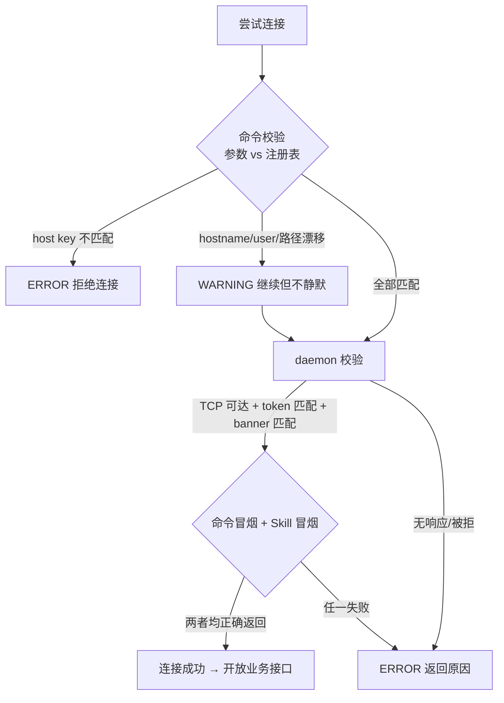
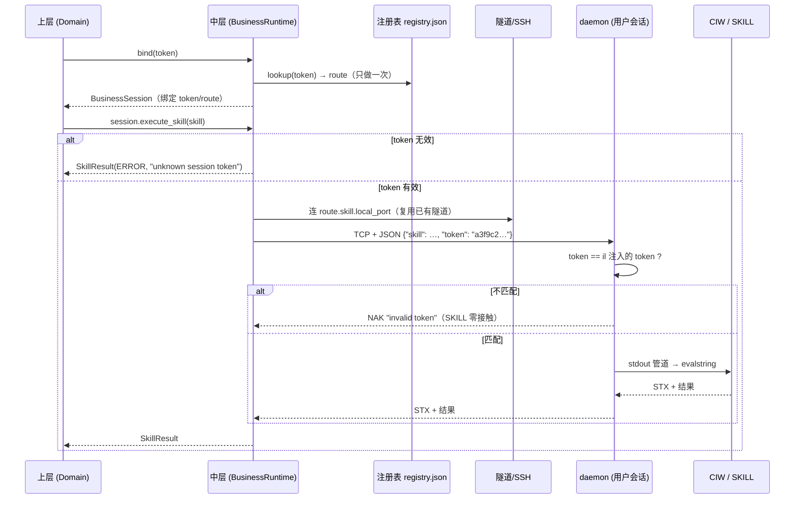

# 多用户设计（Token 寻址、目视确认授权与路由）

> 版本：Draft v1  
> 日期：2026-09-04  
> 状态：设计概念，作为多用户重构的提案基线；实现前允许通过评审修改。  
> 关联：[v1 三层架构](../v1-architecture.md)、[接口契约](../protocol-v1.md)、[Spec 索引](../README.md)

## 1. 目标

把一个**单连接点对点桥接**演进为**多用户接入架构**：

- 每个用户拥有独立的 resident daemon、独立监听端口、独立 SSH 通道；
- 所有会话共存于同一套 bridge 部署与同一网络连接设施之上；
- 上层在建立 `BusinessSession` 时向中层提供一次 **token**，中层根据 token **自动路由**到对应用户的执行端点；后续操作使用已绑定 session，不重复传 token；
- **上层完全无感**：上层代码不接触 host、端口、profile、SSH、tunnel，只看得到"一个业务服务器"。

**量化验收标准**：

> **N 个用户 = N 个命令通道 + N 个 Skill 通道**。例如 6 个用户，上层看到的就是 6 个 `BusinessRuntime` 对象（= 6 个业务服务器），每个背后有一条独立的命令通道（SSH 会话/channel）和一条独立的 Skill 通道（本地端口 → 隧道 → daemon → CIW 会话）。跨用户并行互不阻塞；同账号场景下是桥层通道隔离（命令流不串、返回不混、文件按 client_id 分段），OS 级权限分离由 IT 提供 Unix 账号保证，不在桥的职责内。

核心原则一句话：

> token 是寻址键与授权票；中层是路由器；**授权由用户 load 时目视确认**（SSH 侧按标准公钥注册）；上层只知道"我要执行操作"，不知道"操作发生在哪里、经哪条通道"。

---

## 2. 现状与问题

| 现状机制 | 承担的角色 | 多用户下的缺口 |
|---|---|---|
| `profile`（`VB_*_<profile>` 后缀） | 按名字区分多套连接配置 | 配置写在 `.env`，路由靠**环境变量全局状态**；上层若按 profile 分支即违反分层 |
| `client_id` | 隔离"同一远端用户从多台本地机器连" | 只隔离**部署目录**，不隔离**会话路由**；无寻址语义 |
| `state.json`（每 profile 一份） | 记录端口/隧道/setup 路径 | 已是事实上的注册表雏形，但没有 token 键，也没有统一查询入口 |
| `daemon_guard` | 事后校验"连没连错" | 每次新建客户端都要发一条 SKILL 查证；拦截点太晚（已接触错误会话） |
| 端口分配（用户名哈希） | 远端 daemon 端口去冲突 | 哈希碰撞靠人工改 `VB_REMOTE_PORT`；多用户规模化后不可持续 |

本设计把上述机制**统一收拢**为四步使用流程：**①注册（自动探测）→ ②部署（token 注入 il）→ ③用户手动 load（目视确认授权）→ ④尝试连接（校验+冒烟，通过后开放业务接口）**。

---

## 3. 核心概念

### 3.1 Token

- 形式：`uuid4().hex`（32 字符），或用户手动注册时提供的字符串（如 `alice-prod`）。
- 语义：**一个会话租约的寻址键与授权票**，绑定三元组「daemon 主机 + daemon 端口 + CIW 会话」。
- 生命周期：
  - 本地生成（自动或手动指定）——**生成 ≠ 授权**，只是拿到一张票；
  - **一次生成终生有效，不轮换、不过期**——像账号密码一样，`restart`/重新部署/重建隧道均保留原 token；
  - 仅当**删除用户并重新注册**时才更换 token（相当于注销旧账号、新建账号）。
- **生成与授权分离（目视确认）**：
  - token 由**客户端本地生成**，写入注册表（客户端侧索引，无副作用）；
  - **授权是用户目视确认动作**：token 在投送（部署）时自动写入生成的 il 文件；用户在 CIW 里 `load` 时，il 打印 token，**用户目视确认与客户端持有的 token 一致**——确认即授权（见 3.5）。
- 存放位置（闭环）：
  1. **生成的 il 文件** —— 投送时自动写入 token（`setShellEnvVar`/il 内常量），CIW load 时打印供目视确认，daemon 经环境继承；
  2. daemon 进程 —— 持有 token，比对来访请求；
  3. **注册表** —— 客户端本地持久化，记录 token→路由的期望与 token 明文。

### 3.2 用户注册（注册流程）

**非必须**：已有账号则直接复用，无需重复注册。

```bash
# 远程模式：指定 SSH 主机/用户（daemon 主机缺省与 SSH 主机相同）
virtuoso-bridge user register alice \
    --ssh-host server-a --ssh-user jtliu \
    [--daemon-host compute-host-b] [--daemon-user jtliu] \
    [--daemon-port 65081] [--local-port 65082] \
    [--token "alice-prod"] [--scratch-root /home/jtliu/.vb] \
    [--jump-host jump-a] [--jump-user jtliu]

# 本地模式：--local（或 --daemon-host localhost），无任何 SSH 参数
virtuoso-bridge user register alice --local \
    [--daemon-port 65432] [--token "alice-local"]
```

**模式判定**：显式 `--local`，或 `--daemon-host` 为 `localhost`/`127.0.0.1`/`::1`，或全部远程主机参数缺省时，为本地模式。模式决定参数必选性与探测方式。

#### 注册参数表（按模式）

| 参数 | 远程必选 | 本地模式 | 说明 |
|---|---|---|---|
| 用户名 | 是 | 是 | 仅作人类可读 id（`alice`），无路由/安全语义 |
| 目标 SSH 主机 | 是 | **不需要** | 命令/文件通道的主机（v1 等同 deploy/command host） |
| 目标 SSH user | 是 | **不需要** | SSH 登录账号；也是部署目录的用户段 |
| 目标 daemon 主机 | 否（缺省同 SSH 主机） | 不需要（隐含 `localhost`） | Skill 通道 daemon 监听的主机；split-host 下与 SSH 主机不同 |
| 目标 daemon user | 否（缺省同 SSH user） | **不需要**（隐含当前本地账号） | daemon 进程应运行的 Unix 用户（期望值） |
| daemon 端口 | 否 | 否 | 监听端口（缺省按用户名哈希，注册表分配） |
| 本地端口 | 否 | **不适用** | 仅远程模式：隧道本地端口（缺省同远端） |
| token | 否 | 否 | 缺省自动生成；手动指定用于团队约定/跨机迁移 |
| 目标文件安放地址（scratch root） | 否（不推荐） | 否 | 部署根；本地模式缺省为 bridge 本地 state 目录（现有 `ensure_local_setup` 行为） |
| 跳板主机/用户 | 否 | **不需要** | 需要 `-J` 时提供 |

> **没有 profile 参数**：旧架构的 profile（`VB_*_<profile>` 后缀）使命是"给配置集合起名"，注册表 + token 已把它取代；人类可读标签由用户名（`alice`）承担。profile 仅存在于迁移兼容语境（见 5.1），不参与任何路由/安全决策。

#### 补充的关键参数（注册时自动探测固化，不接受手工输入）

| 参数 | 远程模式获取方式 | 本地模式 | 为什么关键 |
|---|---|---|---|
| **SSH host key 指纹** | 注册时执行一次 SSH 握手，从 `known_hosts`/首连指纹中提取并固化 | **不适用**（无 SSH 通道，由 token 承担全部身份职责） | 防机器漂移/别名重定向/中间人，不再依赖 TOFU 式的"首连按 yes" |
| **daemon 端点期望主机名** | SSH 通道 `hostname -f` 探测 | 本地 `socket.gethostname()` | 连接时比对的基准（banner 漂移可被发现） |
| **python 版本/路径** | SSH 探测 `python3 --version` 等 | 本机 `sys.executable` | 部署时选对 daemon 文件（_3/_27）与解释器 |
| **部署根可见性标记** | 对 daemon/GUI 主机分别 `test -r`/`test -w` | 本机文件系统检查 | 注册时就发现 split-host 路径不可见，而不是部署到一半报错 |
| **daemon 端口占用状态** | 远端 `ss -tln` / bind 探测 | 本机 socket bind 探测 | 注册时拒绝已占用端口，避免哈希碰撞靠人工排查 |

#### 注册探测（部署前可验证项）

注册阶段的探测**不涉及 daemon 运行态**——此时 daemon 尚未部署、更未启动，能验证的只有"这些参数在部署前是否成立"（注册表能不能通）。daemon 的完整校验（是否监听、banner 是否匹配、token 是否已授权）全部属于尝试连接的 daemon 校验阶段（见 3.2.1）。任何一项失败即返回原因、不写入注册表。探测项按模式分叉：

```text
远程模式:
1. SSH 连通性 + 账号身份:  BatchMode 握手 → 拿 host key 指纹 + whoami
2. 主机名:                hostname -f → 固化 daemon 端点期望主机名
3. 端口空闲:              远端 daemon 端口是否被占用（部署前可查；是否真有 daemon 在监听 → 尝试连接的 daemon 校验）
4. 部署根:                mkdir + test -w（对 daemon/GUI 主机分别检查）
5. python:                探测解释器版本（决定 daemon 文件选型）
6. daemon user 存在性:     该 Unix 账号是否存在（id <user>；其运行态身份 → 尝试连接的 daemon 校验）

本地模式:
1. （无 SSH 探测项——host key 不适用，身份由 token 承担）
2. 主机名:                socket.gethostname() → 固化期望主机名
3. 端口空闲:              本机 bind 探测 daemon 端口
4. 部署根:                本地 state 目录 mkdir + 可写检查
5. python:                sys.executable 直接固化
6. （无 daemon user 探测项——隐含当前本地账号）
```

**注册成功**：返回 token + 将完整注册条目（含探测固化的指纹/主机名）**落盘到注册表**。注册只证明"参数能通、可部署"；daemon 是否在跑、token 是否目视确认、banner 是否匹配，均在尝试连接验收。授权在用户 load 时目视确认（见 3.5）。

**注册失败**：返回结构化原因（`ssh handshake failed: ...`、`daemon port 65081 already in use`、`scratch root not visible on GUI host`），注册表不产生任何条目。

### 3.2.1 尝试连接（两阶段）

尝试连接（四步流程第 ④ 步）是"对照注册表验收现实"的过程，分为**命令校验**与**daemon 校验**两阶段，**每阶段都拿注册时固化的期望值与当前实况比对**。**连接成功的最终标准是：全部校验通过，且命令通道与 Skill 通道都真实返回正确结果**（两条通道各自完成一次端到端冒烟）。



#### 阶段 1：命令校验（两种模式都做，探测手段不同）

逐项比对**注册表固化值 vs 当前实况**。远程模式走 SSH 通道；本地模式走本机执行（subprocess/socket），**校验项一致，只是"实测"的手段从 SSH 换成本地**：

| 校验项 | 远程模式实测 | 本地模式实测 | 不匹配处置 |
|---|---|---|---|
| host key 指纹 | 本次 SSH 握手 | **不适用**（无 SSH 通道；身份由阶段 2 token 承担） | 远程 **ERROR 拒绝**（"还是不是那台机器"的强断言） |
| 端点主机名 | SSH `hostname -f` | 本机 `socket.gethostname()` | WARNING（漂移可见可追踪） |
| 执行账号 | SSH `whoami` | 本机 `getpass.getuser()` | WARNING（账号别名/UID 差异） |
| 部署根可见性 | SSH `test -w` | 本机 `os.access` | ERROR（部署文件不可用） |
| **命令执行冒烟** | SSH 跑 `echo vb-ok` 并校验返回 | 本机 subprocess 跑 `echo vb-ok` 并校验返回 | ERROR（命令通道不可用，后续 RunCommand 必失败） |

匹配全部通过 → 进入阶段 2；WARNING 类漂移**上报但不静默**（打印差异并继续），让运维变更可见可追踪。

#### 阶段 2：daemon 校验（Skill 通道；两种模式相同）

| 校验项 | 方式 | 不匹配处置 |
|---|---|---|
| TCP 可达 | 连注册的 daemon 端口（本地模式直连，远程模式经隧道） | 无响应/拒绝 → **ERROR**（提示 CIW 里 load setup） |
| token 授权 | daemon 比对 il 注入的 token（用户 load 时已目视确认） | NAK → **ERROR**（未授权，SKILL 零接触） |
| banner 主机名 | daemon banner `host=` vs 注册的期望主机名 | WARNING（banner 漂移可追踪） |
| daemon user | `getShellEnvVar("USER")` vs 期望 daemon user（本地模式 vs 本地账号） | WARNING（降级诊断，不再是安全校验） |
| **Skill 执行冒烟** | `execute_skill("1+1")` 必须返回 SUCCESS 且值为 `2` | ERROR（Skill 通道未真正打通：daemon 在跑但 SKILL 执行链异常） |

#### 连接成功标准

两阶段全部通过**且**命令冒烟与 Skill 冒烟均正确返回 → 连接成功（这是**本次连接的结果**，不落盘）。ERROR 类返回结构化原因，供上层决策（重试/提示用户 load/重新注册）。连接成功意味着：**命令通道可用 + Skill 通道可用 + 身份/位置校验通过**——三条缺一不可。

### 3.2.2 使用流程（四步）与"测试只在连接时一次"

**主流程（四步）**：

```text
① 注册（自动探测）   验证参数能通、可部署（部署前，无 daemon 运行态）
                    失败 → 返回原因，不落盘；成功 → 返回 token，落盘注册表
② 部署              上传（远程）/复制（本地） daemon、il、setup（含 token 注入）
                    失败 → 结构化错误（目录不可见/磁盘满/权限）
③ 用户手动 load     CIW 里 load setup → daemon 被 ipcBeginProcess 拉起
                    → CIW 打印 token，用户目视确认（授权完成）
④ 尝试连接          = 完整测试：命令校验（阶段 1）+ daemon 校验（阶段 2）+ 双通道冒烟
                    ├─ 全部通过 → 开放业务接口（BusinessRuntime 可用）
                    └─ 失败 → 结构化原因（重试 / 提示 load / 重新注册）
```

`load` 发生在部署之后、尝试连接之前——部署只是放文件，load 才拉起 daemon 并完成目视授权。

**业务接口不重复测试**：

| 时刻 | 发生什么 | 是否测试 |
|---|---|---|
| 尝试连接（④） | 两阶段校验 + 双通道冒烟 | ✅ 唯一一次完整测试 |
| 之后每次 `execute_skill` | 裸请求：JSON{skill, token} → daemon 比对 token → 执行 → 返回 | ❌ **零测试、零校验开销**，与现状的单请求路径完全一致 |
| 之后每次 `run_command` | 裸命令发到已建立的 SSH 会话/channel | ❌ 同上 |

连接建立后，中层只做**路由（内存映射）+ 转发**，冒烟结果只在建立时消费一次。测试成本 O(1) 摊销到全部业务调用。

**通道保活**：

| 通道 | 保活需求 | 策略 |
|---|---|---|
| Skill 通道（daemon） | daemon 是 CIW 的 `ipcBeginProcess` 子进程——**CIW 活着 daemon 就活着**，无空闲超时 | 不保活；每请求新建 TCP 连接（现状），连接失败时业务接口报错，由上层决定重连 |
| Skill 通道（SSH 隧道） | `ssh -N` 空闲会被网络设备/服务器掐断 | 隧道进程保活（`ServerAliveInterval`/paramiko keepalive）；隧道断 → 中层自动重建（现状已有端口自动重试机制） |
| 命令通道（persistent shell） | 空闲 shell 会被 sshd 超时断开 | 保活心跳 + **失效重连**：命令发出时发现 shell 死 → 透明重建后重发（只对幂等命令自动重发；非幂等命令返回"通道已重置"错误由上层决策） |

> **设计原则**：保活是**通道层的技术手段**，业务层无感。业务调用永远只看到"成功/失败"，通道死亡由中层自愈（重建隧道、重建 shell、重发幂等命令），自愈不了的（非幂等命令遇通道重置）以结构化错误返回。

### 3.2.3 并发模型（跨用户非阻塞，单通道串行）

**目标**：非阻塞式运行——**不同用户同时请求时并发执行**；单通道（一个 daemon / 一个 CIW 会话）内部串行是 Virtuoso 语义固有限制，不视为阻塞缺陷。

**并发/阻塞的边界**：

| 维度 | 行为 | 原因 | 是否需要额外机制 |
|---|---|---|---|
| **跨用户（N 通道之间）** | ✅ 完全并发 | 每个用户 = 独立 daemon **进程**（`ipcBeginProcess` 各自拉起）+ 独立 SSH 会话；进程级隔离由 OS 调度保证 | 不需要——天然并行 |
| **单用户单 daemon 内** | ⚠️ 串行排队 | CIW 的 `evalstring` 是同步执行，同一会话的 SKILL 必须排队（Virtuoso 单线程事件循环语义，不可改变） | 不该改——与语义一致 |
| **客户端 API** | 同步阻塞调用 | `execute_skill()` 发请求等响应 | 不需要改——并发由**调用方**实现 |

**客户端并发方式（上层如何同时挂多条命令）**：

```python
with ThreadPoolExecutor() as pool:
    futures = [
        pool.submit(rt_alice.execute_skill, "..."),   # 走 daemon_A，与 bob 并发
        pool.submit(rt_bob.execute_skill, "..."),     # 走 daemon_B，与 alice 并发
        pool.submit(rt_alice.execute_skill, "..."),   # 走 daemon_A，在 A 内排队
    ]
```

- 不同 user 的调用 → 并发（不同 TCP 连接、不同 daemon 进程、不同 SSH channel）；
- 同一 user 的调用 → 在其 daemon 内串行排队（`listen` 的 accept 队列自然排队，而非报错）。

**并发安全的中层要求（唯一需要维护的不变量）**：

| 资源 | 共享方式 | 要求 |
|---|---|---|
| 注册表 | 冷启动读一次后**只读共享** | 零锁、零拷贝；连接建立后不再访问 |
| session 连接对象（TCP socket / SSH channel / tunnel 引用） | **实例私有**，每 session 独立 | 禁止跨 session 共享连接对象 |
| 隧道进程（`ssh -N`） | 多用户共享一条隧道时，转发由 sshd/paramiko 多路复用 | 隧道层天然并发处理多连接，无需桥介入 |

**现有实现印证**：`cli_start` 已用 `ThreadPoolExecutor` 并行起多 profile 隧道；`paramiko_backend` 的多 session 设计即为此并发准备。多用户并发不需要新的基础设施，只需保持"无共享可变状态"。

**服务形态（上层封装为 server 时）**：

上层最终若封装为 HTTP/MCP 等服务，并发能力**结构性天生**——理由三条：负载 I/O-bound（等 daemon/SSH/文件，GIL 在等待期间释放）、请求模型天然无共享（每请求独立 token→session→socket）、并发规模处于线程模型舒适区（几十~几百用户）。但有两个**非天生**的补充要求：

| 补充 | 原因 | 设计去向 |
|---|---|---|
| **session 连接池** | `execute_skill` 每请求新建 TCP 到隧道端口是微秒级，但**SSH 握手是秒级**——若每请求重新起 SSH 连接，并发请求会排队等握手 | 连接生命周期与请求生命周期解耦：按 user 池化 session（隧道复用池 + 每 user 专属 channel），命中即用，未命中建立后入池 |
| **同 token 请求的排队/限流策略** | daemon 单线程 accept + 内核 TCP backlog 有限：同 user 高并发超限时新连接被内核 RST（报错）而非排队 | 上层限流（同 user 并发上限）或接受"连接被拒"错误并重试；排队是 TCP 语义，报错是超限语义，两者都要被上层显式处理 |

### 3.3 注册表（Registry，冷启动）

本地 state 目录下的 `registry.json`，**查询键是 user**：

```json
{
  "users": {
    "alice": {
      "token": "a3f9c2…",
      "mode": "remote",                  ← remote | local
      "route": {
        "skill":   { "local_port": 65082, "daemon_host": "compute-host-b", "daemon_port": 65081 },
        "command": { "host": "server-a", "user": "jtliu" },
        "file":    { "host": "server-a", "root": "/tmp/virtuoso_bridge_jtliu/90590/virtuoso_bridge" }
      },
      "expected": {
        "ssh_host_key_fingerprint": "SHA256:7aX…",      ← 注册时探测固化
        "daemon_endpoint_hostname": "compute-host-b",  ← 注册时探测固化
        "daemon_user": "jtliu",
        "remote_python": "python3"
      },
      "setup_path": "/tmp/virtuoso_bridge_jtliu/90590/virtuoso_bridge/virtuoso_setup.il",
      "identity_path": "/tmp/.../daemon_identity.txt",
      "registered_at": 1725...
    }
  }
}
```

- **查询键**：**user**（`alice`）——上层以 user 构造 runtime，中层按 user 取 token 与路由；
- **冷启动**：注册表只在**连接建立时**读一次（解析 route/expected → 固化到连接对象），之后中层**不频繁查注册表**；探测完成后，中层关注的只有"哪个 token 发到哪个端口、哪个 SSH"——即**内存中的 token→端口/SSH 映射**，注册表仅是这份映射的冷启动源；
- **注册时机**：`user register`（注册即探测，见 3.2）；
- **不维护运行态字段**：注册表**没有** `status`/`authorized` 字段——每次连接都执行两阶段完整探测与冒烟，运行态是连接时的实时结论，落盘快照只会过时误导；
- **注销时机**：仅在 `user remove` 删除用户时移除条目；`stop` 不改变注册表（条目与 token 永久保留）；
- 位置在**本地**（每台调用机一份），与现有 `state.json` 同构、可渐进合并。

### 3.4 路由

中层在三个端口（Skill / RunCommand / File）背后共享同一个路由决策。**注册表只在连接建立时读一次**，之后路由靠连接对象内存中的映射（token → 端口/SSH）：

```text
user ──(冷启动)──► registry lookup ──► route 条目 + token（固化进连接对象）
                                           ├─ Skill  → daemon endpoint（本地 TCP 或隧道端口）
                                           ├─ RunCommand → command host（local subprocess 或 SSH）
                                           └─ File → file host（local copy 或 SCP/tar/Paramiko）

连接建立后：内存映射 token→端口/SSH，不再查注册表
```

- 路由表**只在中层内部可见**，上层拿不到；
- 同一条 SSH 连接上可以挂多条端口转发（多用户隧道复用池），中层对每条 Skill 流选择正确的本地端口；
- 找不到 user、目标不可达 → 结构化错误返回，不猜测、不回退。

### 3.5 授权安置（目视确认 + 标准公钥注册）

**核心原则**：token 在**投送（部署）时自动写入 il 文件**；用户在 CIW 里 `load` 时，il 打印 token，**用户目视确认与客户端持有的一致**——确认即授权。部署可以自动化；目视确认是人工、需要操作 CIW 的明确动作，出错责任清晰归人。

**daemon 侧**：

```text
部署时自动把 token 写入生成的 il（setShellEnvVar 注入）
  ↓
用户 CIW> load(".../virtuoso_setup.il")
  ↓
CIW 打印: [RAMIC] token=a3f9c2…   ← 每次 load 都打印
  ↓
用户目视比对客户端注册表持有的 token
  ↓
一致 → 授权完成；不一致 → 用户立即 RBStop() 并重新注册
```

**打印策略（已明确）**：**每次 `load` 都打印 token**，不做"仅首次"限制——用户每次重载都能当场目视确认，一致才继续使用。

**SSH 侧**：按照标准 SSH 公钥注册流程（`ssh-copy-id` 语义），将客户端公钥注册到目标机器 `~/.ssh/authorized_keys`——不做任何自定义扩展。

**daemon 侧校验**：持有 il 注入的 token，比对来访请求：匹配 → 执行 SKILL；不匹配 → NAK，SKILL 零接触。

---

## 4. 数据流

### 4.1 上层调用形态（完全无感）

```python
# canonical：上层提供 opaque token，得到一个绑定 session
rt = middle.bind("a3f9c2…")

rt.execute_skill("1+2")          # token 由中层自动注入 daemon request
rt.run_command("spectre …")      # 中层使用该 session 的 command route
rt.upload_file(local, server)    # 中层使用该 session 的 file route

# 可选 convenience：user 只是中层 registry 的人类可读索引
rt = middle.bind_user("alice")   # 内部等价于 lookup user → bind(token)
```

上层 MUST NOT 接触：`profile`、端口、host、`SSHClient`、`state.json`、`VB_*`。
换用户 = 换 user 参数，其余代码零改动。

### 4.2 请求链路（Skill 流示例）



### 4.3 三类流的路由差异

| 流 | token 的作用 | 说明 |
|---|---|---|
| Skill | daemon 侧**比对授权文件** + 选隧道端口 | 不在授权文件 → 直接 NAK，SKILL 层完全不知道这次请求 |
| RunCommand | 仅**寻址**（选 command host），无安全校验 | 信任 SSH host key + 账号权限边界（见 5.5） |
| File | 仅**寻址**（选 file host + 根目录），无安全校验 | 同上 |

---

## 5. 各层改造

### 5.1 上层

- 新增 `middle.bind(token)` / `BusinessSession`（canonical）；`bind_user(user)` 只能作为 registry convenience，不是安全凭证；
- 所有领域服务（schematic/layout/maestro/spectre…）只注入 runtime，不注入 host；
- 迁移期兼容：现有 `from_env(profile=…)` 等价于"从注册表取该 profile 对应的旧配置再路由"的语法糖，仅用于旧 `.env` 时代脚本的过渡；新代码一律用 user（或 token）。

### 5.2 中层

- 新增 `registry.py`：注册/注销/查询，**user 为键**；**冷启动只读**——连接建立时读一次，解析 route/expected/token 固化进连接对象内存，之后不频繁查（见 3.3）；token 不可变，只有整条注册记录可增删；
- 新增 `register.py`：**注册探测**六项（SSH 握手取指纹、hostname、端口空闲、部署根可见性、python 版本、daemon user 存在性）——只验部署前可验证项，任一失败返回原因、不落盘；
- 新增 `connect.py`：**尝试连接两阶段**（命令校验 → daemon 校验），逐项比对注册表 `expected` 与实况；host key 指纹与 TCP/token 失败为 ERROR，hostname/user/banner 漂移为 WARNING；**连接成功以命令冒烟（echo vb-ok）与 Skill 冒烟（1+1==2）双通为准**；部署归 `deploy.py`（四步流程第 ② 步），不属尝试连接；
- `business_server.py` 在构造时解析 token → 固化 route 条目（一次查询，全程无感）；
- 端口分配从"用户名哈希"升级为**注册表分配**：新注册时取未被占用的端口（注册探测含远端占用检查），冲突显式报错；
- 隧道复用池：同一远端 host 多会话共享 SSH 连接、多条 `-L` 转发（复用现有 `SSHRunner` 多会话与 `paramiko_backend` 基础）；
- **命令执行隔离（多用户各自独立命令行）**：不同 user 的命令执行**必须各自独立**——同一 host 多用户可共享 SSH transport，但每人独立 exec channel；**禁止多用户共用同一 persistent shell**（单会话 stdin/stdout 串命令）；同一 user 的多连接可复用其专属 channel；",
- **部署流水线注入 token**：`ensure_remote_setup()` 生成 il 时自动写入 token（`setShellEnvVar` 注入 + load 时打印）；token 的安全边界是"用户 load 时目视确认"（见 3.5），部署出错的最坏后果是"连不上"，绝不产生"静默串线"；
- 部署目录权限收紧为 `chmod 700`（保护 daemon 代码与 identity 文件）。

### 5.3 底层（daemon）

- 持有 il 注入的 token（部署时写入，load 时目视确认），**无 token 注入的 il 视为旧版，双轨期放行**；
- 中层到 daemon.py 的 request JSON 增加 `token` 字段；daemon.py 在**写 stdout 管道之前**校验：
  - 匹配 → 正常转发 SKILL；
  - 不匹配 → 直接回 `\x15invalid token…`，SKILL 零接触；
- banner 不打印 token 内容（token 只在 `load` 时由 il 打印，每次 load 都打印供目视确认）；
- 性能：校验为亚微秒级（单字符串比较），占典型请求时长 10⁻⁵ ~ 10⁻⁴，可忽略；错误请求因提前 NAK 反而更快。

### 5.4 guard 角色转变

| 机制 | 多用户架构下的去向 |
|---|---|
| `check_daemon_user` | **降级为诊断**：status 里展示 daemon 用户身份；token 缺失时的 fallback 校验 |
| `check_daemon_host` | **降级为诊断**：建连时打印/比对主机名，帮用户发现配置写错；不再是安全校验 |
| `VB_ALLOW_CROSS_USER_DAEMON` | 语义改为"忽略 token 不匹配"的显式豁免（降级兼容） |

### 5.5 双通道防护分工（token 只用于 Skill 通道）

**核心结论**：对称 token 只服务于 **Skill 通道**；**SSH 通道不引入 token**。两个核心安全问题（"Skill 跑在正确位置"、"命令跑在正确位置"）的答案**同构**——都是"凭证由用户确认、执行端比对"：

| 身份维度 | Skill 通道（裸 TCP，机制要自建） | 命令通道（SSH 固有，早已建好） |
|---|---|---|
| 机器身份（是不是那台机器） | token 经 il 注入 daemon | host key ↔ 本地 `~/.ssh/known_hosts` |
| 账号身份（以谁的身份执行） | token 即会话身份 | 私钥 ↔ 目标机 `~/.ssh/authorized_keys` |
| 确认动作 | 用户 load 时目视确认 token | 用户标准公钥注册（ssh-copy-id 语义） |

**桥对命令通道的唯一责任**：不破坏 SSH 固有保证（禁用 `StrictHostKeyChecking=no` 之类）+ 加一层诊断抓配置笔误。命令通道的"错连"分两类：

- **网络层错连（中间人/DNS 劫持）**：host key 验证杜绝；
- **配置层错连（`VB_REMOTE_HOST` 打错字、split-host 角色配错）**：SSH 忠诚地到达错误的合法主机——这是用户意图错误，不是通道漏洞（与"token 目视确认放行到错误主机"同类，协议无法纠正错误意图）；靠 `hostname -f` 诊断在首次建连时暴露。

**Skill 通道连错主机的三种子场景**（token 比对后的残余风险）：

| 子场景 | token 比对结果 | 处置 |
|---|---|---|
| A. 隧道转到错误主机，其上无 daemon | 不出场（TCP 被拒） | **诊断**：建连失败提示 + `hostname -f` 比对注册表，帮用户定位配错 |
| B. 错误主机上有他人 daemon | ✅ NAK（对方 daemon 的 token 与我不匹配），SKILL 零接触 | 拦截完成 |
| C. 错误主机上也注入了同 token（同一部署被多个 CIW load） | 匹配通过 | ⚠️ 目视确认时用户可能未察觉多会话 load；默认禁止一 token 多主机（注册表记录唯一 daemon host） |

**保留的轻量诊断**（非安全校验）：

1. **注册表固化端点主机名与 host key 指纹**：注册时探测写入 `expected`（见 3.2）；
2. **建连时比对**：尝试连接的命令校验阶段逐项比对（host key 不匹配拒绝、hostname 漂移 warning），而非静默重试；
3. **NAK 携带位置证据**（可选协议扩展）：拒绝时返回 `\x15invalid token (host=<实际主机>)`，让"被拒"升级为"知道落到了哪台错机器"。

---

## 6. 边界与安全权衡
### 6.0 为什么比原来更强（新流程 vs 旧机制）

| 维度 | 旧机制 | 新流程 | 提升点 |
|---|---|---|---|
| SSH 机器身份 | known_hosts TOFU（首连警告，用户乱按 yes 即失效） | 注册时**主动探测并固化 host key 指纹**，连接时比对，不匹配直接拒绝 | 机器漂移/别名重定向/中间人从"靠人眼"变为"强断言" |
| Skill 会话身份 | 连上后发 `getShellEnvVar("USER")` 查证 | daemon 层 token 比对，NAK 时 SKILL 零接触 | 拦截点从"已接触错误会话"提前到"错误会话不可见" |
| 配置完整性 | `.env` 散落多文件，值可互相矛盾 | 注册时**一次性固化全部目标参数**，尝试连接两阶段逐项比对 | 参数漂移从"运行时神秘失败"变为"结构化 ERROR/WARNING" |
| 失败可诊断性 | 连接失败只有笼统的 Connection refused | 六项注册探测 + 两阶段连接校验，每项有独立原因 | 用户不用猜"哪里没对上" |
| 端口冲突 | 用户名哈希碰撞靠人工改 `VB_REMOTE_PORT` | 注册探测远端占用，注册表分配 | 冲突在注册时就拒绝 |
| split-host 路径 | 部署到一半才报"文件不可见" | 注册时对 daemon/GUI 主机分别 `test -r`/`test -w` | 可见性问题在注册时暴露 |
| 错误分级 | 失败/成功二元 | ERROR（拒绝）与 WARNING（漂移继续但不静默）分级 | 运维变更可见可追踪，不误伤合法变更 |


| 问题 | 结论 |
|---|---|
| 一个 daemon 一个 CIW 会话 | **硬约束**。Virtuoso 的 SKILL 执行是单会话语义，token 不能合并会话；多用户 = 多 daemon = 多端口 = 多隧道 |
| token 防什么 | 防** Skill 通道误连**（连错会话/连到别人的 daemon）；部署被错误路由的后果上限是"拒绝服务"，不是"静默串线"；身份绑定与部署生命周期解耦（重新部署后旧客户端仍凭原 token 连到同一用户的会话） |
| token 不防什么 | **SSH 通道不需要 token**（host key + 账号权限边界已足够，见 5.5）；恶意攻击：同服务器用户若能读目标用户的部署目录，可看到 il 里的 token 明文并冒充。缓解：部署目录 `chmod 700` + banner 不重现 token（token 仅在 load 时打印）+ token 终生不变，泄漏后的恢复手段就是删除用户重新注册 |
| 路由表放本地还是远端 | **本地**。放远端需"先 SSH 读表再决定 SSH 什么"，绕且慢；本地与 state.json 同构，天然渐进 |
| 要不要时间戳/HMAC | 第一版**不要**（YAGNI）。token 即长期身份，删除用户重新注册即覆盖泄漏风险，未来若 daemon 脱离 SSH 隧道直连再评估 |

---

## 7. 迁移路径（分四阶段，可回滚）

| 阶段 | 内容 | 回滚性 |
|---|---|---|
| 1 双轨 | daemon 支持可选 token 比对（il 注入 token 才校验，旧版 il 放行）；部署生成 il 时写入 token 并打印；部署流程其余不变 | ✅ 新旧客户端共存 |
| 2 注册表 | `registry.json` 落地（user 为键，冷启动只读）；`user register`（含注册探测）+ 注册表 `expected` 固化；`BusinessRuntime.for_user()` 路由工厂 | ✅ |
| 3 连接流程 | 尝试连接两阶段（命令校验 → daemon 校验）＋部署步骤拆分；host key 指纹比对；端口注册表分配；token 终生固定 | ⚠️ 需一次性迁移 |
| 4 收紧 | daemon **强制** token 比对（旧版 il 不再放行）；部署目录 `chmod 700` | ⚠️ 需一次性迁移 |
| 5 清理 | 删除 guard 强制路径，保留诊断；`VB_ALLOW_CROSS_USER_DAEMON` 降级为兼容开关 | ✅ |

---

## 8. 协议最终口径

```text
上层 → 中层：bind(token)；之后 session.execute_skill/run_command/upload/download
中层 → daemon.py：TCP + JSON + EOF；每个 request 带 token/request_id/skill/timeout_ms
 daemon.py → ramic_bridge.il：一个物理行的 SKILL + LF；不带 token
 ramic_bridge.il → daemon.py：0x02 或 0x15 + %L payload + 0x1e
```

token 只在两处出现：上层建立中层 session 时，以及中层发给 daemon.py 时。它不进入 `ramic_bridge.il`，也不用于 `RunCommand`/`File` 的 SSH 认证；命令和文件由中层已经绑定的 route/channel 执行。

## 8. 与 v1 架构规范的关系

本设计是 [v1-architecture.md](../v1-architecture.md) 的**扩展而非替代**：

- 三层职责、三端口契约（Skill/RunCommand/File）、上层无感原则**全部不变**；具体字段与 framing 以 [protocol-v1.md](../protocol-v1.md) 为准；
- 本设计新增的是中层内部的身份与路由机制：**token 寻址 + il 注入 + 目视确认授权 + 注册表 + 隧道复用池 + daemon token 比对**；
- v1 "尚未决定事项"中的"是否引入正式认证/签名协议"由本文档初步回答：**引入对称 token 协议（il 注入 + 目视确认）**；非对称暂不引入（daemon 的 Python 2.7 环境无库支撑，且防误连需求对称已满足），留作未来选项。

## 9. 待评审问题

1. token 是否需要**读权限分级**（只读 token / 可写 token）？第一版建议单一 token；
2. 注册表是否允许多台调用机共享（网络共享目录）？第一版建议各机独立；
3. 手动 token 的命名/长度约束（当前建议 ≤64 字符、`[A-Za-z0-9._-]`）；
4. **token 取代 profile**（已明确）：profile 的全部旧职能（环境变量后缀/状态文件分离/部署目录叶子/venv 绑定）已由注册表 + token + 用户名取代；profile 仅保留为旧 `.env` 脚本的迁移兼容入口；
5. token 终生不变后，`stop` 保留注册、`user remove` 才销毁 token 的语义边界是否足够？
6. **多会话边界**：同一部署目录的 il 可被同一用户的多个 Virtuoso 会话 load——若用户希望"token A 只能控制会话 1"，是否需要按会话/端口分离部署？第一版建议一份部署一个 token；
7. **一个 token 多主机**：同一部署被多台机器 load 时 token 会在多主机生效；默认禁止（每 token 绑定注册表唯一 daemon host）还是允许（当作用户显式授权）？
8. **host key 指纹的更新时机**：机器重装后 host key 变更，连接阶段 2 会 ERROR——是否提供 `user re-register` / `user trust-host` 显式更新指纹？
9. **WARNING 的消费方**：阶段 2 的 hostname/user 漂移只上报 warning 并继续，上层是否需要可编程访问（如结果里带 `warnings` 列表）以便 CI 流程拒绝漂移？
10. **load 时打印 token**（已明确）：**每次 `load` 都打印 token**（不做仅首次限制），用户每次重载当场目视确认；是否在打印处同步标注"该 token 对应哪个用户名"以方便多用户混用（第一版建议仅打印 token 本身）；
