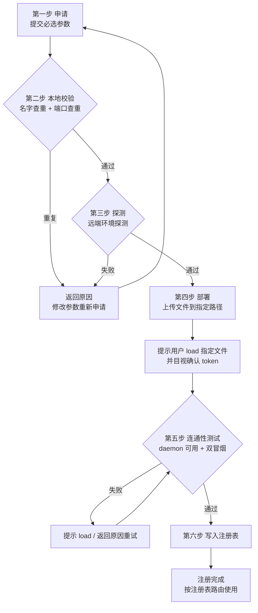
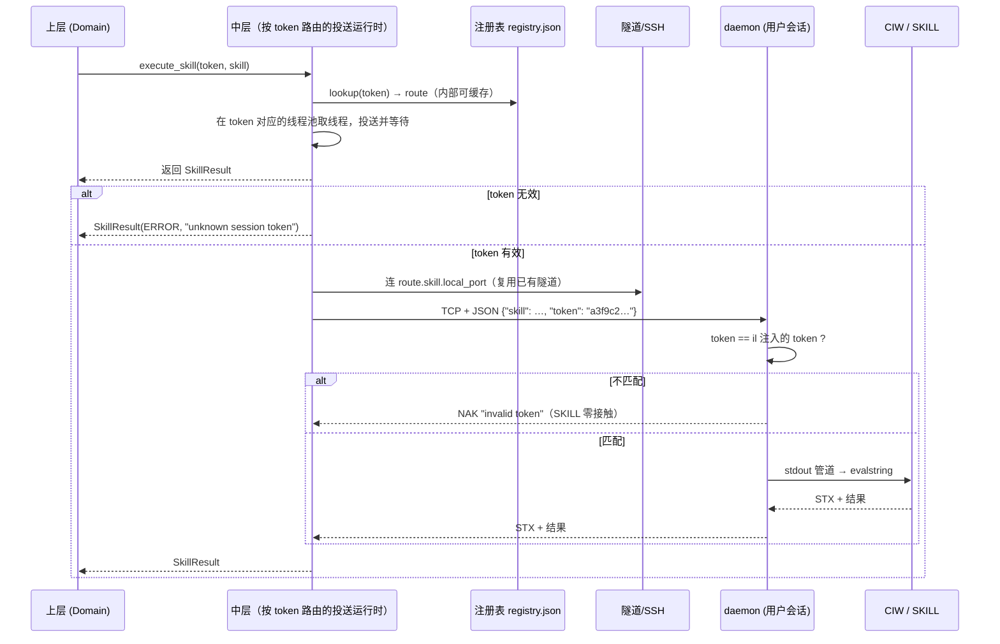

# 多用户设计（Token 寻址、目视确认授权与路由）

> 版本：Draft v1  
> 日期：2026-09-04  
> 状态：设计概念，作为多用户重构的提案基线；实现前允许通过评审修改。  
> 关联：[三层整体架构设计](../总览/三层整体架构设计.md)、[接口契约](../../protocol-v1.md)、[Spec 索引](../../README.md)

## 1. 目标

把一个**单连接点对点桥接**演进为**多用户接入架构**：

- 每个用户拥有独立的 resident daemon、独立监听端口、独立 SSH 通道；
- 所有会话共存于同一套 bridge 部署与同一网络连接设施之上；
- 上层每次调用向中层传入 **token 参数**，中层根据 token **自动路由**到对应用户的执行端点；token 是普通参数，不存在 `bind()` 绑定，也不要求上层维护 session 对象；
- **上层完全无感**：上层代码不接触 host、端口、profile、SSH、tunnel，只看得到"一个业务服务器"。

**量化验收标准**：

> **N 个用户 = N 个命令通道 + N 个 Skill 通道**。例如 6 个用户，上层看到的是 6 个业务服务器；中层按 token 参数路由到 6 个隔离域，每个背后有一条独立的命令通道（SSH 会话/channel）和一条独立的 Skill 通道（本地端口 → 隧道 → daemon → CIW 会话）。跨用户并行互不阻塞；同账号场景下是桥层通道隔离（命令流不串、返回不混、文件在各自用户自己的远端目录）；**token 是核心区分**，OS 级权限分离由 IT 提供 Unix 账号保证，不在桥的职责内。

核心原则一句话：

> token 是寻址键与授权票；中层是路由器；**授权由用户 load 时目视确认**（SSH 侧按标准公钥注册）；上层只知道"我要执行操作"，不知道"操作发生在哪里、经哪条通道"。

---

## 2. 现状与问题

| 现状机制 | 承担的角色 | 多用户下的缺口 |
|---|---|---|
| `profile`（`VB_*_<profile>` 后缀） | 按名字区分多套连接配置 | 配置写在 `.env`，路由靠**环境变量全局状态**；上层若按 profile 分支即违反分层 |
| `client_id` | 隔离"同一远端用户从多台本地机器连" | 遗留机制：改造后**删除**，远端目录按**用户名**子目录区分（`~/.virtuoso-bridge/<user>`），不再做客户端分段 |
| `state.json`（每 profile 一份） | 记录端口/隧道/setup 路径 | 已是事实上的注册表雏形，但没有 token 键，也没有统一查询入口 |
| `daemon_guard` | 事后校验"连没连错" | 每次新建客户端都要发一条 SKILL 查证；拦截点太晚（已接触错误会话） |
| 端口分配（用户名哈希） | 远端 daemon 端口去冲突 | 哈希碰撞靠人工改 `VB_REMOTE_PORT`；多用户规模化后不可持续 |

本设计把上述机制**统一收拢**为六步注册流程（详见 3.2）：**①申请 → ②本地校验 → ③探测 → ④部署 → ⑤连通性测试 → ⑥写入注册表**。注册完成后，使用中按注册表路由，**每用户一个独立 SSH**（详见 [并发处理设计](并发处理设计.md)）。

---

## 3. 核心概念

### 3.1 Token

- 形式：`uuid4().hex`（32 字符），或用户手动注册时提供的字符串（如 `alice-prod`）。
- 语义：**寻址键与授权票**，对应三元组「daemon 主机 + daemon 端口 + CIW 会话」；它是每次调用的参数，不是绑定会话对象。
- 生命周期：
  - 本地生成（自动或手动指定）——**生成 ≠ 授权**，只是拿到一张票；
  - **一次生成终生有效，不轮换、不过期**——像账号密码一样，`restart`/重新部署/重建隧道均保留原 token；
  - 仅当**删除用户并重新注册**时才更换 token（相当于注销旧账号、新建账号）。
- **生成与授权分离（目视确认）**：
  - token 由**客户端本地生成**，写入注册表（客户端侧索引，无副作用）；
  - **授权是用户目视确认动作**：token 在投送（部署）时自动写入生成的 il 文件；用户在 CIW 里 `load` 时，il 打印 token，**用户目视确认与客户端持有的 token 一致**——确认即授权（见 3.5）。
- **token 使用范围（已明确）**：token 只用于**路由与校验**（注册表路由、daemon 比对、Skill 请求）；**用户可读路径一律用唯一用户名**（如 `~/.virtuoso-bridge/<user>/`），token 太长太散，不再作为路径段。
- 存放位置（闭环）：
  1. **生成的 il 文件** —— 投送时自动把 token 写成 il 常量（或 daemon 启动参数），CIW load 时打印供目视确认，daemon 直接持有，不经 Virtuoso 进程环境；
  2. daemon 进程 —— 持有 token，比对来访请求；
  3. **注册表** —— 客户端本地持久化，记录 token→路由的期望与 token 明文。

### 3.2 用户注册（六步注册流程）

**非必须**：已有账号则直接复用，无需重复注册。

注册是一条**先验证、后落盘**的流水线：前五步任何一步失败，注册表都不产生条目；第六步是唯一写入点。参数细节见 [注册配置一览](注册配置一览.md)，此处聚焦流程本身。



#### 第一步：申请

用户发起注册请求，提交**必选参数**（用户名、目标主机、端口等）。本步只是"提出申请"，不产生任何副作用。token 在此时生成（自动或手动指定），随申请在流程内部传递，第六步才落盘。

> **参数清单**：完整参数表见 [注册配置一览](注册配置一览.md)——本文件只关注流程，参数细节不在此展开。

#### 第二步：注册表本地校验

**纯本地、无网络**。对申请做两项查重：

| 校验项 | 检查内容 | 失败处置 |
|---|---|---|
| 用户名查重 | `registry.json` 里是否已有同名 user | **回退第一步**，返回"user 已存在" |
| 端口查重 | daemon 端口、本地端口是否与已有条目冲突 | **回退第一步**，返回"端口已被占用" |

本步只挡**注册表内**的冲突；远端环境是否真的可用，由第三步探测。

#### 第三步：探测（远端环境探测）

**核心时序**：此时 daemon 尚未启动，但 SSH 已可达——本步只探测“不依赖 daemon 即可验证”的项目并**固化**。对用户未填写的参数，以探测结果为准；对用户**显式填写**的参数，做**可用性校验**，不可用必须报告“该参数有问题”（而不是静默替换）。

**通过 SSH 去远端验证环境**（本地模式则在本机执行等价检查）。探测清单：

| # | 探测项 | 验什么 |
|---|---|---|
| 1 | 端口能不能用 | 远端 daemon 端口是否空闲（bind/占用检查）——**部署前可查**；是否真有 daemon 在监听留到第五步 |
| 2 | 主机对不对 | SSH 握手取 host key 指纹（固化，供日后比对防机器漂移）+ `hostname -f` 与期望主机名比对 |
| 3 | 名字对不对 | `whoami` 验证登录账号、`id <daemon_user>` 验证 daemon 用户存在性 |
| 4 | 路径可不可写 | `mkdir -p` + `test -w` 部署根；split-host 下对 daemon/GUI 主机分别检查 |
| 5 | python 版本 | 探测 `python3 --version` 等，决定 daemon 文件选型（_3 / _27） |

任一失败 → **回退第一步**，返回结构化原因（如 `ssh handshake failed`、`daemon port 65081 already in use`、`scratch root not visible on GUI host`）。

#### 第四步：部署

探测通过 → 上传必要文件到指定路径：

```text
daemon 脚本（按探测到的 python 版本选 _3/_27）
ramic_bridge.il
生成的 virtuoso_setup.il（含 token 注入）
```

**完成后必须提示用户**：去 CIW 里 `load` 指定文件并启动 Virtuoso（load 会拉起 daemon，CIW 打印 token 供目视确认，见 3.5）。**部署结束 ≠ 注册完成**——daemon 起没起来、通道通不通，由第五步验收。

#### 第五步：连通性测试

**核心时序**：此时 daemon 已可用，把第三步“daemon 不可用期间无法完成”的校验全部补齐，完成全部探测/校准/确认后才允许进入第六步。

用户 load 之后，逐项验收：

| 校验项 | 方式 | 不匹配处置 |
|---|---|---|
| daemon 是否可用 | 连注册的 daemon 端口（本地直连 / 远程经隧道） | 无响应 → **ERROR**（提示 CIW 里 load setup） |
| token 比对 | daemon 校验 il 注入的 token | NAK → **ERROR**（未授权，SKILL 零接触） |
| banner 主机名 | daemon banner `host=` vs 注册的期望主机名 | WARNING（漂移可追踪） |
| **host key 指纹** | 当前 host key 与第三步固化值比对 | 不匹配 → **ERROR**（防机器漂移/中间人） |
| **命令冒烟** | SSH 跑 `echo vb-ok` 并校验返回 | ERROR（命令通道不可用） |
| **Skill 冒烟** | `execute_skill("1+1")` 必须 SUCCESS 且值为 `2` | ERROR（Skill 链未真正打通） |

失败 → 返回原因，**重试第五步**（提示 load / 重新部署）；通过 → 进入第六步。

#### 第六步：写入注册表

**前五步全部成功才落盘。** 写入完整注册条目（token、mode、route、expected 固化值，见 3.4）。从此该 user 进入"已注册"状态，使用中按注册表路由（见 3.3）。

> **不落盘原则**：第二~五步任何失败，注册表不产生任何条目——不会留下"半成品 user"污染后续注册与路由。

### 3.3 使用中的路由与并发（每用户一个 SSH）

**注册完成后，使用期的核心约定：每用户一个独立 SSH，按注册表路由。** 并发细节见 [并发处理设计](并发处理设计.md)，此处只列与路由相关的决策点。

```text
user ──(冷启动)──► registry lookup ──► route 条目 + token（固化进连接对象）
                                           ├─ Skill  → daemon endpoint（本地 TCP 或隧道端口）
                                           ├─ RunCommand → command host（该 user 自己的 SSH）
                                           └─ File → file host（该 user 自己的 SSH）

连接建立后：内存映射 user→token→端口/SSH，不再查注册表
```

- **每用户一个独立 SSH 连接**（+ 独立线程池 + 独立 channel 预算）——严禁跨 user 复用；两个 user 连同一台机器也是两条 SSH（详见并发处理设计 §11）；
- 路由表**只在中层内部可见**，上层拿不到；找不到 user、目标不可达 → 结构化错误返回，不猜测、不回退。

**业务接口不重复测试**：

| 时刻 | 发生什么 | 是否测试 |
|---|---|---|
| 注册第五步（连通性测试） | daemon 校验 + 双通道冒烟 | ✅ 唯一一次完整测试 |
| 之后每次 `execute_skill` | 中层发出 `{skill, timeout, token}` → daemon 比对 token → 执行 → 返回 | ❌ 零测试、零校验开销 |
| 之后每次 `run_command` | 裸命令发到该 user 的 SSH 会话/channel | ❌ 同上 |

**通道保活**：

| 通道 | 保活需求 | 策略 |
|---|---|---|
| Skill 通道（daemon） | daemon 是 CIW 的 `ipcBeginProcess` 子进程——**CIW 活着 daemon 就活着**，无空闲超时 | 不保活；每请求新建 TCP 连接（现状），连接失败时业务接口报错，由上层决定重连 |
| Skill 通道（SSH 隧道） | `ssh -N` 空闲会被网络设备/服务器掐断 | 隧道进程保活（`ServerAliveInterval`/paramiko keepalive）；隧道断 → 中层自动重建（现状已有端口自动重试机制） |
| 命令通道（persistent shell） | 空闲 shell 会被 sshd 超时断开 | 保活心跳 + **失效重连**：命令发出时发现 shell 死 → 透明重建后重发（只对幂等命令自动重发；非幂等命令返回"通道已重置"错误由上层决策） |

> **设计原则**：保活是**通道层的技术手段**，业务层无感。业务调用永远只看到"成功/失败"，通道死亡由中层自愈（重建隧道、重建 shell、重发幂等命令），自愈不了的（非幂等命令遇通道重置）以结构化错误返回。

### 3.4 注册表（Registry，冷启动）

- **查询键**：**user**（`alice`）——中层的用户便利入口可按 user 查找 token 与路由；canonical 上层入口仍是每次调用携带 token 参数；
- **字段组成**：token、mode、route（skill/command/file 三路）、expected（探测固化值）——**字段与示例见 [注册配置一览](注册配置一览.md)**，此处不重复；
- **冷启动**：注册表只在**连接建立时**读一次（解析 route/expected → 固化到连接对象），之后中层**不频繁查注册表**；探测完成后，中层关注的只有"哪个 token 发到哪个端口、哪个 SSH"——即**内存中的 token→端口/SSH 映射**，注册表仅是这份映射的冷启动源；
- **注册时机**：六步流程**第六步**（前五步全部成功才落盘，见 3.2）；
- **不维护运行态字段**：注册表**没有** `status`/`authorized` 字段——每次连接都执行完整探测与冒烟（注册第五步），运行态是连接时的实时结论，落盘快照只会过时误导；
- **注销时机**：仅在 `user remove` 删除用户时移除条目；`stop` 不改变注册表（条目与 token 永久保留）；
- 位置在**本地**（每台调用机一份），与现有 `state.json` 同构、可渐进合并。

### 3.5 授权安置（目视确认 + 标准公钥注册）

**核心原则**：token 在**投送（部署）时自动写入 il 文件**；用户在 CIW 里 `load` 时，il 打印 token，**用户目视确认与客户端持有的一致**——确认即授权。部署可以自动化；目视确认是人工、需要操作 CIW 的明确动作，出错责任清晰归人。

**daemon 侧**：

```text
部署时自动把 token 写成生成 il 的常量（不经 setShellEnvVar）
  ↓
用户 CIW> load(".../virtuoso_setup.il")
  ↓
CIW 打印: [RAMIC] token=a3f9c2…   ← 每次 load 都打印
  ↓
用户目视比对客户端注册表持有的 token
  ↓
一致 → 授权完成；不一致 → 用户立即 RBStop() 并重新注册
```

**打印策略（已明确）**：**每次 `load` 都打印 token**，不做"仅首次"限制——用户每次重载都能当场目视确认，一致才继续使用。

**SSH 侧**：按照标准 SSH 公钥注册流程（`ssh-copy-id` 语义），将客户端公钥注册到目标机器 `~/.ssh/authorized_keys`——不做任何自定义扩展。

**daemon 侧校验**：持有 il 注入的 token，比对来访请求：匹配 → 执行 SKILL；不匹配 → NAK，SKILL 零接触。

---

## 4. 数据流

### 4.1 上层调用形态（完全无感）

```python
# canonical：在现代码三接口上新增 token 参数（最小改动）
middle.execute_skill("1+2", token="a3f9c2…")
middle.run_command("spectre …", token="a3f9c2…")
middle.upload_file(local, server, token="a3f9c2…")
middle.download_file(server, local, token="a3f9c2…")

# 可选 convenience：user 只是中层 registry 的人类可读索引
# 中层内部按 user 查 token 后，仍以 token 参数执行同一接口
```

上层 MUST NOT 接触：`profile`、端口、host、`SSHClient`、`state.json`、`VB_*`。
换用户 = 换 token 参数，其余代码零改动。

### 4.2 请求链路（Skill 流示例）



### 4.3 三类流的路由差异

| 流 | token 的作用 | 说明 |
|---|---|---|
| Skill | daemon 侧**比对授权文件** + 选隧道端口 | 不在授权文件 → 直接 NAK，SKILL 层完全不知道这次请求 |
| RunCommand | 仅**寻址**（选 command host），无安全校验 | 信任 SSH host key + 账号权限边界（见 5.5） |
| File | 仅**寻址**（选 file host + 根目录），无安全校验 | 同上 |

---

## 5. 各层改造

### 5.1 上层

- 中层接口每次调用携带 `token` 参数（canonical）；不提供 `bind()`/session 对象；`user` 只能作为 registry 的人类可读索引，不是安全凭证；
- 所有领域服务（schematic/layout/maestro/spectre…）只注入 runtime，不注入 host；
- 迁移期兼容：现有 `from_env(profile=…)` 等价于"从注册表取该 profile 对应的旧配置再路由"的语法糖，仅用于旧 `.env` 时代脚本的过渡；新代码一律用 user（或 token）。

### 5.2 中层

- 新增 `registry.py`：注册/注销/查询，**user 为键**；**冷启动只读**——连接建立时读一次，解析 route/expected/token 固化进连接对象内存，之后不频繁查（见 3.3）；token 不可变，只有整条注册记录可增删；
- 新增 `register.py`：**第三步探测**（SSH 握手取指纹、hostname、端口空闲、部署根可见性、python 版本、daemon user 存在性）——只验部署前可验证项，任一失败返回原因、不落盘；
- 新增 `connect.py`：**连通性测试**（六步流程第五步，命令校验 → daemon 校验），逐项比对注册表 `expected` 与实况；host key 指纹与 TCP/token 失败为 ERROR，hostname/user/banner 漂移为 WARNING；**测试通过以命令冒烟（echo vb-ok）与 Skill 冒烟（1+1==2）双通为准**；部署归 `deploy.py`（六步流程第四步），不属连通性测试；
- 中层每次调用按 token 查 route；内部可缓存查询结果，但上层每次仍以参数携带 token，不持有绑定对象；
- 端口分配从"用户名哈希"升级为**注册表分配**：新注册时取未被占用的端口（第三步探测含远端占用检查），冲突显式报错；
- 隧道复用池：**每 token 独立 SSH 连接**，token 内部复用 channel（隧道、命令、文件），复用现有 `SSHRunner` 多会话与 `paramiko_backend` 基础；
- **命令执行隔离（多用户各自独立命令行）**：不同 token 的命令执行**必须各自独立**——每 token 独立 SSH 连接和 exec channel；**禁止跨 token 共用 SSH 连接或 persistent shell**（单会话 stdin/stdout 串命令）；同一 token 的多连接可复用其专属 channel；
- **部署流水线注入 token**：`ensure_remote_setup()` 生成 il 时自动写入 token（il 常量注入 + load 时打印）；token 的安全边界是"用户 load 时目视确认"（见 3.5），部署出错的最坏后果是"连不上"，绝不产生"静默串线"；
- 部署目录权限收紧为 `chmod 700`（保护 daemon 代码与 identity 文件）。

### 5.3 底层（daemon）

- 持有 il 注入的 token（部署时写入，load 时目视确认），**无 token 注入的 il 视为旧版，双轨期放行**；
- 中层到 daemon.py 的 request JSON 增加 `token` 字段；daemon.py 在**写 stdout 管道之前**校验：
  - 匹配 → 正常转发 SKILL；
  - 不匹配 → 直接回 `\x15invalid token…`，SKILL 零接触；
- banner 不打印 token 内容（token 只在 `load` 时由 il 打印，每次 load 都打印供目视确认）；
- 性能：校验为亚微秒级（单字符串比较），占典型请求时长 10⁻⁵ ~ 10⁻⁴，可忽略；错误请求因提前 NAK 反而更快。

### 5.4 guard 角色转变

| 机制 | 多用户架构下的去向 |
|---|---|
| `check_daemon_user` | **降级为诊断**：status 里展示 daemon 用户身份；token 缺失时的 fallback 校验 |
| `check_daemon_host` | **降级为诊断**：建连时打印/比对主机名，帮用户发现配置写错；不再是安全校验 |
| `VB_ALLOW_CROSS_USER_DAEMON` | 语义改为"忽略 token 不匹配"的显式豁免（降级兼容） |

### 5.5 双通道防护分工（token 只用于 Skill 通道）

**核心结论**：对称 token 只服务于 **Skill 通道**；**SSH 通道不引入 token**。两个核心安全问题（"Skill 跑在正确位置"、"命令跑在正确位置"）的答案**同构**——都是"凭证由用户确认、执行端比对"：

| 身份维度 | Skill 通道（裸 TCP，机制要自建） | 命令通道（SSH 固有，早已建好） |
|---|---|---|
| 机器身份（是不是那台机器） | token 经 il 注入 daemon | host key ↔ 本地 `~/.ssh/known_hosts` |
| 账号身份（以谁的身份执行） | token 即路由/授权身份 | 私钥 ↔ 目标机 `~/.ssh/authorized_keys` |
| 确认动作 | 用户 load 时目视确认 token | 用户标准公钥注册（ssh-copy-id 语义） |

**桥对命令通道的唯一责任**：不破坏 SSH 固有保证（禁用 `StrictHostKeyChecking=no` 之类）+ 加一层诊断抓配置笔误。命令通道的"错连"分两类：

- **网络层错连（中间人/DNS 劫持）**：host key 验证杜绝；
- **配置层错连（`VB_REMOTE_HOST` 打错字、split-host 角色配错）**：SSH 忠诚地到达错误的合法主机——这是用户意图错误，不是通道漏洞（与"token 目视确认放行到错误主机"同类，协议无法纠正错误意图）；靠 `hostname -f` 诊断在首次建连时暴露。

**Skill 通道连错主机的三种子场景**（token 比对后的残余风险）：

| 子场景 | token 比对结果 | 处置 |
|---|---|---|
| A. 隧道转到错误主机，其上无 daemon | 不出场（TCP 被拒） | **诊断**：建连失败提示 + `hostname -f` 比对注册表，帮用户定位配错 |
| B. 错误主机上有他人 daemon | ✅ NAK（对方 daemon 的 token 与我不匹配），SKILL 零接触 | 拦截完成 |
| C. 错误主机上也注入了同 token（同一部署被多个 CIW load） | 匹配通过 | ⚠️ 目视确认时用户可能未察觉多会话 load；默认禁止一 token 多主机（注册表记录唯一 daemon host） |

**保留的轻量诊断**（非安全校验）：

1. **注册表固化端点主机名与 host key 指纹**：注册时探测写入 `expected`（见 3.2）；
2. **建连时比对**：连通性测试的命令校验阶段逐项比对（host key 不匹配拒绝、hostname 漂移 warning），而非静默重试；
3. **NAK 携带位置证据**（可选协议扩展）：拒绝时返回 `\x15invalid token (host=<实际主机>)`，让"被拒"升级为"知道落到了哪台错机器"。

---

## 6. 边界与安全权衡
### 6.0 为什么比原来更强（新流程 vs 旧机制）

| 维度 | 旧机制 | 新流程 | 提升点 |
|---|---|---|---|
| SSH 机器身份 | known_hosts TOFU（首连警告，用户乱按 yes 即失效） | 注册时**主动探测并固化 host key 指纹**，连接时比对，不匹配直接拒绝 | 机器漂移/别名重定向/中间人从"靠人眼"变为"强断言" |
| Skill 会话身份 | 连上后发 `getShellEnvVar("USER")` 查证 | daemon 层 token 比对，NAK 时 SKILL 零接触 | 拦截点从"已接触错误会话"提前到"错误会话不可见" |
| 配置完整性 | `.env` 散落多文件，值可互相矛盾 | 注册时**一次性固化全部目标参数**，连通性测试逐项比对 | 参数漂移从"运行时神秘失败"变为"结构化 ERROR/WARNING" |
| 失败可诊断性 | 连接失败只有笼统的 Connection refused | 第三步探测 + 连通性测试，每项有独立原因 | 用户不用猜"哪里没对上" |
| 端口冲突 | 用户名哈希碰撞靠人工改 `VB_REMOTE_PORT` | 第三步探测远端占用，注册表分配 | 冲突在注册时就拒绝 |
| split-host 路径 | 部署到一半才报"文件不可见" | 注册时对 daemon/GUI 主机分别 `test -r`/`test -w` | 可见性问题在注册时暴露 |
| 错误分级 | 失败/成功二元 | ERROR（拒绝）与 WARNING（漂移继续但不静默）分级 | 运维变更可见可追踪，不误伤合法变更 |


| 问题 | 结论 |
|---|---|
| 一个 daemon 一个 CIW 会话 | **硬约束**。Virtuoso 的 SKILL 执行是单会话语义，token 不能合并会话；多用户 = 多 daemon = 多端口 = 多隧道 |
| token 防什么 | 防** Skill 通道误连**（连错会话/连到别人的 daemon）；部署被错误路由的后果上限是"拒绝服务"，不是"静默串线"；身份绑定与部署生命周期解耦（重新部署后旧客户端仍凭原 token 连到同一用户的会话） |
| token 不防什么 | **SSH 通道不需要 token**（host key + 账号权限边界已足够，见 5.5）；恶意攻击：同服务器用户若能读目标用户的部署目录，可看到 il 里的 token 明文并冒充。缓解：部署目录 `chmod 700` + banner 不重现 token（token 仅在 load 时打印）+ token 终生不变，泄漏后的恢复手段就是删除用户重新注册 |
| 路由表放本地还是远端 | **本地**。放远端需"先 SSH 读表再决定 SSH 什么"，绕且慢；本地与 state.json 同构，天然渐进 |
| 要不要时间戳/HMAC | 第一版**不要**（YAGNI）。token 即长期身份，删除用户重新注册即覆盖泄漏风险，未来若 daemon 脱离 SSH 隧道直连再评估 |

---

## 7. 迁移路径（分四阶段，可回滚）

| 阶段 | 内容 | 回滚性 |
|---|---|---|
| 1 双轨 | daemon 支持可选 token 比对（il 注入 token 才校验，旧版 il 放行）；部署生成 il 时写入 token 并打印；部署流程其余不变 | ✅ 新旧客户端共存 |
| 2 注册表 | `registry.json` 落地（user 为键，冷启动只读）；六步注册流程（申请 → 本地校验 → 探测 → 部署 → 连通性测试 → 写入注册表）+ 注册表 `expected` 固化；`middle.bind_user(user)` 便利入口 | ✅ |
| 3 连接流程 | 六步注册流程（申请 → 本地校验 → 探测 → 部署 → 连通性测试 → 写入注册表）；host key 指纹比对；端口注册表分配；token 终生固定 | ⚠️ 需一次性迁移 |
| 4 收紧 | daemon **强制** token 比对（旧版 il 不再放行）；部署目录 `chmod 700` | ⚠️ 需一次性迁移 |
| 5 清理 | 删除 guard 强制路径，保留诊断；`VB_ALLOW_CROSS_USER_DAEMON` 降级为兼容开关 | ✅ |

---

## 8. 协议最终口径

```text
上层 → 中层：每次调用带 token 参数；execute_skill/run_command/upload/download
中层 → daemon.py：TCP + JSON + EOF；request 为现代码 `{skill, timeout}` + 新增 `token`
 daemon.py → ramic_bridge.il：一个物理行的 SKILL + LF；不带 token
 ramic_bridge.il → daemon.py：0x02 或 0x15 + %L payload + 0x1e
```

token 在每次上层调用中作为参数出现，并由中层放入发给 daemon.py 的请求。它不进入 `ramic_bridge.il`，也不用于 `RunCommand`/`File` 的 SSH 认证；命令和文件由中层按该 token 对应的 route/channel 执行。

## 8. 与 v1 架构规范的关系

本设计是 [三层整体架构设计](../总览/三层整体架构设计.md) 的**扩展而非替代**：

- 三层职责、三端口契约（Skill/RunCommand/File）、上层无感原则**全部不变**；具体字段与 framing 以 [protocol-v1.md](../../protocol-v1.md) 为准；
- 本设计新增的是中层内部的身份与路由机制：**token 寻址 + il 注入 + 目视确认授权 + 注册表 + 隧道复用池 + daemon token 比对**；
- v1 "尚未决定事项"中的"是否引入正式认证/签名协议"由本文档初步回答：**引入对称 token 协议（il 注入 + 目视确认）**。当前 token 可视为**客户端侧公钥**；未来可扩展为 daemon 与客户端各自持有公私钥的非对称认证，**本版不做**（daemon 的 Python 2.7 环境无库支撑，且防误连需求对称已满足）。

## 9. 待评审问题

1. token 是否需要**读权限分级**（只读 token / 可写 token）？第一版建议单一 token；
2. 注册表是否允许多台调用机共享（网络共享目录）？第一版建议各机独立；
3. 手动 token 的命名/长度约束（当前建议 ≤64 字符、`[A-Za-z0-9._-]`）；
4. **token 取代 profile**（已明确）：profile 的全部旧职能（环境变量后缀/状态文件分离/部署目录叶子/venv 绑定）已由注册表 + token + 用户名取代；profile 仅保留为旧 `.env` 脚本的迁移兼容入口；
5. token 终生不变后，`stop` 保留注册、`user remove` 才销毁 token 的语义边界是否足够？
6. **多会话边界**：同一部署目录的 il 可被同一用户的多个 Virtuoso 会话 load——若用户希望"token A 只能控制会话 1"，是否需要按会话/端口分离部署？第一版建议一份部署一个 token；
7. **一个 token 多主机**：同一部署被多台机器 load 时 token 会在多主机生效；默认禁止（每 token 绑定注册表唯一 daemon host）还是允许（当作用户显式授权）？
8. **host key 指纹的更新时机**：机器重装后 host key 变更，连接阶段 2 会 ERROR——是否提供 `user re-register` / `user trust-host` 显式更新指纹？
9. **WARNING 的消费方**：阶段 2 的 hostname/user 漂移只上报 warning 并继续，上层是否需要可编程访问（如结果里带 `warnings` 列表）以便 CI 流程拒绝漂移？
10. **load 时打印 token**（已明确）：**每次 `load` 都打印 token**（不做仅首次限制），用户每次重载当场目视确认；是否在打印处同步标注"该 token 对应哪个用户名"以方便多用户混用（第一版建议仅打印 token 本身）；
