# 并发处理设计

> 版本：Draft v3
> 日期：2026-09-10
> 状态：已冻结
> 关联：[三层整体架构设计](../总览/三层整体架构设计.md)、[Spec 索引](../../README.md)
> 背景阅读：[并发与网络关键背景](../../research/05-concurrency-network-key-background.md)（SSH、端口转发、常驻/临时的入门讲解）

> 读者对象：有编程基础（嵌入式/单片机背景）但未系统学过 Python 网络编程的工程师。本文不假设 Python 语法知识，但假设读者理解进程、文件、管道等 OS 基础概念。

---

## 1. 结论先行

**问题**：不同用户同时发起请求时，能不能并发执行？谁先完成谁先返回？

**答案**：能，而且并发**不需要任何额外机制**。三个事实拼起来就是全部理由：

| # | 事实 | 后果 |
|---|---|---|
| 1 | 每个用户的 daemon 是**独立 OS 进程**（`ipcBeginProcess` 各自拉起） | 远端真并行——一个忙不阻塞另一个 |
| 2 | 请求线程进入 `recv()` 等待后**被内核挂起，不占 CPU、释放 GIL** | 一个 Python 进程同时"等"很多请求，代价≈0 |
| 3 | 负载 99.9% 是"等"（等 daemon、等 SSH、等文件），不是"算" | GIL 只串行计算，而计算只有微秒级 |

**唯一事实边界**：单个 daemon（= 单个 CIW 会话）串行——Virtuoso 语义，不可改也不应改。同用户并发请求在其 daemon 内排队。

---

## 2. 先破除三个误区

这三个误区是"并发到底怎么发生的"想不明白的根源。

### 误区一："一个请求需要一个进程/线程一直盯着"

**真相：等待不占任何资源。** 进程在 `recv()` 阻塞时被内核挂起，CPU 占用 = 0。所以**一个进程可以同时"等"很多请求**——它们全部挂在各自 socket 的内核接收队列上睡觉，谁的数据先到，内核先叫醒谁。

```text
"recv()" 不是"我盯着看数据来没来"，而是"我睡下了，数据来了叫我"。
——叫人这件事，是操作系统内核干的。
```

服务形态下"每请求一线程"不是为了并行计算，而是给每个请求一个**独立的睡觉位置**。

### 误区二："隧道是内核在转发字节"

**真相：隧道进程是本地 `ssh` 客户端进程，它在 `select()` 上等活，有数据才醒、醒了才搬。**

`ssh -N -L 65082:...:65081` 的本质：本地 ssh 进程在 65082 开一个"假服务端"，自己阻塞在 `select()` 上同时监听两处（65082 有没有人敲门 + SSH 管道有没有回程字节）。字节流来了它就醒来搬一段，搬完继续睡。CPU 占用 ≈ 0，但它是一个真实存在的用户态进程，不是内核魔法。

### 误区三："常驻是某种特殊实体"

**真相："常驻"= 两端各有一个进程阻塞在等待上 + 中间一条活着的 TCP 连接。** 没有轮询、没有守护魔法，全是"睡下等叫"。

---

## 3. 谁是常驻、谁在等什么（全景）

本项目中每个常驻者都阻塞在同一个模式上，只是等的对象不同：

| 常驻者 | 在哪台机器 | 在等什么 | 等的方式 |
|---|---|---|---|
| sshd 前台 | 远端 | 新 SSH 登录者连 22 | `accept()` 阻塞 |
| sshd 子进程 | 远端 | 该 SSH 连接上的字节 | `select()` 阻塞 |
| **隧道进程**（`start` 拉起） | 本地 | 65082 敲门 + SSH 回程字节 | `select()` 阻塞 |
| **daemon**（CIW 拉起） | 远端 | 65081 敲门 | `accept()` 阻塞 |
| CIW（Virtuoso） | 远端 | daemon 的 IPC 管道 | 事件循环阻塞 |
| 上层服务进程 | 本地 | 新 HTTP/MCP 请求 | `accept()` 阻塞 |
| 请求线程 | 本地 | 自己的 socket 有数据 | `recv()` 阻塞 |

**临时者**（生命周期短、建立代价低）：

| 临时者 | 生命周期 |
|---|---|
| 每次 `execute_skill` 的 TCP 连接（连本地 65082） | 一请求一连接，用完即弃（微秒级） |
| `parallel=True` 的 `run_command` 一次性 exec channel + 远端临时 shell | 一命令一个 channel，shell 跑完即退 |

**生命周期责任链**：

```text
start（本地 CLI，临时）→ 起隧道（常驻）+ 部署文件 + 打印 load 行
用户手动在 CIW load → ipcBeginProcess 拉起 daemon（常驻，CIW 活着它就活着）
上层服务（常驻）→ 冷启动读注册表建连接 → 每请求连隧道 → 失败自愈
```

---

## 4. 一次请求的旅程（每段只有一个搬运工）

`execute_skill` 从发出到返回，谁在哪一段干活：

```text
你的线程              隧道进程(本地)              sshd子进程(远端)           daemon(远端)
  │ sendall(JSON) ──► 内核缓冲（线程即走，去 recv 睡觉）
  │                     select 醒来 → 读出 → 加密 → 扔进 SSH 连接 ──► 解密 → 连 127.0.0.1:65081 ──► accept → 读 JSON → 比对 token
  │                                                                                                       │ 写 stdout 管道给 CIW
  │                                                                                                       │ 阻塞等 SKILL 回包
  │                                                                                CIW: evalstring 执行（秒~分钟）
  │  ◄───── recv() 返回 ── 加密回传 ◄── 解密写回本地 65082 ◄────── sendall(回复) ◄── 回包经 stdin 管道到达
  │  解析结果，返回调用者
```

**三个要点**：

1. 数据穿过 4 次"写→读"接力，但**请求线程只参与第一棒和最后一棒**——中途两棒（隧道进程、sshd 子进程）各自"有活就搬、没活就睡"，不占任何请求的线程；
2. 线程从发出 JSON 到收到回复全程睡觉，期间其他线程照常运行；
3. 回复沿**原路返回**——TCP 全双工，不需要任何"回传寻址"设计。

---

## 5. 并发为什么成立：三层各管一段

### 5.1 远端：进程隔离（并发的地基）

```text
远端主机进程列表：
  virtuoso                     ← alice 的 CIW
  ramic_bridge_daemon_3.py     ← alice 的 daemon（CIW 的子进程）
  ramic_bridge_daemon_3.py     ← bob 的 daemon（bob 的 CIW 的子进程）
```

- 每个 daemon 有独立内存、独立 socket、独立 accept 循环；
- 远端内核**独立调度**它们——alice 的 SKILL 跑 10 分钟，bob 的 daemon 照常 accept；
- **真并行**：多进程、多 CIW、多套人马。

注意：多进程在这里的目的**不是并发手段，是隔离手段**（崩溃不互连、CIW 串行语义互不干扰）。并发本身由"等待"提供。

### 5.2 管道：隧道与 sshd 天然多路复用

- 隧道进程和 sshd 子进程各自 `select()` 等活，字节到达就搬——6 路数据过一条隧道，是内核+ssh 的多路复用，桥不用做任何事；
- sshd 子进程按 **SSH 连接数** fork，不按 channel 数；channel 是子进程内部的逻辑状态机。

### 5.3 本地：线程 + GIL（等待期间锁全释放）

每请求一条线程。线程进入 `recv()` 后：

| 操作类型 | GIL 行为 |
|---|---|
| 计算（解析 JSON、拼串、算 hash） | 持锁，串行（微秒级） |
| I/O 等待（`recv()`、`read()`、`waitpid()`） | **立即释放锁**，线程被内核挂起 |

6 个请求的真实交错（示意时间线）：

```text
t=0~3ms   6 个线程依次拿 GIL：拼 JSON → 发出 → recv() 阻塞 → 释放 GIL
t=3ms     6 条请求全部发出，6 个线程全部在内核里睡觉——Python 进程里没有任何线程在跑代码
t=30s     T3 的 socket 有数据 → 内核唤醒 T3 → 拿 GIL 解析 → 返回
t=1min    T2 返回；t=10min T1 返回（谁先完成谁先回，与发出顺序无关）
```

**为什么不用 asyncio**：`paramiko`（SSH）与 `subprocess` 都是同步阻塞库，直接放进协程会卡死事件循环，标准解法仍是丢线程池。v1 决定：线程模型。

---

## 6. 单通道串行的精确机制

### 6.1 daemon 的 accept 循环

```text
daemon 主循环（单线程）：
  while True:
    conn = s.accept()          ← 从内核积压队列取一个连接
    data = conn.recv(...)      ← 读请求
    send_to_skill(data)        ← 写 stdout 管道给 CIW
    result = wait_skill()      ← 等 SKILL 执行完（期间什么都做不了）
    conn.sendall(result)       ← 回传
    conn.close()               ← 处理下一个
```

### 6.2 同 token 的两个并发请求

```text
t=0     两个 TCP SYN 到达 → 三次握手由内核完成 → 都进 daemon 的积压队列
        （daemon 还没 accept，根本没察觉）
t=0.1   daemon accept 第一个，开始处理；第二个在队列里挂着（不报错）
t=10min 第一个完成 → accept 第二个 → 处理
```

**两种结局，取决于积压队列（backlog）有没有满**：

| 情形 | 结局 | 语义 |
|---|---|---|
| 并发数 ≤ backlog | 排队等待 | TCP 语义（内核白送的排队） |
| 并发数 > backlog | 新连接被内核 **RST**，客户端得到 Connection refused | 超限语义 |

> **遗留问题（已登记）**：当前 daemon `listen(1)` 的 backlog 过小——重构时评估调大 backlog，或上层按"每 token 并发上限 = backlog 容量"限流。

### 6.3 对上层的要求

| 情形 | 处置 |
|---|---|
| 同 user 低并发 | 自然排队，无需任何机制 |
| 同 user 高并发 | 限流，或接受 refused 并重试（把"排队"和"被拒"都当作显式可处理的结果） |
| 不同 user 并发 | 互不影响，各自队列各自排 |

---

## 7. 进程账目：三用户布局示例

布局：alice、bob → 1 号机器；carol → 2 号机器；每人一条 SSH，内含命令 channel + `-L` 隧道转发。

```text
1 号机器：
  sshd 前台        1 个（监听 22，只"接客"）
  sshd 子进程      2 个（按 SSH 连接数 fork：alice、bob 各一）
                  每个子进程内部 2 个逻辑 channel（命令 channel、隧道 channel）
  daemon           2 个（alice、bob 的 CIW 各自 ipcBeginProcess 拉起，与 sshd 无父子关系）
2 号机器：
  sshd 前台 1 + sshd 子进程 1（carol）+ daemon 1
```

> 记账规则：子进程数看"SSH 连接数"；channel 是子进程内部状态机；daemon 与临时 shell 是独立进程，不在 sshd 账本里。

---

## 8. 并发安全纪律（server 形态的硬要求）

服务形态下线程安全不是可选项：

| 纪律 | 内容 | 违反后果 |
|---|---|---|
| **注册表只读共享** | 冷启动读一次 → 固化进连接对象内存；之后不再访问 | 反复读写则需加锁，不加锁则数据竞争 |
| **连接对象实例私有** | 每个 token 的连接对象（socket / SSH channel）只属于该 token 对应的路由实例 | 两线程共用一个 socket 会交错读写、响应串包 |
| **禁止模块级可变全局状态** | 不允许"当前用户""当前端口"这类全局变量 | 线程 A 改全局配置，线程 B 立刻受害——**旧架构 `.env` 全局状态模型进不了服务形态的根因** |

**对照旧架构**：旧代码的配置在环境变量和模块级变量里，天然假设"一个进程服务一个连接"。新设计的 token→路由实例对象模型把状态全部收进实例，服务形态自然成立。

---

## 9. 服务形态的两个补充（并发成立的必要条件）

并发框架**结构性天生**（进程隔离 + 等待释放 GIL + 请求无共享），但要跑好需补两块：

### 9.1 连接池（避免每请求 SSH 重握手）

| 连接种类 | 建立成本 | 是否需池化 |
|---|---|---|
| execute_skill 的 TCP（连本地隧道端口） | 微秒级 | 不需要（短连接即可，见三层整体架构设计 §4.2 的“一条连接=一请求一响应”设计） |
| SSH 会话（跑命令的 shell） | **秒级握手** | **必须池化** |

复用机制：**ControlMaster** + **persistent shell**，三级降级（persistent shell → ControlMaster → 裸 ssh）。**隔离口径（已定）**：线程池、channel 预算、ControlMaster 均 per-token——ControlPath 含 token 命名空间，不跨 token 共享；性能由同一 token 内部复用 ControlMaster 保证，关闭只影响本 token。

### 9.2 同 token 限流/重试（backlog 有限的现实）

见 §6.2——排队是 TCP 语义，报错是超限语义，两者都要被上层显式处理。

---

## 10. 典型案例：三位工程师的并发全景

布局：Alice、Bob → 主机 192.168.1.100（daemon 端口 65080、65081）；Claire → 192.168.1.200（daemon 端口 65080，不同主机不冲突）。三人已各自建立 SSH 隧道。**注意：下列 6 个请求全部由 Alice 一人发出**——本案例考的不是"多用户"，而是"单用户多请求 × 三条通道"的交叉并发。

请求清单：

| 时刻 | 通道 | 内容 | 耗时 |
|---|---|---|---|
| t=0 | Skill | skill A | 3s |
| t=0 | 命令 | cmd A | 6s |
| t=0 | 文件 | upload A | 10s |
| t=1 | Skill | skill B | 5s |
| t=1 | 命令 | cmd B | 5s |
| t=1 | 文件 | download A | 10s |

### 10.1 全景时间线

```mermaid
gantt
    title Alice 的 6 个请求
    dateFormat X
    axisFormat %ss

    section Skill 通道（daemon 串行——语义必须）
    skill A 执行 3s      :0, 3
    skill B 排队 2s      :1, 2
    skill B 执行 5s      :3, 5

    section 命令通道（persistent shell 串行——实现产物，见 10.3）
    cmd A 执行 6s        :0, 6
    cmd B 排队 5s        :1, 5
    cmd B 执行 5s        :6, 5

    section 文件通道（上传/下载各自独立，天然并行）
    upload A 10s         :0, 10
    download A 10s       :1, 10
```



完成时刻：skill A=3s，skill B=8s，cmd A=6s，cmd B=11s，upload=10s，download=11s。

### 10.2 逐通道发生了什么

**Skill 通道：排队是 TCP 语义，不是 bug**

```text
t=0  skill A 连本地 65082 → 隧道 → daemon(65080) accept → 执行（3s）
t=1  skill B 到达 → 内核完成三次握手 → 进 backlog 队列
     （daemon 正忙，还没 accept——skill B 的线程已在 recv() 睡觉，无感）
t=3  skill A 回包 → daemon accept 下一条 → skill B 执行
t=8  skill B 回包
```

**命令通道：现状实现下 cmd B 排队 5s（本案例逼出的决策点）**

cmd A、cmd B 走同一个 persistent shell——一个 shell 会话只有一根 stdin/stdout，cmd A 占着跑 6s，cmd B 在 t=1 只能等：

```text
t=0  cmd A 写进 persistent shell → 跑（6s）
t=1  cmd B 到达 → shell 忙 → 排队
t=6  cmd A 完成 → cmd B 写进 shell → 跑 5s → t=11 完成
```

**文件通道：天然并行**——upload（写方向）与 download（读方向）是两个独立 SCP/SFTP 进程，各占一个 channel：

```text
t=0   upload A 开始（10s）
t=1   download A 开始（10s）——不排队，方向独立、进程独立
t=10  upload 完成；t=11 download 完成
```

**三条通道之间：完全互不阻塞**——skill A 在 daemon 里跑时，cmd A 的 shell 照常跑、文件照常传。它们是三个独立执行位置（daemon 进程 / 远端 shell / SCP 进程），谁也不占谁的线。

**Bob 与 Claire：零影响（本案例的"诱饵"）**

- Bob 与 Alice 同主机（100）但 daemon 在 65081——独立进程，Alice 挤满 65080 不阻塞它；
- Claire 在 200 上的 65080——与 Alice 的 65080 是两台机器上的两个端口，**同端口号 ≠ 冲突，主机不同**；
- Alice 的 6 个请求在 Alice 自己的 SSH 连接内多路复用 5 个 channel（隧道×1 + 命令×2 + 文件×2，MaxSessions=10 限制内）。

### 10.3 案例逼出的设计决策：命令通道的并发度

cmd B 在共享 shell 下 **11s** 完成；若允许"同用户每命令独立 exec channel"，cmd B 会 **6s** 完成。差距 5s 的本质问题：

> **同一用户的并发命令，串行（共享 persistent shell）还是并行（每命令独立 channel）？**

| 方案 | cmd B 完成 | 代价 |
|---|---|---|
| 共享 persistent shell（现状） | 11s | 命令自然串行，依赖顺序有保证（先跑网表再跑仿真不会被乱序） |
| 每命令独立 channel | 6s | 同用户命令乱序并发；两条有依赖的命令会互相踩 |

**设计倾向**：**默认串行，显式并发**——保持 persistent shell 的串行语义作默认（保证命令依赖顺序），上层想并行跑独立命令时，显式并发 = `run_command(..., parallel=True)`，中层分配独立 exec channel。理由：命令间的依赖（编译→运行、生成→读取）是常态，串行默认防止静默乱序；并行是少数需求，应显式表达。并行只是 `run_command` 的 `parallel=True` 参数，不是第四个接口。

### 10.4 案例变体：Bob 同时加入（跨用户零排队）

布局不变。Alice 的第二波改为：skill B（5s）、cmd B（5s）、**upload B（10s，同为上传）**。同时 t=1 Bob 发出**一模一样的三条**：skill B'（5s）、cmd B'（5s）、upload B'（10s）。

| 时刻 | 通道 | Alice | Bob |
|---|---|---|---|
| t=0 | Skill / 命令 / 文件 | skill A(3s)、cmd A(6s)、upload A(10s) | — |
| t=1 | Skill | skill B(5s) | skill B'(5s) |
| t=1 | 命令 | cmd B(5s) | cmd B'(5s) |
| t=1 | 文件 | upload B(10s) | upload B'(10s) |

**全景时间线**：

```mermaid
gantt
    title Alice + Bob 并发（t=1 Bob 加入）
    dateFormat X
    axisFormat %ss

    section Skill 通道 Alice（daemon 65080 串行）
    skill A 执行 3s       :0, 3
    skill B 排队 2s       :1, 2
    skill B 执行 5s       :3, 5

    section Skill 通道 Bob（daemon 65081 独立进程）
    skill B' 执行 5s      :1, 5

    section 命令通道 Alice（persistent shell 串行）
    cmd A 执行 6s         :0, 6
    cmd B 排队 5s         :1, 5
    cmd B 执行 5s         :6, 5

    section 命令通道 Bob（自己的 persistent shell）
    cmd B' 执行 5s        :1, 5

    section 文件通道 Alice（无锁，天然并行）
    upload A 10s          :0, 10
    upload B 10s          :1, 10

    section 文件通道 Bob（无锁，天然并行）
    upload B' 10s         :1, 10
```



完成时刻：Alice 的 skill B=8s、cmd B=11s、upload B=11s；**Bob 的 skill B'=6s、cmd B'=6s、upload B'=11s**。

**这个变体揭示了什么**：

1. **排队只发生在"通道内部"**——Alice 的第二波在自己通道里排队（skill B 等 2s、cmd B 等 5s），因为通道的锁（daemon 的 accept 循环、shell 的单会话）被自己的第一波占着；
2. **跨用户零排队**——Bob 与 Alice 同主机，但 Bob 的 daemon 是独立进程（65081）、shell 是自己的会话：三条请求**全部立即执行，一秒没等**。skill B' 比 Alice 的 skill B 早 2s 完成，cmd B' 早 5s 完成——晚发的人先完成，这是跨通道并行的最直观证据；
3. **文件通道无锁**——三路上传（Alice 两路 + Bob 一路）是独立 SCP 进程，谁也不排队，各自 10s 完成（t=10、11、11）。注意两路同为上传也**不排队**——文件通道没有"同一方向必须串行"的锁，与 skill、命令形成鲜明对照。

**三条通道的"慢"机制对比（案例系列的最终结论）**：

| 通道 | 慢的机制 | 本质 | 能否消除 |
|---|---|---|---|
| Skill | **排队**（daemon 单线程 accept 持锁） | 等别人释放锁 | 不可——CIW 单线程语义 |
| 命令 | **排队**（persistent shell 单会话持锁） | 等别人释放锁 | 可实现选择（独立 channel 可并行，见 §10.3） |
| 文件 | **不排队**（无锁，独立 SCP 进程） | 天然并行 | 无需消除 |

> 一句话：**锁在哪里，排队就在哪里。** Skill 的锁是语义（改不了），命令的锁是复用实现（可以选），文件没有锁（天然并行）。

---

## 11. 并发配置决策（已定）

本节把前面所有讨论收敛为**可实施的配置规则**。

### 11.1 每 token 独立运行时（三件套绑定一个 token）

| 资源 | 每 token 拥有 | 规则 |
|---|---|---|
| SSH 连接 | 每 token 1 条 | 线程池/channel 预算/ControlMaster 均 per-token；ControlPath 含 token 命名空间 |
| 线程池 | 1 个 | **严禁跨 token 复用**；默认 32 线程，可调 |
| channel 预算 | 1 份 | 每 token 独立记账；默认上限 MaxSessions=10，可调 |

**线程池机制（已定）**：采用线程池（非每请求新建线程）。线程干完回池复用，不销毁；池收缩（shutdown）才真正销毁。**超过线程上限（默认 32）直接返回错误值**，不排队等线程。一次调用的生命周期：收到调用 → 按 token 匹配路由 → 在该 token 的线程池取一个线程 → 线程负责投送并在 `recv()`/`waitpid()` 中挂起等待 → 结果返回后线程回池。命令未完成期间该线程一直被占用（但处于内核睡眠，不占 CPU）。

> 两个 user 连同一台机器的场景（如 Alice、Bob 都连 192.168.1.100）：各自独立的 SSH、线程池、channel 预算——共享的只有远端主机本身。

### 11.2 三通道并发度（已定）

| 通道 | 默认并发度 | 机制 | 超限行为 |
|---|---|---|---|
| Skill | **串行**（已确认正确） | daemon 单线程 accept + CIW 语义 | backlog 排队（§6.2） |
| 命令 | **串行**（默认） | persistent shell 单会话 | 队列等待 |
| | 并行（**`parallel=True`**） | 新增加并发执行通道：每并发命令独立 exec channel | 见 channel 记账 |
| 文件 | **并行**（**天然，无需任何声明/参数**） | 独立 SCP/SFTP 进程，每路一个 channel | 见 channel 记账 |

**命令通道的"默认串行、显式并行"**（§10.3 的决策落地）：上层默认走 persistent shell（串行，保证依赖顺序）；需要并行跑独立命令时显式声明，中层分配独立 exec channel。

**文件通道的"无条件并行"**：文件传输不存在串行模式可切换——每路传输本来就是独立进程 + 独立 channel，**没有任何参数要传**。并行是它的唯一形态。

### 11.2.1 命令并行通道的生命周期（自动销毁，零管理）

**并行命令的 exec channel 是一次性资源：命令结束，channel 被远端自动关闭——不需要任何销毁代码。**

```text
上层: run_command(cmd, token=…, parallel=True)
中层: transport.open_channel() → exec_request(cmd) → 读输出 → 收退出码
      （命令退出时 sshd 已自动发 channel close，中层连 close 都不用主动发）
```

这是 exec channel 的协议固有语义（一次执行）：sshd fork 命令 → 命令退出 → 自动关闭 channel。上下两层谁都不用管销毁。

**长驻 vs 一次性资源的完整清单**：

| 资源 | 生命周期 | 管理方式 |
|---|---|---|
| 隧道 channel | 长驻（随 SSH 连接生死） | 连接建立/断开时处理 |
| persistent shell（串行命令） | 长驻 | 保活 + 失效重建（§3） |
| **并行命令 exec channel** | **一次性** | **自动销毁，零管理** |
| 文件传输 channel | **一次性** | **自动销毁，零管理** |
| execute_skill 的 TCP 连接 | **一次性** | 自动关闭（协议：一连接一请求一响应） |

**成本账（为什么自动销毁不心疼）**：SSH 握手（秒级）只在连接建立时付过一次；开一个 exec channel 是在已建立连接上的一次轻量往返（毫秒级以下），销毁零成本。**贵的常驻（握手一次付清），便宜的一次性（用完自动消失）**——每次并行命令开一个 channel、用完即毁，没有任何需要优化的浪费。

**channel 记账（每 token 独立）**：

```text
每 token 的 SSH 连接内 channel 占用：
  隧道 channel      ×1   （-L 端口转发，常驻）
  命令串行 shell    ×1   （persistent shell，常驻）
  命令并发通道      ×N   （显式并行时，每并发命令一个，用完自动销毁）
  文件传输          ×M   （每路传输一个，用完自动销毁）
  ──────────────────────
  合计 ≤ 该 user 的 channel 上限（默认 10，可调）
```

**超过 channel 上限 → 拒绝**（返回错误），不排队等待——因为 channel 超限意味着连接配置已到硬顶，排队只会无限堆积。

### 11.3 与旧机制的对照

| 项 | 旧机制 | 新决策 |
|---|---|---|
| 线程 | 每请求隐式新建（或 CLI 临时 pool） | 每 token 线程池，默认 32，超限报错 |
| SSH 复用 | ControlMaster 同 host 全局共享一条 TCP | **per-token**：ControlPath 含 token；token 内复用 channel/连接 |
| 命令并发 | 单一 persistent shell，全部串行 | 默认串行 + 显式并行通道（一次性 exec channel，自动销毁） |
| 文件并发 | 无记账 | **天然并行（无需声明）**，每 token channel 预算内，超限拒绝 |
| channel 预算 | 依赖 SSH 默认 MaxSessions=10 | 每 token 显式记账 + 可调上限；一次性 channel 用完自动销毁 |

---

## 12. 组织方式 vs 执行方式（"三种组织方式"到底讲什么）

一个进程服务多个请求有三种组织方式（详见 [背景文档 §6](../../research/05-concurrency-network-key-background.md)）。**它们讲的是"怎么等"，不是"并行还是串行"**——串行/并行的最终结果由 socket 背后"干活的人"决定：

| 组织方式 | 等待方式 | 执行结果 | 为什么是这个结果 |
|---|---|---|---|
| 单线程顺序 accept | 等待串行 | 执行串行 | 干活的人是 CIW——**单线程语义，串行是必须的**；accept 循环只是忠实镜像它 |
| 每请求一线程 | 等待并行 | 执行并行 | 干活的人是远端独立进程——每个请求有独立睡觉位置，谁先干完谁先被叫醒 |
| select 事件循环 | 等待并行 | 执行并发 | 干活的是"搬字节"（非阻塞）——一个循环同时照看 N 路数据流 |

**核心区分**：

```text
组织方式（怎么等）      ≠      执行方式（活怎么干）
  单线程 / 多线程 / select        串行 / 并行 / 并发
                                  ↑ 由"干活的人"决定
```

对照本项目的三个位置：

| 位置 | 组织方式 | 干活的人 | 最终结果 |
|---|---|---|---|
| daemon | 单线程顺序 accept | CIW（单线程） | 串行（语义必须，正确） |
| 上层服务 | 每请求一线程 | 远端 daemon/shell（独立进程） | 并行 |
| 隧道/sshd | select 事件循环 | 字节搬运（非阻塞） | 并发 |

**回答"为什么其他通道也串行"**：命令通道的串行**不是语义必须**，是 persistent shell 复用的实现产物（一个会话 = 一根 stdin/stdout）。远端主机完全能并行跑进程——是否给命令通道提供并行入口，是 §10.3 的设计决策，不是物理边界。文件通道在案例中已并行（独立 SCP 进程）。唯一"天生就该串行"的只有 Skill 通道（CIW 语义）。

---

## 13. 一句话总结

> 并发的地基是**进程隔离**（N 个 daemon = N 个 OS 进程，远端真并行）；并发的方式是**睡下等叫**（所有参与者阻塞在系统调用上，内核按数据到达唤醒，谁先完成谁先回）；并发的代价是**零**（等待期间 GIL 释放，计算只有微秒）；要守的纪律是**无共享可变状态**（注册表只读、连接私有、禁全局变量）。**并发配置（已定）**：每 token 独立 SSH + 线程池（默认 32，超限报错）+ channel 预算（超限拒绝）；Skill 串行（语义）、命令默认串行、显式并行（run_command 的 `parallel=True`）、文件默认并行。服务形态补上连接池与同 token 限流，就是完整的非阻塞多用户架构。
