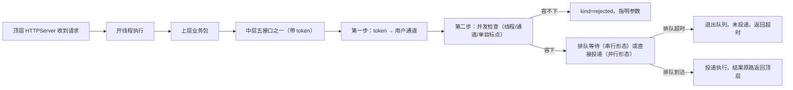

# 整体流程示例

> 版本：Draft v1
> 日期：2026-09-16
> 状态：Informative（示例与索引，不定义机制；任何冲突以唯一 owner 为准）
> 定位：用一次完整的命令过程演示请求从顶层进入、经上层业务包、中层路由与投递、再原路返回的链路；机制与数值的唯一 owner 见 §3。

## 1. 示例设定

以一次 **Skill 执行**为例：调用方 `POST /api/execute_skill`，请求体携带 `skill` 与 `token`；用户已完成六步注册、注册表已导入内存（见[多用户与注册](../中层/1-多用户与注册.md)）。

## 2. 完整流程

1. **HTTPServer 收到请求**：顶层对外 API 接收调用；
2. **开线程执行**：顶层为每个任务开一个线程执行该请求（每任务一线程，见[四层整体架构与接口 §3.1](1-四层整体架构与接口.md)）；
3. **使用对应业务包**：线程调用对应的上层业务包（顶层与上层之间不设定死的接口）；
4. **上层调用中层五接口**：业务包按业务需要调用中层的五个接口之一，本示例为 `execute_skill(skill, timeout, token)`（签名见[四层整体架构与接口 §4.1](1-四层整体架构与接口.md)）；
5. **中层按 token 路由（第一步）**：按 `token` 查注册表内存快照，定位到该用户的通道集合；此后该用户与其它用户彻底隔离（见[路由设计 §0](../中层/3-路由设计.md)）；
6. **并发检查（第二步）**：在用户内按 role 解析目标后，依次做并发检查——线程预算、最大通道数、单目标点通道上限（见[并发设计 §2/§3](../中层/2-并发设计.md)）；
7. **未通过 → 拒绝**：任一预算容不下，返回 `kind=rejected` 并指明是哪个参数容不下，请求结束；
8. **通过 → 排队等待投递**：Skill 属于串行形态，进入该用户对应队列排队等待；排队等待耗尽该请求的 deadline 时**退出队列**——该请求确定未投递（仅中层内部口径），对外返回超时结果（见[并发设计 §1](../中层/2-并发设计.md)、[四层整体架构与接口 §5.8](1-四层整体架构与接口.md)）；
9. **完成投递、结果返回顶层**：排队到达后投递到 daemon role 的隧道/端口，执行并携带结果原路返回：中层 → 上层业务包 → 顶层，作为 HTTP 响应返回调用方。

## 3. 边界与索引

- 五接口签名、返回与错误合同：[四层整体架构与接口 §4](1-四层整体架构与接口.md)；
- token 两步路由与 role 投递目标：[路由设计 §0/§3](../中层/3-路由设计.md)；
- 并发检查、排队与直接投递、记账矩阵：[并发设计 §1–§3](../中层/2-并发设计.md)；
- 端到端 deadline 与超时语义：[四层整体架构与接口 §5.8](1-四层整体架构与接口.md)；
- 注册表产生与导入：[多用户与注册](../中层/1-多用户与注册.md)；字段与默认值：[中层配置文档](../中层/add-中层配置文档.md)。

> 本文只演示“一条请求怎么走”，不复制任何机制、数值或枚举。