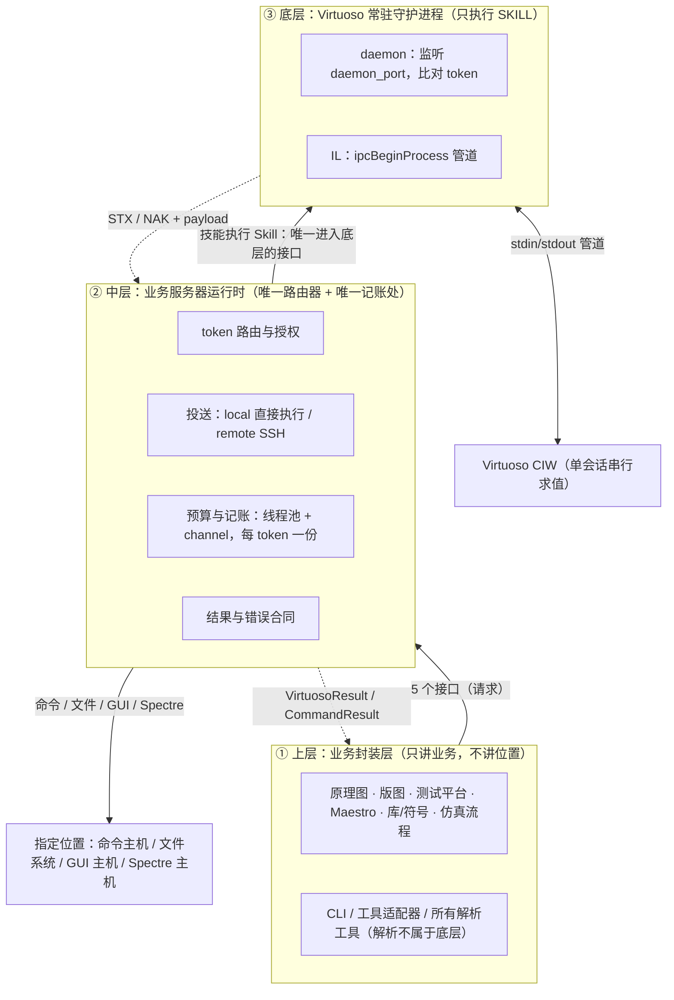
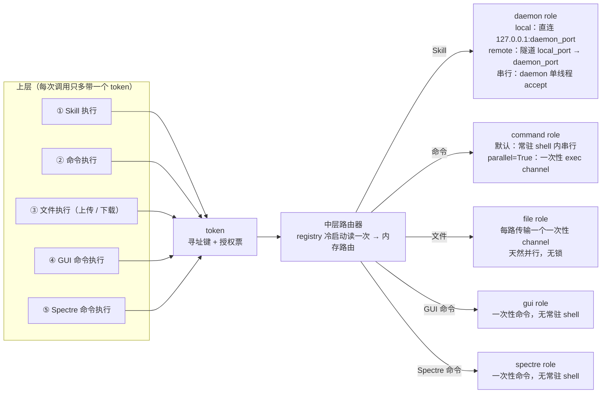
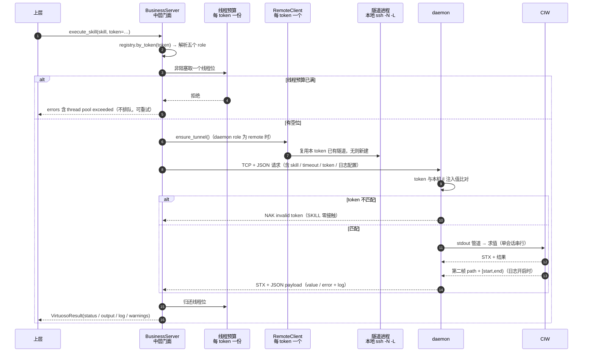
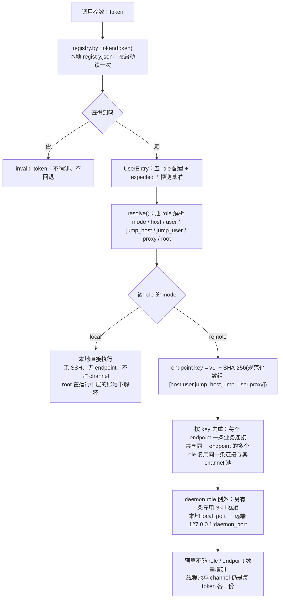
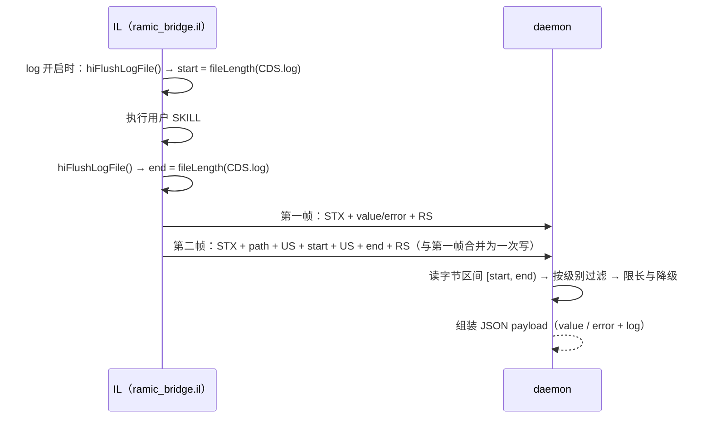

# 架构总览图（图说）

> 版本：Draft v1
> 日期：2026-09-15
> 状态：Informative（**只做可视化与索引**，不定义任何机制、数值、枚举或矩阵）
> 规则：本文所有图都是**示意图**。机制的唯一 owner 见 §1；任何冲突以 owner 为准，本文不产生第二套口径。

## 1. 索引：图的来源与唯一 owner

| 本文的图 | 主题 | 唯一 owner（定义处） |
|---|---|---|
| §2 四层总览 | 分层、职责边界、接口总数 | [四层整体架构与接口](1-四层整体架构与接口.md) |
| §3 接口 → role 路由 | 五个接口与五个 role 的对应 | [路由设计](../中层/3-路由设计.md) §3 |
| §4 一次 Skill 调用的时序 | 请求/返回链路、token 校验、帧格式 | [四层整体架构与接口](1-四层整体架构与接口.md) §4.2 / §4.3、[多用户与注册](../中层/1-多用户与注册.md) §4.2 |
| §5 路由链与 endpoint 去重 | token 寻址、role 解析、连接复用 | [多用户与注册](../中层/1-多用户与注册.md) §3.3、[路由设计](../中层/3-路由设计.md) §6 |
| §6 计数：预算与账本 | 线程池/channel 记账、串行位、连接账本 | [并发设计](../中层/2-并发设计.md) §11 |
| §7 CDS.log 的 offset 计数 | 日志增量、限长、降级 | [日志返回设计标准](../底层/6-日志返回设计标准.md) |
| §8 代码落点 | 四层与源码模块的对应 | —（本文自述） |

字段名与默认值读[中层配置文档](add-中层配置文档.md)；本版不做什么读[本版范围与明确不支持](本版范围与明确不支持.md)；总索引见 [Spec README](../../README.md)。

---

## 2. 四层总览

要点：

- 上层不接触 host、端口、SSH、隧道、socket、subprocess；它只看到**一个逻辑业务服务器**。
- 底层**只执行 SKILL**；命令、文件、GUI、Spectre 四条在中层完成，底层不参与。
- 依赖方向单向：上层 → 中层 → 底层 → Virtuoso；返回沿原路反向。

---

## 3. 五接口 → 五 role 路由图

要点：

- **一个接口只投送一个 role**，不存在隐式退化，也不存在第六个接口。
- **token 只由 daemon 比对**（Skill 通道）；命令 / 文件 / GUI / Spectre 只做寻址，安全边界是 SSH host key + 目标账号权限。
- role 之间**互相独立**：可跨主机、可混合 local/remote，bridge 不判断、不校验它们的拓扑一致性（忠实投送）。

---

## 4. 一次 Skill 调用的时序（含计数点与失败点）

要点：

- **Skill 也占通道**：专用隧道的 forwarding 通道计入该 token 的最大通道数（每 daemon endpoint 一条）；记账唯一口径见[2-并发设计 §3](../中层/2-并发设计.md)。
- 客户端超时**不等于**请求未投递；daemon 队列里已投递的请求不会被取消。
- 日志第二帧超时时，第一帧结果优先返回，`log=""` 并附固定 warning。

---

## 5. 路由链：从 token 到 endpoint

要点：

- **`mode=local` 的 role 没有 endpoint**，也就不产生 SSH 连接、不占 channel；但它**照常占线程预算**。
- **跨 token 永不共用连接**：即使两个 token 解析出同一个 endpoint，也是两条 SSH。
- 注册期的路由载体是**内存候选对象**（不写 registry）；第六步是注册表唯一写盘点，运行期只读一次。
- 路径解析只有一套：绝对路径与 `~` 原样，相对路径按**目标 role 的根**拼接。

---

## 6. 计数：三份预算 + 排队/直接开通道（索引）

> 本图只是图说；**唯一口径见[2-并发设计 §2/§3](../中层/2-并发设计.md)**，数值见[中层配置文档](add-中层配置文档.md)。

- 三份预算（每 token）：**线程预算**（在途请求，含排队中）、**最大通道数**（token 内全部 endpoint 已打开 SSH 通道总数）、**单目标点上限**（`role.<name>.max_sessions`）；
- 串行类（Skill、默认命令）在中层**投递前**排队；并行类（文件、`parallel=True`、GUI、Spectre）**直接开通道**执行；
- 任一预算超限 → `kind=rejected`（可重试，不排队）。

## 7. CDS.log 的 offset 计数（每次只取增量）

要点：

- 增量靠**两个字节偏移**定界，不需要 request_id，也不需要 daemon 常驻 cursor；不向 CDS.log 注入任何 marker。
- 文件轮转或清空导致 `size < start` 或 `end < start` → `start` 归零，本次读 `[0, end)`，不报错。
- 超长先降级为只回 error，再按字节截断靠前部分；截断不会留下半个 UTF-8 字符。
- `log=off` 是**从源头掐断**：IL 不 flush、不取长度、不回第二帧，daemon 不读文件。

---

## 8. 代码落点（spec ↔ 源码）

| 层 / 关注点 | 源码位置 | 说明 |
|---|---|---|
| 上层 | `src_bak/virtuoso_bridge/`（cli、wrappers、virtuoso 各领域包） | 业务封装、命令装配与所有解析工具 |
| 中层门面 | `src/transport/middle.py` | 五接口入口、token 路由、线程预算、错误映射 |
| 中层 · 每 token 远端状态 | `src/transport/tunnel.py` | endpoint 去重、channel 预算、Skill 隧道、串行位 |
| 中层 · 连接与后端 | `src/transport/ssh.py`、`src/transport/paramiko_backend.py` | SSH 连接、ControlMaster、单连接会话上限 |
| 中层 · 注册与解析 | `src/transport/register/`、`registry.py`、`remote_roles.py` | 六步注册、注册表、role 解析与 endpoint key |
| 中层 · 协议与文件 | `src/transport/skill_client.py`、`transfer.py`、`deploy.py` | 帧协议与日志挂载、上传下载与校验、部署 |
| 底层 | `src/bridge/resources/ramic_bridge_daemon_3.py`、`ramic_bridge_daemon_27.py`、`ramic_bridge.il` | daemon 与 IL（部署产物） |
| 接口模型 | `src/pyapi/models.py` | `VirtuosoResult`、`CommandResult`、`Middle` 协议 |
| 服务形态 | `src/server/registration_server.py`、`stress_server.py` | 注册服务与压测服务 |

---

## 9. 图的读法小结

| 问题 | 看哪张图 |
|---|---|
| 谁在哪一层、谁能调谁 | §2 |
| 某个接口最后落在哪台机器、哪种执行形态 | §3 |
| 一次调用路上发生什么、哪里会被拒绝 | §4、§6.1 |
| 为什么两个用户不互相干扰 | §5、§6.4 |
| 为什么 Skill 会排队、命令可以并行、文件从不排队 | §6.3 |
| 日志的“增量”是怎么数出来的 | §7 |
