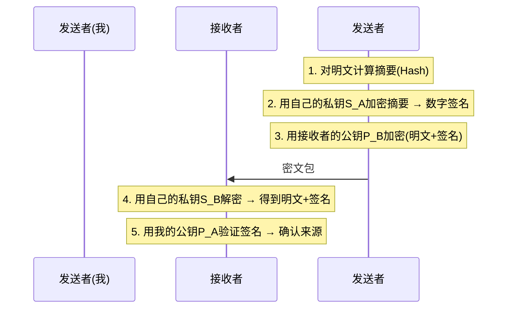
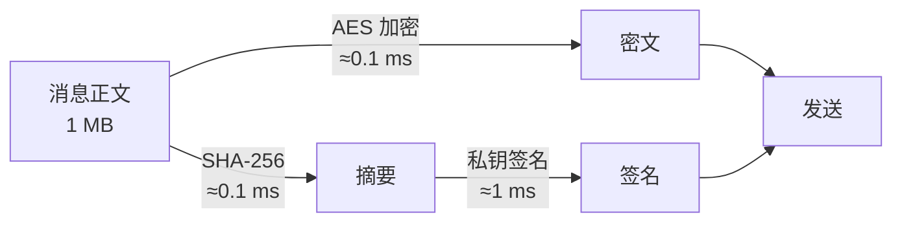
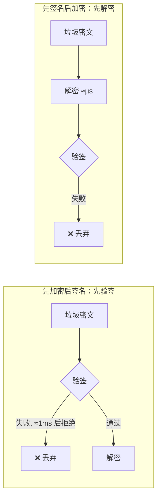

# 密码学基础：签名、加密与验证顺序

> 版本：v1
> 日期：2026-09-10
> 状态：调查记录（面向未来安全加固的入门级密码学背景整理），源自一次围绕「非对称加密如何保证来源与保密」「加密解密的性能消耗」「先验签还是先解密」的逐问逐答。
> 关联：[多用户设计](../design-concepts/底层与中层/多用户设计.md)、[三层整体架构设计](../design-concepts/总览/三层整体架构设计.md)

> 读者对象：有编程基础但未系统学过密码学的工程师。本文不假设密码学背景，只讲清「签名 / 加密 / 顺序 / 性能」这几个概念及其工程含义。

---

## 0. 为什么写这份文档

当前接口基线（三层整体架构设计 §4）中 token 是**明文传递、daemon 侧简单比对**，安全边界靠「用户目视确认 + SSH 公钥注册」。若未来要加固（例如对中层↔daemon 通道做防篡改、防伪造、防窃听），需要一组密码学地基概念。本文回答逐问逐答中提出的三个问题：

1. 非对称密钥如何同时满足「证明信息确实是我发的」与「只有接收者能看内容」；
2. 加密解密对性能的消耗有多大；
3. 通常先验签还是先解密，先解密会不会浪费性能。

---

## 1. 非对称密钥：一对钥匙的分工

### 1.1 公钥与私钥

非对称密码的核心是一对密钥，数学上保证：

- **公钥**加密的内容，只有**私钥**能解开；
- **私钥**签名的内容，任何持有**公钥**的人都能验证。

公钥公开给任何人，私钥只有自己持有。这对钥匙是「不对称」的：加密与解密用的是不同的钥匙，不能互相推导。

### 1.2 两个需求对应两种操作

| 需求 | 用谁的钥匙 | 效果 |
|---|---|---|
| 只有接收者能解密 | **接收者的公钥**加密 | 只有接收者的私钥能解开，第三者拿到密文也没用 |
| 证明确实是我发的 | **我的私钥**签名 | 别人用我的公钥验证，通过就说明签名只能是我做的 |

### 1.3 完整流程：签名 + 加密

设我（发送者）有私钥 $S_A$、公钥 $P_A$，接收者有私钥 $S_B$、公钥 $P_B$。公钥互相公开，私钥各自保密。

1. **签名（解决需求 1）**：对消息计算哈希摘要，用**我的私钥**加密这个摘要，得到数字签名。
2. **加密（解决需求 2）**：把「明文 + 签名」一起用**接收者的公钥**加密。
3. **传输**：密文发出。
4. **解密**：接收者用**自己的私钥**解开密文，得到明文和签名。
5. **验签**：接收者用**我的公钥**验证签名。验签通过 ⇒ 消息确实由持有我私钥的人发出，且内容未被篡改。

### 1.4 为什么能满足两个要求

- **抗冒充（需求 1）**：签名是用我的私钥做的，而私钥只有我有。第三者即使截获了我以前的密文，也无法伪造出能用我的公钥验签通过的签名。
- **保密（需求 2）**：密文用接收者的公钥加密，只有接收者的私钥能解密。第三者截获密文，没有 $S_B$ 就解不开。

### 1.5 一个关键前提：公钥的信任问题

以上一切成立的前提是「我拿到的 $P_B$ 确实是接收者的公钥」。如果中间人把自己的公钥冒充成接收者的公钥给你，你加密的内容中间人就能解开——这就是**中间人攻击**。解决方案：

- CA 证书体系 / PKI（浏览器 HTTPS 的信任链）；
- 预共享指纹（SSH 首次连接的 fingerprint 确认）；
- 线下交换公钥（PGP 信任网）。

本项目 token 的「目视确认」本质上是同一类手段：用一条**可信旁路**确认关键凭证。

---

## 2. 性能：对称 vs 非对称

### 2.1 核心结论：非对称极慢，对称极快

两者差距约 **100~1000 倍**，这是实际系统必须「混合加密」的根本原因。

| 算法类型 | 典型算法 | 速度量级 | 适用场景 |
|---|---|---|---|
| 对称加密 | AES-256-GCM | **每秒数 GB** | 加密消息正文、大文件、TLS 会话数据 |
| 非对称加密 | RSA-2048 | **每秒几十~几百次** | 只用来加密一把小钥匙 |
| 非对称加密 | ECC（如 X25519） | 每秒数千~上万次，比 RSA 快很多 | 同上，现代首选 |
| 数字签名 | RSA 签名 / Ed25519 | 与各自加密同量级 | 每次消息的签名 |
| 哈希 | SHA-256 | **每秒数百 MB~GB** | 摘要计算，成本可忽略 |

具体量级（现代桌面 CPU，配合硬件加速指令）：

- **AES**：有 AES-NI 指令集后，加密 1 GB 数据约几十毫秒。硬盘读写往往比 AES 还慢，所以全盘加密（如 BitLocker）几乎无感。
- **RSA-2048**：一次加密/解密约 **1~5 毫秒**。若用它加密整个文件，每块数据都要一次 RSA 运算，立刻慢成龟速。
- **ECC（Curve25519）**：一次操作约 **0.1~0.5 毫秒**，密钥更短（256 位 ≈ RSA-3072 的安全强度）。SSH、TLS 1.3 都优先用 ECC。

### 2.2 为什么差距这么大

- 对称算法是「搅乱 + 置换」的位运算，CPU 有专门指令加速，天然适合流水线处理海量数据。
- 非对称算法依赖**大整数模幂 / 椭圆曲线点乘**，是数学上极重的运算，天生就慢。

### 2.3 混合加密：正文对称、钥匙非对称

实际工程中从不直接拿非对称加密大数据，而是：

1. 随机生成一把一次性**对称密钥**（如 AES），用它加密消息本体（快）；
2. 用接收者的**公钥**加密这把对称密钥（慢但数据极小）；
3. 接收者先用私钥解出对称密钥，再用它解密正文。

发一条「签名 + 加密」消息的开销分布（以 1 MB 正文为例）：

大头是非对称的两步（一次签名 + 一次加密对称密钥 ≈ 1~2 毫秒）；正文无论多大，AES 都处理得飞快。即便每秒发 1000 条消息，非对称部分也只占几秒 CPU，通常完全可接受。

### 2.4 现实系统的权衡

| 系统 | 做法 |
|---|---|
| **HTTPS/TLS** | 握手时用 ECC/RSA 协商出一把会话密钥，之后整个连接的数据流全部用 AES。握手成本只在连接建立时付一次。 |
| **SSH** | 认证/密钥交换用非对称，会话数据用 AES/ChaCha20。`scp` 大文件传输速度接近裸网速。 |
| **PGP/GPG 邮件** | 正文用对称密钥加密，那把对称密钥用接收者公钥加密后附在邮件里——即 2.3 的混合加密。 |
| **文件签名分发** | 只对文件的哈希签名（毫秒级），不对整个文件做 RSA。 |

### 2.5 优化要点

1. **正文永远用 AES**，非对称只处理「钥匙的钥匙」——一次握手，全程复用。
2. **选 ECC 而非 RSA**：更快、密钥更短，现代库（OpenSSL、libsodium）默认支持。
3. **签名只签摘要**：先哈希，只对 32 字节的摘要做私钥运算，签名成本与消息大小无关。
4. 高频小消息场景可考虑**会话密钥缓存**：双方首次握手建立一把对称密钥，后续一段时间内全部用 AES+HMAC，定期轮换。

**一句话总结**：非对称运算贵但只用几次；对称运算便宜到几乎免费，负责全部数据量。混合使用后，密码学开销在绝大多数应用中占不到 1% 的 CPU。

---

## 3. 先验签还是先解密

### 3.1 直接结论：现代最佳实践是「先验签、后解密」

顺序取决于发送方的**构造顺序**，存在两种合法构造：

| 构造顺序 | 代表系统 | 接收方处理顺序 |
|---|---|---|
| 先签名 → 后加密（S→E） | PGP、S/MIME、嵌套 JOSE | **被迫先解密**，拿到明文里的签名再验签 |
| 先加密 → 后签名（E→S） | SSH、TLS、IPsec | **先验证密文上的签名**，通过后才解密 |

现代工程共识（**Cryptographic Doom Principle**，Moxie Marlinspike 提出）明确倾向后者：

> 如果你在验证签名/MAC 之前就必须执行任何解密操作，最终一定会导致灾难。

### 3.2 先解密真的浪费性能吗

**浪费是真的，但很小——真正的原因是安全，不是性能。**

**收到有效消息时（正常情况）**：两种顺序都要付一次验签 + 一次解密，成本完全相同。AES 解密是微秒级，签名验证（RSA-2048）约 0.1~1 毫秒才是大头。无论顺序如何，验签这个最贵的操作都躲不掉；先解密只是额外垫付几微秒的 AES 成本，相对毫秒级验签可忽略。

**收到垃圾/攻击数据时**：

S→E 多付的解密成本微不足道，纯性能看两者几乎打平。

### 3.3 那为什么坚持「先验签」——安全理由

性能是烟雾弹，真正的理由是：

1. **绝不把未认证的数据送进解密引擎**。对未经认证的密文执行解密，是大量历史漏洞的温床：
   - Padding Oracle（CBC 模式解密报错泄露明文）；
   - Bleichenbacher 攻击（RSA 解密报错被利用）。
   「先验签」保证**只有通过认证的数据才会被解密**，攻击者连让解密算法跑一次的机会都没有。
2. **解密失败信息不外泄**。先解密时若报「解密失败」，这个反馈本身可能被攻击者当作 Oracle 反复探测。
3. **防止 DoS 放大器**：攻击者洪水式发垃圾包。先验签时每个垃圾包在验签环节就被廉价拒绝；先解密则每个包都完整走一遍解密流程，再配合上一条的 Oracle 风险就更危险。

### 3.4 现实系统的选择

| 系统 | 做法 |
|---|---|
| **SSH** | encrypt-then-MAC：先验 MAC，垃圾包直接丢，永不进解密 |
| **TLS 1.2/1.3（AEAD 模式）** | AES-GCM / ChaCha20-Poly1305：解密和认证**融合在一步**，tag 验证通过才吐出明文——等于免费获得「先验签」语义，零额外开销 |
| **IPsec ESP** | 2006 年修订后明确 encrypt-then-authenticate |
| **PGP / S/MIME** | 例外，采用 sign-then-encrypt。代价是接收方必须解密一切，理由是「签名绑定内容本身」的不可否认性语义 |

### 3.5 小结

- **通常顺序**：现代系统（SSH/TLS）先验签再解密；老式邮件系统（PGP）先解密再验签。
- **先解密浪费性能吗**：会，但浪费极小（微秒级 AES），验签的毫秒级成本横竖都要付，性能上不值得纠结。
- **真正重要的**：先验签是安全原则——解密只应作用于已认证数据，否则埋下 Oracle 攻击隐患。

补充：实际工程中「验签」这一步多数时候不是非对称签名，而是 **HMAC / Poly1305 这类对称认证码**（每包微秒级），非对称验签只在会话建立时做一次。那样「先验证」的每包成本比 AES 解密还低，就更没有理由先解密了。

---

## 4. 对本项目的启示

结合三层整体架构设计与多用户设计的现状：

1. **现有通道已具备传输安全**：项目走 SSH 隧道，SSH 本身就是 encrypt-then-MAC + AEAD 的实现（先认证后解密、正文对称加密），中层↔daemon 的 TCP 数据在隧道内已经受保护。本项目的安全短板不在传输层，而在「token 明文传递、daemon 简单比对」这层应用级认证。
2. **token 的防伪造方向是签名，不是加密**：token 的目的是「证明请求来自已授权客户端」——这正是数字签名/认证码的语义。若未来加固，可让客户端用私钥对请求签名（或共享 HMAC 密钥），daemon 验签后放行；不需要对 SKILL 请求本身做加密（内容本就要在 CIW 执行，且隧道已加密）。
3. **若未来要端到端保护请求内容**（例如绕过 SSH 的直连场景），遵循两条原则：
   - 用**混合加密**：会话密钥 AES 加密正文，握手时用 ECC 交换密钥；
   - 用 **AEAD**（如 ChaCha20-Poly1305）一步完成加密+认证，天然满足「先验后解」，避免自造 CBC 组合；
   - 直接使用成熟库（libsodium / PyNaCl / cryptography），不要手写密码学原语组合。
4. **密钥管理是主要成本**：私钥的安全存储、轮换、吊销，比算法选择更影响工程落地。对 bridge 这类工具，把「客户端私钥文件 + 服务端白名单公钥」与现有注册表（registry.json）并置，是最小改动路径。
