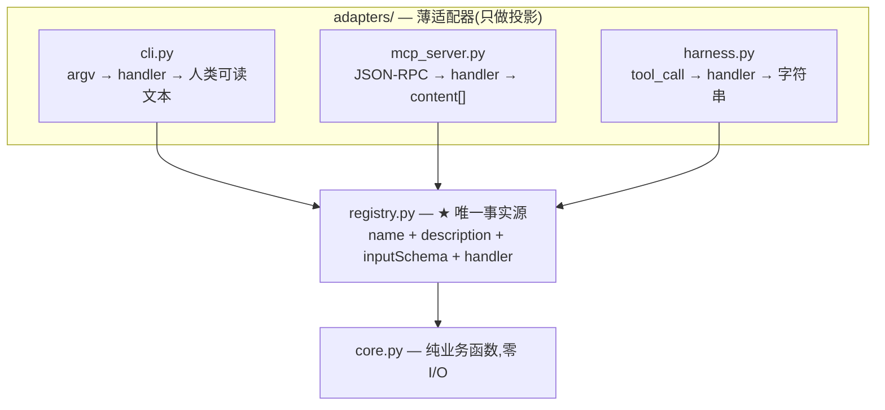

# 三接口统一架构研究报告

**CLI / MCP / Harness Tool-Call 共享单一工具注册表的最小可行架构**

> 日期:2026-09-04 · 仓库:virtuoso-bridge-NCS · 目录:`spec/research/` · 语言:Python

---

## 1. 摘要

当一个项目需要同时提供三种对外界面——**命令行(CLI)、MCP 服务器(agent 协议)、AI Harness 工具调用(OpenAI function calling / LangChain 等)**——最容易犯的错误是把业务逻辑实现三遍。三份代码必然漂移:schema 不一致、错误语义不同、测试三倍、修 bug 三处。

本报告给出一个最小可行架构:**业务核心无 I/O、工具注册表单点定义、三个适配器只做"投影"**。随附可运行示例 `example_calc/`(加法计算器),用约 150 行代码完整演示三界面共享一套核心。

## 2. 问题定义

| 界面 | 使用者 | 典型调用形态 |
|---|---|---|
| CLI | 人类 / 脚本 | `calc add 1 2` |
| MCP server | MCP 宿主(VS Code Copilot、Claude Desktop 等) | JSON-RPC `tools/call` |
| Harness | OpenAI SDK / LangChain / 自研 agent | `chat.completions(tools=[...])` → `tool_call` 循环 |

三者的**能力完全相同**:参数(JSON Schema)→ 执行 → 结构化结果。差异只在**参数从哪来、结果怎么呈现、错误怎么表达**。因此正确的架构是把"能力"与"呈现"分离。

## 3. 架构原则



**五条纪律:**

1. **核心无 I/O**:`core/` 不读 argv/stdin、不 print、不起子进程。输入参数 → 返回结构化结果;失败抛类型化异常。
2. **注册表单点定义**:工具的 `name` / `description` / `inputSchema`(JSON Schema)/ `handler` 只在 `registry.py` 写一次。任何界面新增工具只需在注册表加一条,三界面同时获得。
3. **适配器只做投影**:参数入口替换 + 输出呈现替换,不碰业务逻辑。每个适配器 < 100 行。
4. **stdout 纪律**:stdout 是"正式输出通道"(CLI 的结果 / MCP 的协议帧),一切日志走 stderr。MCP 下 stdout 被日志污染 = 协议崩溃。
5. **错误类型化**:core 抛 `CalcError`,三个适配器各自翻译成本界面的错误语义,谁都不吞谁都不崩。

## 4. 最小示例:加法计算器(`example_calc/`)

### 4.1 目录结构

```
example_calc/
  __init__.py
  core.py            # 纯业务:CalcError / CalcResult / add/sub/mul/div + OPERATIONS
  registry.py        # ★ 唯一事实源:TOOLS = {name, description, inputSchema, handler}
  adapters/
    __init__.py
    cli.py           # argparse 从 registry 自动生成子命令
    mcp_server.py    # stdio JSON-RPC 最小实现(演示协议骨架)
    harness.py       # registry → OpenAI function calling 格式
```

### 4.2 核心层(零 I/O)

```python
# core.py
class CalcError(Exception): ...          # 类型化业务异常

@dataclass
class CalcResult:                        # 结构化结果,三界面共用
    operation: str
    a: float
    b: float
    result: float
    def to_dict(self) -> dict: ...

def add(a, b): return CalcResult("add", a, b, a + b)
def div(a, b):
    if b == 0: raise CalcError("division by zero")
    return CalcResult("div", a, b, a / b)

OPERATIONS = {"add": add, "sub": sub, "mul": mul, "div": div}
```

### 4.3 工具注册表(唯一事实源)

```python
# registry.py
_BINARY_SCHEMA = {
    "type": "object",
    "properties": {
        "a": {"type": "number", "description": "第一个操作数"},
        "b": {"type": "number", "description": "第二个操作数"},
    },
    "required": ["a", "b"],
}

TOOLS = {  # 每个工具 = 元数据 + JSON Schema + 指向 core 的 handler
    "add": {"name": "add", "description": "两数相加 (a + b)",
            "inputSchema": _BINARY_SCHEMA, "handler": core.add},
    ...
}
```

**这个 registry 是三种界面的共同答案:**
- MCP 的 `tools/list` 直接输出 `inputSchema`;
- Harness 的 `function.parameters` 直接复用 `inputSchema`;
- CLI 的 argparse 从 `name`/`description` 生成子命令,从 `handler` 执行。

### 4.4 三个适配器的投影对照

| 维度 | CLI | MCP | Harness |
|---|---|---|---|
| 参数来源 | `argv`(位置参数) | `tools/call.params.arguments` | `tool_call.function.arguments`(JSON 字符串,需 `json.loads`) |
| schema 形态 | argparse 子命令 | `inputSchema`(JSON Schema) | `function.parameters`(JSON Schema) |
| 输出 | 人类可读文本(stdout) | `content: [{type:"text", text}]` | 序列化字符串(作为 `role:"tool"` 消息回给模型) |
| 错误语义 | stderr + 退出码 1 | `isError: true` | 错误文本返回给模型自行决策 |
| 生命周期 | 每次调用一个短命进程 | 会话内常驻(stdin EOF 即退) | 宿主控制 |

### 4.5 用法演示

**① CLI(在 `spec/research/` 目录下):**

```bash
python -m example_calc.adapters.cli add 1 2
# → 1.0 add 2.0 = 3.0

python -m example_calc.adapters.cli div 5 0
# → (stderr) error: division by zero   (退出码 1)
```

**② MCP(管道喂入 JSON-RPC 帧):**

```bash
printf '%s\n' \
  '{"jsonrpc":"2.0","id":1,"method":"initialize","params":{}}' \
  '{"jsonrpc":"2.0","id":2,"method":"tools/list","params":{}}' \
  '{"jsonrpc":"2.0","id":3,"method":"tools/call","params":{"name":"add","arguments":{"a":1,"b":2}}}' \
| python -m example_calc.adapters.mcp_server
```

依次返回 `initialize` 应答、4 个工具的清单、`1 add 2 = 3`。
(注:MCP 的 `arguments` 传入整数时结果按 int 运算;CLI 强制 `type=float`,故 CLI 显示 `1.0`。)

**③ Harness(离线演示):**

```bash
python -m example_calc.adapters.harness
# 打印 tools 定义 + 执行一个伪造 tool_call 的结果
```

## 5. 每个界面独有的坑

### 5.1 MCP

- **stdout 是协议通道**:任何 `print` 都会让客户端 JSON 解析失败。本示例中所有日志强制走 stderr。
- **握手是必须的**:`initialize` → `notifications/initialized` → `tools/list` → `tools/call`。严格实现还应拒绝未初始化就 `tools/call` 的客户端(最小示例从简)。
- **`content` 格式**:MCP 要求返回 `[{type:"text", text:...}]`,不是裸字符串。
- **生产用官方 SDK**(`pip install mcp`),协议版本协商、错误码、流式输出等细节交给库;本示例手写协议仅为教学。

### 5.2 Harness

- **arguments 是 JSON 字符串**,不是 dict,必须 `json.loads`。
- **错误不要炸进程**:把错误文本作为 tool 消息回给模型,模型常能自我纠正(如改参数重试)。
- **tool_call_id 要回传**:追加 `role:"tool"` 消息时必须带上对应的 `tool_call_id`。

### 5.3 CLI

- argparse 的 `-h` 输出与 registry 的 description 同源,天然一致。
- 若要机器可读输出,加 `--json` 开关直接打印 `CalcResult.to_dict()`,不要另写序列化逻辑。

## 6. 验证

| 界面 | 命令 | 期望 |
|---|---|---|
| CLI 成功 | `python -m example_calc.adapters.cli add 1 2` | stdout `1.0 add 2.0 = 3.0`,退出码 0 |
| CLI 失败 | `python -m example_calc.adapters.cli div 5 0` | stderr `error: division by zero`,退出码 1 |
| MCP | 见 4.5 ② | 三帧应答:initialize 能力声明 / 4 工具清单 / 运算结果 |
| Harness | `python -m example_calc.adapters.harness` | tools 定义 JSON + `{"operation": "add", ...}` |

## 7. 生产化建议

1. **MCP 用官方 SDK**:协议层交给 `mcp` 包,自己只写工具定义与 handler。
2. **schema 从 pydantic 自动生成**:手写 JSON Schema 会与代码漂移;用 pydantic 模型 `model_json_schema()` 生成,registry 从模型装配。
3. **core 单测为主**:纯函数可 100% 单测,一次覆盖三界面;适配器只做薄集成测试。
4. **工具数量增长后按域拆分 registry**(如 `registry/calc.py`、`registry/doc.py`),再在顶层聚合,保持每个模块 < 200 行。
5. **版本化 registry**:三界面对外暴露同一 schema,改动即破坏性变更;给 registry 加版本号并在 MCP `serverInfo` / CLI `--version` 中暴露。

## 8. 结论

三接口共存的本质是**同一能力集的三种调用协议**。最小架构 = 无 I/O 核心 + 单一工具注册表 + 投影式薄适配器。本仓库的 `skill_doc_server.py`(后端 `search()`/`more_info()` 已是纯函数)正是该架构的天然候选:抽出 `registry` 后,CLI 与 MCP 界面各是一个 < 100 行的投影文件。

**一句话:核心只写一次,注册表定义一次,每增加一种界面只花一个适配器文件的成本。**
